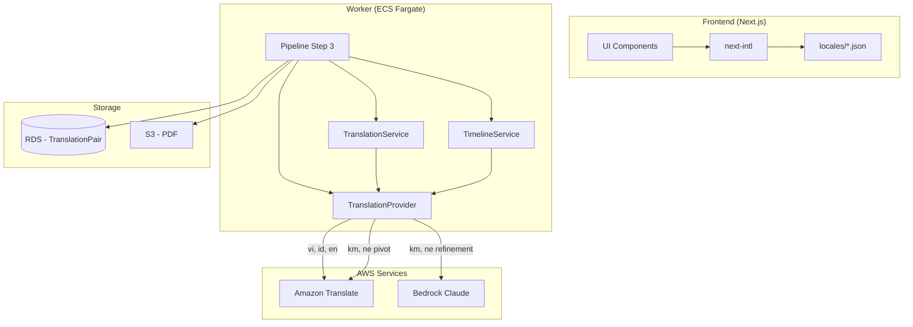
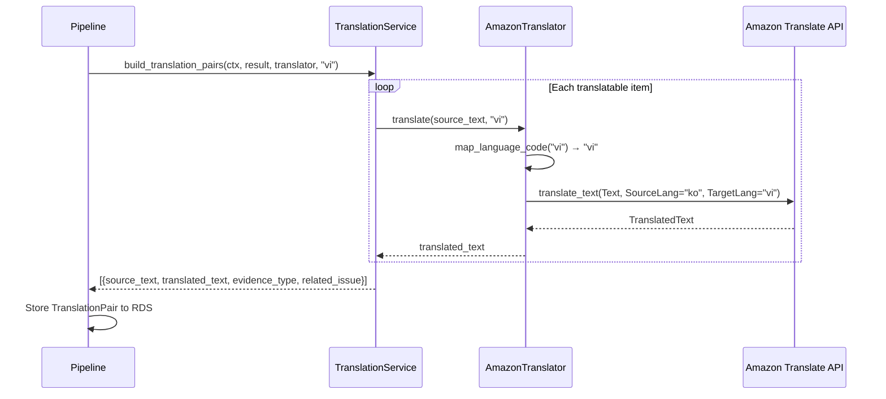
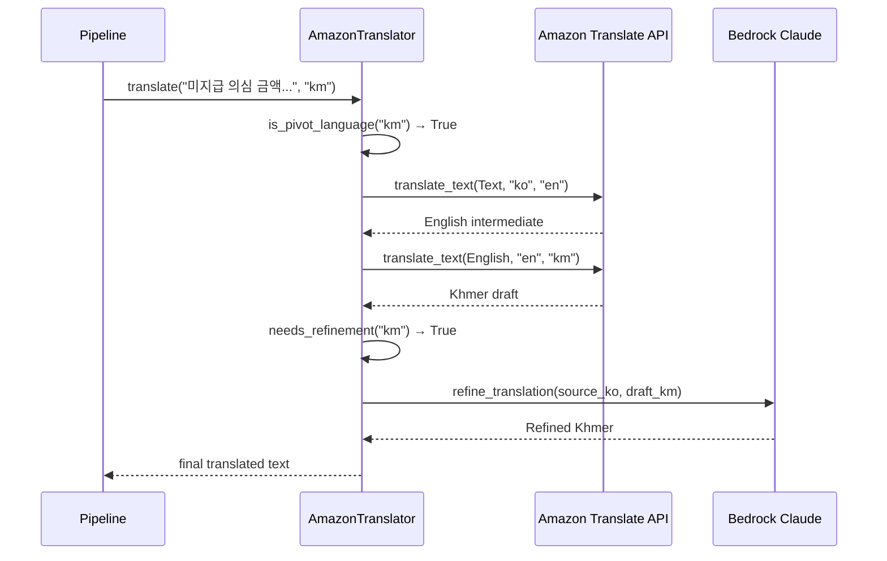
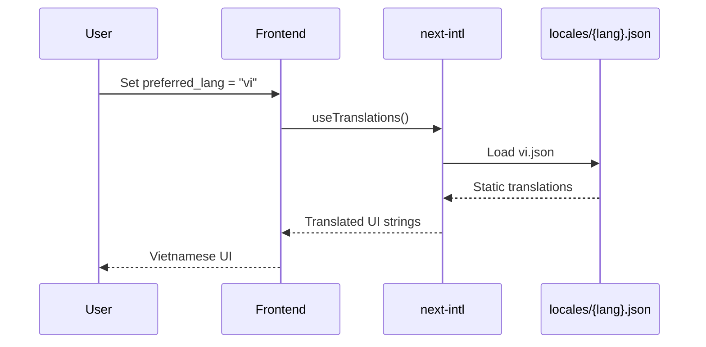

# Design Document: Multilingual Translation

## Overview

BADA의 다국어 번역 기능은 외국인 노동자가 분석 결과(타임라인, 공제 내역, 미지급 의심 금액 등)를 자신의 모국어로 이해할 수 있도록 동적 콘텐츠를 번역하는 시스템이다. Amazon Translate를 기본 엔진으로 사용하며, 크메르어·네팔어 같은 저자원 언어에는 ko→en→target 피벗 또는 Claude 보정을 적용한다.

핵심 원칙은 **원문 항상 병기**(side-by-side)로, 번역 오류 시 원문 확인이 가능해야 한다. 정적 UI 텍스트는 next-intl JSON locale 파일로 관리하고, 동적 분석 결과는 **리포트 조회 시점에 실시간 번역**한다 (분석 재실행 불필요).

번역 시점 전략:
- **분석 시**: 한국어 원문으로 결과를 DB에 저장 (번역하지 않음)
- **리포트 조회 시**: `lang` 파라미터에 따라 실시간으로 Amazon Translate 호출하여 번역 표시
- **PDF 인쇄 시**: 항상 `lang=ko` (한국어 제출용, 공공기관/법무법인 제출 목적)

환경변수 `TRANSLATE_MODE`로 번역만 독립적으로 aws 모드 전환 가능 (LLM/OCR 미구현이어도 번역 테스트 가능).

데모 우선순위는 베트남어 + 영어 완성도 확보이며, 크메르어·네팔어·인도네시아어는 i18n 골격만 제공한다. 면책 고지 문구도 반드시 번역 대상에 포함된다.

## Architecture



## Sequence Diagrams

### Main Translation Flow (Vietnamese/English — Direct)



### Low-Resource Language Flow (Khmer/Nepali — Pivot + Refinement)



### Static UI Locale Flow



## Components and Interfaces

### Component 1: AmazonTranslator (Provider)

**Purpose**: Amazon Translate API와의 통신을 캡슐화하고, 언어별 번역 전략(직접/피벗/보정)을 결정한다.

**Interface**:
```python
class Translator(ABC):
    @abstractmethod
    def translate(self, text: str, target_lang: str) -> str:
        """Translate Korean text to target language."""
        ...

    @abstractmethod
    def translate_batch(self, texts: list[str], target_lang: str) -> list[str]:
        """Batch translate for efficiency. Preserves order."""
        ...


class AmazonTranslator(Translator):
    def __init__(self, region: str = "ap-northeast-2"):
        ...

    def translate(self, text: str, target_lang: str) -> str:
        ...

    def translate_batch(self, texts: list[str], target_lang: str) -> list[str]:
        ...
```

**Responsibilities**:
- Amazon Translate API 호출 (region: ap-northeast-2)
- 언어 코드 매핑 (BADA 내부 코드 → Amazon Translate 코드)
- 피벗 번역 로직 (ko→en→target) for 크메르/네팔어
- Claude 보정 호출 (선택적, 저자원 언어)
- 빈 텍스트/한국어 타겟 시 원문 반환 (no-op)
- 오류 시 원문 반환 (graceful degradation)

### Component 2: TranslationService (서비스 레이어)

**Purpose**: 분석 결과에서 번역 대상 텍스트를 추출하고 TranslationPair 구조를 생성한다.

**Interface**:
```python
def build_translation_pairs(
    ctx: dict,
    result: dict,
    translator: Translator,
    target_lang: str = "ko",
) -> list[dict]:
    """
    분석 결과에서 번역 대상을 추출하여 원문-번역 대조표를 생성한다.
    항목: 공제 설명, 미지급 의심 문구, 면책 고지, 누락 안내.
    """
    ...
```

**Responsibilities**:
- 공제 항목 설명 번역
- 미지급 의심 금액 설명 번역
- 면책 고지 번역
- 누락 증거 안내 번역
- TranslationPair 구조 조립 (source_text + translated_text + metadata)

### Component 3: TimelineService (타임라인 번역 통합)

**Purpose**: 타임라인 이벤트 설명을 모국어로 번역하여 description_translated 필드에 저장한다.

**Interface**:
```python
def build_timeline(
    ctx: dict,
    result: dict,
    llm,
    translator: Translator,
    target_lang: str = "ko",
) -> list[dict]:
    """
    타임라인 이벤트를 생성하고 각 description을 target_lang으로 번역한다.
    반환: [{date, type, description, description_translated}]
    """
    ...
```

**Responsibilities**:
- 타임라인 이벤트 설명(한국어) 생성
- 각 설명을 target_lang으로 번역
- 원문(description) + 번역(description_translated) 쌍 보존

### Component 4: LanguageConfig (언어 설정)

**Purpose**: 지원 언어 목록, 코드 매핑, 번역 전략 결정을 중앙에서 관리한다.

**Interface**:
```python
@dataclass
class LanguageStrategy:
    bada_code: str           # BADA internal: ko, vi, en, km, ne, id
    translate_code: str      # Amazon Translate code
    strategy: str            # "direct" | "pivot" | "pivot+refine"
    pivot_lang: str | None   # "en" if pivot needed
    needs_refinement: bool   # Claude refinement for low-resource


SUPPORTED_LANGUAGES: dict[str, LanguageStrategy] = {
    "ko": LanguageStrategy("ko", "ko", "none", None, False),
    "vi": LanguageStrategy("vi", "vi", "direct", None, False),
    "en": LanguageStrategy("en", "en", "direct", None, False),
    "id": LanguageStrategy("id", "id", "direct", None, False),
    "km": LanguageStrategy("km", "km", "pivot+refine", "en", True),
    "ne": LanguageStrategy("ne", "ne", "pivot+refine", "en", True),
}
```

**Responsibilities**:
- 지원 언어 등록 및 조회
- 언어별 번역 전략 결정
- BADA 내부 코드 ↔ Amazon Translate 코드 매핑
- 지원 여부 검증

## Data Models

### TranslationPair (Existing — 확장 없음)

```python
class TranslationPair(Base):
    __tablename__ = "translation_pairs"
    id: Mapped[str]                    # UUID PK
    case_id: Mapped[str]               # FK → cases.id
    source_text: Mapped[str]           # 원문 (한국어)
    translated_text: Mapped[str]       # 모국어 번역
    evidence_type: Mapped[str | None]  # "급여명세서/공제", "사용자 진술" 등
    related_issue: Mapped[str | None]  # "deduction", "wage_unpaid" 등
    source_evidence_id: Mapped[str | None]  # FK → evidences.id
```

**Validation Rules**:
- source_text는 비어있을 수 없다
- translated_text는 비어있을 수 없다 (번역 실패 시 원문 복사)
- target_lang이 "ko"면 translated_text = source_text

### TimelineEvent (Existing — description_translated 활용)

```python
class TimelineEvent(Base):
    __tablename__ = "timeline_events"
    description: Mapped[str | None]             # 한국어 원문
    description_translated: Mapped[str | None]  # 모국어 번역
```

**Validation Rules**:
- description이 있으면 description_translated도 존재해야 한다
- target_lang = "ko"이면 description_translated = description

### User (Existing — preferred_lang 활용)

```python
class User(Base):
    preferred_lang: Mapped[str]  # "ko" | "vi" | "en" | "km" | "ne" | "id"
```

**Validation Rules**:
- preferred_lang은 SUPPORTED_LANGUAGES 키 중 하나여야 한다

## Algorithmic Pseudocode

### Main Translation Algorithm

```python
ALGORITHM translate_text(text, target_lang):
    INPUT: text (Korean source string), target_lang (BADA language code)
    OUTPUT: translated string

    BEGIN
        # Precondition: text is non-empty, target_lang is supported
        ASSERT text is not empty
        ASSERT target_lang in SUPPORTED_LANGUAGES

        # No-op cases
        IF target_lang == "ko" OR text is empty THEN
            RETURN text
        END IF

        strategy = SUPPORTED_LANGUAGES[target_lang]

        IF strategy.strategy == "direct" THEN
            # Direct: ko → target via Amazon Translate
            result = amazon_translate(text, source="ko", target=strategy.translate_code)

        ELSE IF strategy.strategy == "pivot" THEN
            # Pivot: ko → en → target
            english = amazon_translate(text, source="ko", target="en")
            result = amazon_translate(english, source="en", target=strategy.translate_code)

        ELSE IF strategy.strategy == "pivot+refine" THEN
            # Pivot + Claude refinement
            english = amazon_translate(text, source="ko", target="en")
            draft = amazon_translate(english, source="en", target=strategy.translate_code)
            result = claude_refine(source_ko=text, draft_translation=draft, target_lang=target_lang)

        END IF

        RETURN result

    EXCEPTION on any error:
        log_warning("Translation failed, returning source text")
        RETURN text  # Graceful degradation: 원문 반환
    END
```

### Batch Translation Algorithm

```python
ALGORITHM translate_batch(texts, target_lang):
    INPUT: texts (list of Korean strings), target_lang (BADA language code)
    OUTPUT: list of translated strings (same length, same order)

    BEGIN
        ASSERT len(texts) > 0
        ASSERT target_lang in SUPPORTED_LANGUAGES

        IF target_lang == "ko" THEN
            RETURN texts  # No translation needed
        END IF

        results = []
        # Chunk into batches of MAX_BATCH_SIZE for API limits
        FOR each chunk IN partition(texts, MAX_BATCH_SIZE) DO
            INVARIANT: len(results) == number of texts processed so far

            translated_chunk = []
            FOR each text IN chunk DO
                translated = translate_text(text, target_lang)
                translated_chunk.append(translated)
            END FOR
            results.extend(translated_chunk)
        END FOR

        ASSERT len(results) == len(texts)
        RETURN results
    END
```

### Claude Refinement Algorithm

```python
ALGORITHM claude_refine(source_ko, draft_translation, target_lang):
    INPUT: source_ko (original Korean), draft_translation (machine-translated draft),
           target_lang (target language code)
    OUTPUT: refined translation string

    BEGIN
        # Only called for low-resource languages (km, ne)
        ASSERT target_lang in ["km", "ne"]

        prompt = f"""
        Original Korean: {source_ko}
        Machine translation ({target_lang}): {draft_translation}

        Please refine the translation for naturalness and accuracy.
        Keep the meaning identical. Return ONLY the refined translation.
        """

        refined = bedrock_invoke(prompt, model=BEDROCK_MODEL_ID)

        IF refined is empty or invalid THEN
            RETURN draft_translation  # Fallback to machine draft
        END IF

        RETURN refined
    END
```

## Key Functions with Formal Specifications

### Function 1: translate()

```python
def translate(self, text: str, target_lang: str) -> str:
```

**Preconditions:**
- `text` is a string (may be empty)
- `target_lang` is one of: "ko", "vi", "en", "id", "km", "ne"
- AWS credentials are configured for Amazon Translate in ap-northeast-2

**Postconditions:**
- Returns a non-None string
- If `text` is empty → returns empty string
- If `target_lang == "ko"` → returns `text` unchanged
- If translation succeeds → returns translated text in target language
- If translation fails → returns `text` unchanged (graceful degradation)
- Source text is never modified (immutability)

**Loop Invariants:** N/A (single call)

### Function 2: translate_batch()

```python
def translate_batch(self, texts: list[str], target_lang: str) -> list[str]:
```

**Preconditions:**
- `texts` is a list of strings
- `target_lang` is a supported language code
- All elements in `texts` are non-None

**Postconditions:**
- Returns a list of same length as input
- Order is preserved: `result[i]` is the translation of `texts[i]`
- Each element satisfies the postconditions of `translate()`
- No partial results: either all succeed or each failure falls back to source

**Loop Invariants:**
- After processing i items: `len(results) == i`
- All processed results satisfy individual translate() postconditions

### Function 3: build_translation_pairs()

```python
def build_translation_pairs(ctx: dict, result: dict, translator: Translator, target_lang: str) -> list[dict]:
```

**Preconditions:**
- `result` contains `deduction_items` (list) and optionally `suspected_unpaid` (int)
- `translator` implements `Translator` interface
- `target_lang` is a supported language code

**Postconditions:**
- Returns list of dicts, each with keys: source_text, translated_text, evidence_type, related_issue
- Every item has non-empty source_text
- Every item has non-empty translated_text (fallback = source_text)
- 면책 고지 항목이 항상 포함된다
- Number of pairs ≥ len(deduction_items) + (1 if suspected_unpaid > 0) + 1 (disclaimer)

**Loop Invariants:**
- All pairs generated so far have valid source_text and translated_text

### Function 4: get_language_strategy()

```python
def get_language_strategy(lang_code: str) -> LanguageStrategy:
```

**Preconditions:**
- `lang_code` is a string

**Postconditions:**
- If `lang_code` in SUPPORTED_LANGUAGES → returns corresponding LanguageStrategy
- If `lang_code` not supported → raises `UnsupportedLanguageError`
- Returned strategy has valid `strategy` field ("none", "direct", "pivot", "pivot+refine")

**Loop Invariants:** N/A

## Example Usage

```python
# Example 1: Direct translation (Vietnamese)
from worker.providers.translate import get_translator

translator = get_translator()  # Returns AmazonTranslator if PROVIDER_MODE=aws
result = translator.translate("미지급 의심 금액 약 400,000원이 확인됩니다.", "vi")
# → "Số tiền nghi chưa trả khoảng 400.000 won đã được xác nhận."

# Example 2: Batch translation for timeline
descriptions = [
    "2024-01-15, 사업장에서 근무를 시작했습니다.",
    "2024-02-28, 2,300,000원이 입금되었습니다.",
    "미지급 의심 금액 약 400,000원이 확인됩니다.",
]
translated = translator.translate_batch(descriptions, "vi")
assert len(translated) == len(descriptions)

# Example 3: Pivot translation (Khmer)
result = translator.translate("기숙사비 250,000원이 공제되었습니다.", "km")
# Internally: ko→en→km + Claude refinement

# Example 4: Pipeline integration
from worker.services.translation import build_translation_pairs

ctx = {"workplace_name": "○○제조"}
result = {
    "deduction_items": [{"name": "기숙사비", "amount": 250000, "check": "계약서 명시 확인 필요"}],
    "suspected_unpaid": 400000,
}
pairs = build_translation_pairs(ctx, result, translator, target_lang="vi")
# pairs[0] = {"source_text": "기숙사비 250,000원이...", "translated_text": "...", ...}
# pairs[-1] = disclaimer translation pair (always included)

# Example 5: No-op for Korean target
result = translator.translate("테스트 문장", "ko")
assert result == "테스트 문장"  # Identity function when target is Korean

# Example 6: Graceful degradation on failure
# If Amazon Translate API fails, returns source text
result = translator.translate("어떤 문장", "vi")
# → "어떤 문장" (fallback: original preserved)
```

## Correctness Properties

*A property is a characteristic or behavior that should hold true across all valid executions of a system—essentially, a formal statement about what the system should do. Properties serve as the bridge between human-readable specifications and machine-verifiable correctness guarantees.*

### Property 1: 원문 보존 (Source Preservation)

*For any* text and any supported target language, calling translate(text, lang) SHALL never modify the original text object. The source_text field in TranslationPair and the description field in TimelineEvent always contain the unmodified Korean original.

**Validates: Requirements 1.5, 6.3, 8.4**

### Property 2: 동일 언어 항등성 (Identity for Korean)

*For any* text (including empty), translate(text, "ko") SHALL return text unchanged. Likewise, translate_batch(texts, "ko") SHALL return the input list unchanged, and TimelineService SHALL set description_translated equal to description when target is "ko".

**Validates: Requirements 1.2, 2.3, 6.2**

### Property 3: 배치 순서·길이 보존 (Batch Order and Length Preservation)

*For any* list of texts and any supported target language, translate_batch(texts, lang) SHALL return a list of the same length where the i-th output corresponds to the i-th input.

**Validates: Requirements 2.1, 2.2**

### Property 4: 빈 텍스트 안전 (Empty Text Safety)

*For any* supported language, translate("", lang) SHALL return an empty string without making any external API call.

**Validates: Requirements 1.3**

### Property 5: 그레이스풀 디그레이데이션 (Graceful Degradation)

*For any* text and any supported language, if the Amazon Translate API or Claude refinement fails, translate(text, lang) SHALL return the source text unchanged without raising an exception. In batch mode, failed items return source text while other items continue processing normally.

**Validates: Requirements 4.1, 4.2, 4.3, 4.4, 2.4, 3.5, 9.3**

### Property 6: 면책 고지 포함 (Disclaimer Always Translated)

*For any* analysis result (regardless of deduction items count or suspected_unpaid value) and any supported target language, build_translation_pairs output SHALL always contain at least one TranslationPair representing the disclaimer (면책 고지).

**Validates: Requirements 5.3**

### Property 7: 번역 쌍 완전성 (Pair Completeness)

*For any* TranslationPair generated by build_translation_pairs, source_text SHALL be non-empty AND translated_text SHALL be non-empty. Every pair SHALL have evidence_type and related_issue metadata populated.

**Validates: Requirements 5.4, 5.5, 5.6, 8.1**

### Property 8: 지원 언어 유효성 (Supported Language Validation)

*For any* language code string not contained in SUPPORTED_LANGUAGES, calling translate(text, lang) or get_language_strategy(lang) SHALL raise an UnsupportedLanguageError.

**Validates: Requirements 1.4, 7.3**

## Error Handling

### Error Scenario 1: Amazon Translate API Failure

**Condition**: boto3 client raises ClientError (throttling, service unavailable, invalid request)
**Response**: Log warning with error details, return source text as translated_text
**Recovery**: Next call retries normally. No circuit breaker in MVP (low volume).

### Error Scenario 2: Unsupported Language Code

**Condition**: target_lang not in SUPPORTED_LANGUAGES
**Response**: Raise `UnsupportedLanguageError` with descriptive message
**Recovery**: Caller (pipeline) logs error and skips translation step. Result will have source_text = translated_text.

### Error Scenario 3: Claude Refinement Failure (Pivot Languages)

**Condition**: Bedrock invocation fails or returns empty/malformed response during refinement
**Response**: Fall back to the unrefined machine translation draft (pivot result without Claude)
**Recovery**: Log warning. Degraded quality but still intelligible.

### Error Scenario 4: Empty/None Source Text

**Condition**: translate() called with empty string or None-equivalent
**Response**: Return empty string immediately without API call
**Recovery**: N/A — this is a valid no-op path.

### Error Scenario 5: Text Exceeds Amazon Translate Limit

**Condition**: Single text exceeds 10,000 bytes (Amazon Translate limit)
**Response**: Chunk text at sentence boundaries, translate chunks individually, concatenate results
**Recovery**: Automatic chunking. If a chunk still fails, that chunk returns source text.

## Testing Strategy

### Unit Testing Approach

- **MockTranslator**: 기존 항등 함수 mock으로 파이프라인 통합 테스트 가능
- **Language strategy tests**: 각 언어 코드에 대해 올바른 전략이 반환되는지 검증
- **Edge cases**: 빈 문자열, None, 지원하지 않는 언어 코드, 초장문
- **build_translation_pairs**: 다양한 result 구조에 대해 정확한 pair 생성 검증
- **Disclaimer inclusion**: 어떤 input이든 면책 고지 pair가 포함되는지 검증

### Property-Based Testing Approach

**Property Test Library**: hypothesis (Python)

```python
from hypothesis import given, strategies as st

@given(text=st.text(min_size=0, max_size=1000))
def test_korean_target_is_identity(text):
    """translate(text, "ko") always returns text unchanged."""
    translator = MockTranslator()
    assert translator.translate(text, "ko") == text

@given(texts=st.lists(st.text(min_size=1, max_size=100), min_size=1, max_size=20))
def test_batch_preserves_length_and_order(texts):
    """Batch translation preserves list length."""
    translator = MockTranslator()
    results = translator.translate_batch(texts, "vi")
    assert len(results) == len(texts)

@given(text=st.text(min_size=0, max_size=500))
def test_translate_never_returns_none(text):
    """Translation always returns a string, never None."""
    translator = MockTranslator()
    for lang in ["vi", "en", "km", "ne", "id", "ko"]:
        result = translator.translate(text, lang)
        assert result is not None
        assert isinstance(result, str)
```

### Integration Testing Approach

- **Live API test** (PROVIDER_MODE=aws, 수동): 실제 Amazon Translate 호출로 vi/en 번역 품질 확인
- **Pivot test**: km/ne 번역 시 중간 영어 번역이 합리적인지 확인
- **Pipeline E2E**: process_case() 호출 → translation_pairs와 timeline 내 번역 필드 존재 확인
- **Locale file completeness**: 모든 locale JSON이 동일한 키 구조를 가지는지 검증

## Performance Considerations

- **배치 처리**: 개별 translate() 호출 대신 translate_batch()로 네트워크 라운드트립 최소화
- **No-op 최적화**: target_lang == "ko"이면 API 호출 없이 즉시 반환
- **Amazon Translate 제한**: 리전 ap-northeast-2 기본 초당 요청 제한 고려. MVP 트래픽에서는 문제 없으나, 대량 배치 시 지수 백오프 적용
- **캐싱 (Phase 2)**: 동일 문구 반복 번역 방지를 위한 번역 캐시는 MVP에서 미구현. 반복되는 면책 고지 등은 코드 내 상수로 처리
- **Chunking**: 10KB 초과 텍스트 분할 처리. 문장 경계 기준 분할로 의미 손실 최소화

## Security Considerations

- **데이터 전송**: Amazon Translate는 AWS 신뢰경계 내 서비스 → PII 마스킹 불필요 (security.md 원칙 준수)
- **Bedrock Claude 보정**: 역시 AWS 신뢰경계 내 → 마스킹 불필요
- **번역 결과 저장**: RDS에 암호화 저장 (기존 인프라 활용)
- **API 키 관리**: boto3 기본 credential chain 사용 (IAM Role on ECS)
- **원문 보존**: 번역 오류/조작 시 원문 대조 가능하도록 source_text 무수정 보존

## Dependencies

- **boto3** (Amazon Translate client) — 기존 requirements.txt에 포함
- **Amazon Translate API** — Region: ap-northeast-2, IAM 권한 필요: `translate:TranslateText`
- **Amazon Bedrock** (Claude refinement for km/ne) — 기존 bedrock.py 활용
- **next-intl** — 프론트엔드 정적 i18n (기존 설치 완료)
- **Noto Sans font family** — PDF 렌더링 시 다국어 글리프 지원 (Docker 이미지에 포함)
