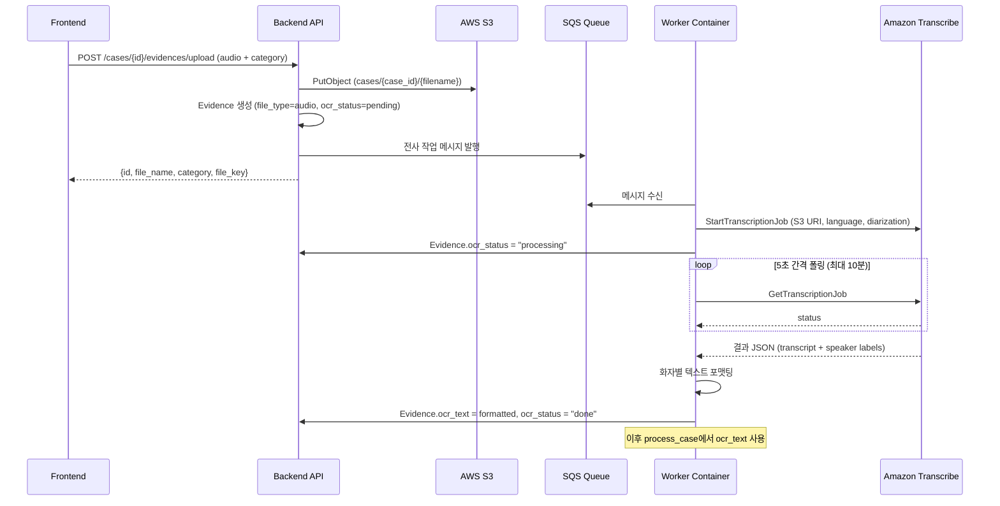

# Design Document: Speech-to-Text

## Overview

BADA에 오디오 업로드 → Amazon Transcribe 비동기 전사 → 결과 저장 → 기존 엔티티 추출 파이프라인 합류를 구현한다. 기존 OCR/번역/LLM 프로바이더와 동일한 팩토리 패턴(`get_transcriber()`)을 따르며, `PROVIDER_MODE`에 따라 `MockTranscriber`(로컬) / `AmazonTranscriber`(AWS)로 분기한다.

핵심 흐름:
1. 사용자가 오디오 파일 업로드 → S3 저장 + Evidence 레코드 생성 (`file_type="audio"`)
2. Worker가 SQS 메시지 소비 → Transcribe 잡 생성 → 5초 간격 폴링
3. 완료 시 화자 분리 결과를 `"Speaker 0: text\nSpeaker 1: text"` 형식으로 `Evidence.ocr_text`에 저장
4. `ocr_status="done"` 이후 기존 `process_case` 파이프라인이 동일하게 처리

## Architecture



### 설계 결정

| 결정 | 근거 |
|------|------|
| Evidence.ocr_text 재사용 (별도 transcript 컬럼 없음) | 기존 파이프라인이 ocr_text를 읽으므로 변경 최소화 |
| file_type="audio" 추가 (enum 확장) | 기존 image/pdf/text와 구분하여 라우팅 가능 |
| 기존 /upload 엔드포인트 확장 | 새 엔드포인트보다 프론트 변경 최소화 |
| 5초 폴링 + 10분 타임아웃 | Transcribe 평균 처리 시간 대비 합리적 간격 |
| 화자 분리 고정 활성화 (max 5) | 노동자-사업주 대화 시나리오에 충분 |

## Components and Interfaces

### 1. Provider Layer: `worker/providers/transcribe.py`

```python
class Transcriber(ABC):
    """전사 프로바이더 추상 인터페이스."""
    
    @abstractmethod
    def start_job(self, s3_uri: str, language_code: str, job_name: str) -> str:
        """전사 잡을 시작하고 job_name을 반환한다."""
        ...

    @abstractmethod
    def get_job_status(self, job_name: str) -> TranscriptionStatus:
        """잡의 현재 상태를 반환한다."""
        ...

    @abstractmethod
    def get_result(self, job_name: str) -> TranscriptionResult:
        """완료된 잡의 전사 결과를 반환한다."""
        ...


class MockTranscriber(Transcriber):
    """로컬 개발용. 즉시 고정 텍스트 반환."""
    ...


class AmazonTranscriber(Transcriber):
    """Amazon Transcribe API 래핑. 화자 분리 활성화."""
    ...


def get_transcriber() -> Transcriber:
    """PROVIDER_MODE에 따라 적절한 Transcriber 반환."""
    ...
```

### 2. Data Types

```python
@dataclass
class TranscriptionStatus:
    status: str          # "IN_PROGRESS" | "COMPLETED" | "FAILED"
    failure_reason: str | None = None

@dataclass
class TranscriptionResult:
    segments: list[SpeakerSegment]

@dataclass
class SpeakerSegment:
    speaker_label: str   # "Speaker 0", "Speaker 1", ...
    text: str
```

### 3. Worker 전사 서비스: `worker/services/transcription.py`

```python
def process_transcription(evidence_id: str, s3_key: str, language_code: str) -> None:
    """전사 전체 흐름 오케스트레이션.
    
    1. Evidence.ocr_status → "processing"
    2. Transcribe 잡 시작
    3. 5초 간격 폴링 (최대 10분)
    4. 결과 포맷팅 → Evidence.ocr_text 저장
    5. ocr_status → "done" (또는 "failed")
    """
    ...


def format_diarized_text(result: TranscriptionResult) -> str:
    """화자별 세그먼트를 'Speaker N: text' 형식으로 결합."""
    ...
```

### 4. Backend API 확장: `backend/app/routers/evidences.py`

기존 `/upload` 엔드포인트에 오디오 파일 처리 분기 추가:
- 확장자 기반 `file_type="audio"` 자동 감지
- `language_code` 파라미터 추가 (Form, optional)
- 파일 크기 200MB 제한 검증
- SQS에 전사 작업 메시지 발행

### 5. Frontend 확장

기존 업로드 카드 패턴에 "audio" 카테고리 추가:
- 오디오 파일 선택 UI
- 언어 선택 드롭다운 (기본: ko-KR)
- 전사 진행 상태 폴링 + 로딩 인디케이터
- 완료 시 화자별 텍스트 표시 (교대 스타일)

## Data Models

### Evidence 모델 변경

```python
# file_type 허용값 확장: "image" | "pdf" | "text" | "audio"
# 새 컬럼 없음 — ocr_text, ocr_status 재사용
```

기존 `Evidence` 모델은 변경 없이 `file_type="audio"` 값만 추가 사용한다.

### Transcribe Job Naming Convention

```
bada-{case_id[:8]}-{evidence_id[:8]}-{timestamp}
```

S3 URI 형식:
```
s3://{bucket}/cases/{case_id}/{filename}
```

### 지원 언어 코드 매핑

| BADA 언어 | Amazon Transcribe 코드 |
|-----------|----------------------|
| ko        | ko-KR               |
| vi        | vi-VN (지원 확인 필요) |
| en        | en-US               |
| th        | th-TH               |
| ja        | ja-JP               |
| id        | id-ID               |
| km        | km-KH (지원 제한)    |
| ne        | ne-NP (지원 제한)    |

### SQS 메시지 스키마

```json
{
  "task": "transcribe",
  "evidence_id": "uuid",
  "case_id": "uuid",
  "s3_key": "cases/{case_id}/{filename}",
  "language_code": "ko-KR"
}
```


## Correctness Properties

*A property is a characteristic or behavior that should hold true across all valid executions of a system — essentially, a formal statement about what the system should do. Properties serve as the bridge between human-readable specifications and machine-verifiable correctness guarantees.*

### Property 1: Audio upload creates correct Evidence record

*For any* file with a valid audio extension (mp3, mp4, wav, flac, ogg, amr, webm) and any valid case_id, uploading that file SHALL create an Evidence record with `file_type="audio"`, `ocr_status="pending"`, and `file_key` matching the pattern `cases/{case_id}/{filename}`.

**Validates: Requirements 1.1, 1.2**

### Property 2: Invalid audio extensions are rejected

*For any* file extension NOT in the set {mp3, mp4, wav, flac, ogg, amr, webm}, attempting to upload that file as audio SHALL result in an HTTP 422 response containing the list of supported formats.

**Validates: Requirements 1.3**

### Property 3: Valid language code acceptance and pass-through

*For any* language code in the set {ko-KR, vi-VN, en-US, th-TH, ja-JP, id-ID, km-KH, ne-NP}, the Transcription_Service SHALL accept the code and pass it unchanged to Amazon Transcribe as the LanguageCode parameter.

**Validates: Requirements 3.1, 3.3**

### Property 4: Invalid language code rejection

*For any* string NOT in the set of supported language codes, the Backend_API SHALL return HTTP 422 with the supported language codes list.

**Validates: Requirements 3.4**

### Property 5: Speaker diarization formatting

*For any* list of speaker segments (each with a speaker_label and text), `format_diarized_text` SHALL produce a string where each segment appears as `"Speaker {N}: {text}"` separated by newlines, preserving the original order and content.

**Validates: Requirements 4.2**

### Property 6: Transcription result storage round-trip

*For any* successful TranscriptionResult, the formatted text stored in Evidence.ocr_text SHALL equal the output of `format_diarized_text(result)`, and `ocr_status` SHALL be "done".

**Validates: Requirements 2.3, 4.3**

### Property 7: MockTranscriber performance constraint

*For any* valid s3_uri and language_code input, MockTranscriber SHALL return a complete response in less than 100 milliseconds.

**Validates: Requirements 6.4**

## Error Handling

### 전사 실패 시나리오

| 실패 유형 | 처리 전략 |
|-----------|-----------|
| Transcribe 잡 실패 (FAILED) | `ocr_status="failed"`, `failure_reason` 로깅 |
| 10분 타임아웃 | `ocr_status="failed"`, reason="timeout" |
| S3 접근 오류 | 잡 시작 전 실패 → `ocr_status="failed"`, reason="s3_access_error" |
| 지원하지 않는 오디오 형식 (Transcribe 거부) | `ocr_status="failed"`, reason="unsupported_format" |
| 빈 전사 결과 (무음 파일) | `ocr_text=""`, `ocr_status="done"` (빈 텍스트도 유효 결과) |

### 재시도 정책

- Transcribe 잡 실패 시 자동 재시도 **하지 않음** (사용자가 UI에서 수동 재시도)
- S3 업로드 실패: boto3 기본 재시도 (exponential backoff, 최대 3회)
- SQS 메시지 처리 실패: DLQ로 이동 (기존 SQS 설정 따름)

### 검증 계층

```
업로드 시 (Backend API):
  - 파일 확장자 검증 → 422
  - 파일 크기 검증 (200MB) → 413  
  - language_code 검증 → 422

처리 시 (Worker):
  - S3 URI 존재 확인
  - Transcribe 응답 파싱 실패 → failed + 로그
  - 결과가 빈 segments → 빈 문자열 저장 (유효)
```

## Testing Strategy

### Property-Based Tests (hypothesis)

Property-based testing 라이브러리: **hypothesis** (Python)

각 Property 테스트는 최소 100회 반복 실행하며, 설계 문서의 Property 번호를 태그한다.

```python
# 태그 형식 예시
# Feature: speech-to-text, Property 5: Speaker diarization formatting
```

대상 Properties:
1. **Property 1**: 유효 확장자 → 올바른 Evidence 생성 (임의의 유효 확장자 + 파일명 조합)
2. **Property 2**: 무효 확장자 → 422 거부 (임의의 비-오디오 확장자)
3. **Property 3**: 유효 language_code → 통과 및 전달 (유효 코드 집합에서 임의 선택)
4. **Property 4**: 무효 language_code → 422 거부 (임의의 무효 문자열)
5. **Property 5**: format_diarized_text 포맷 보존 (임의의 SpeakerSegment 리스트)
6. **Property 6**: 전사 결과 저장 라운드트립 (임의의 TranscriptionResult)
7. **Property 7**: MockTranscriber 100ms 이내 응답 (임의 입력)

### Unit Tests (pytest)

- 팩토리 패턴: `get_transcriber()` 반환 타입 검증 (PROVIDER_MODE별)
- 기본값: language_code 미지정 시 ko-KR 사용
- 타임아웃: 10분 초과 시 failed 처리 (mocked time)
- 상태 전이: pending → processing → done/failed
- 폴링: 5초 간격 sleep 호출 검증

### Integration Tests

- E2E 업로드 흐름: 실제 파일 → S3 → Evidence 생성 확인 (LocalStack 또는 Moto)
- Worker 처리 흐름: SQS 메시지 → 전사 완료 → DB 반영 (Moto mock)
- process_case 통합: audio evidence + ocr_text → 엔티티 추출 합류 검증
