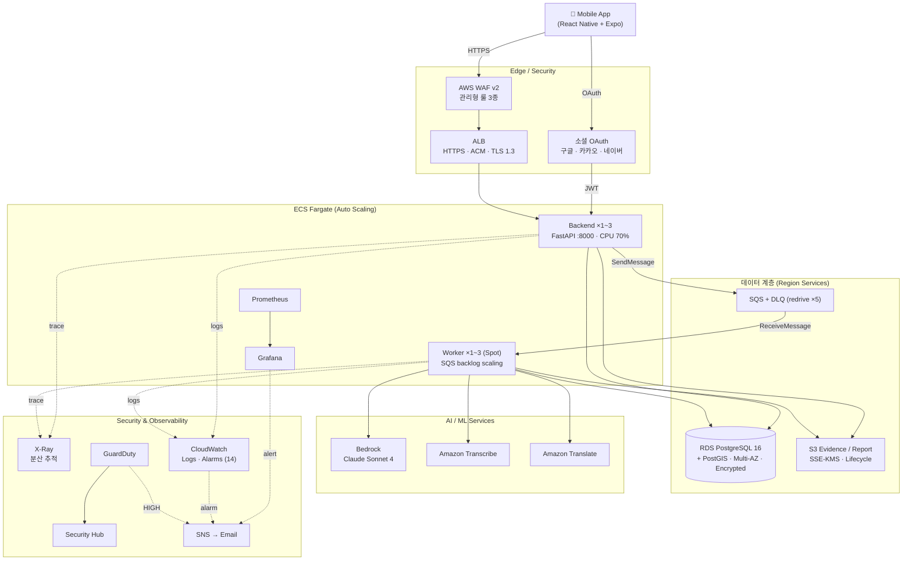
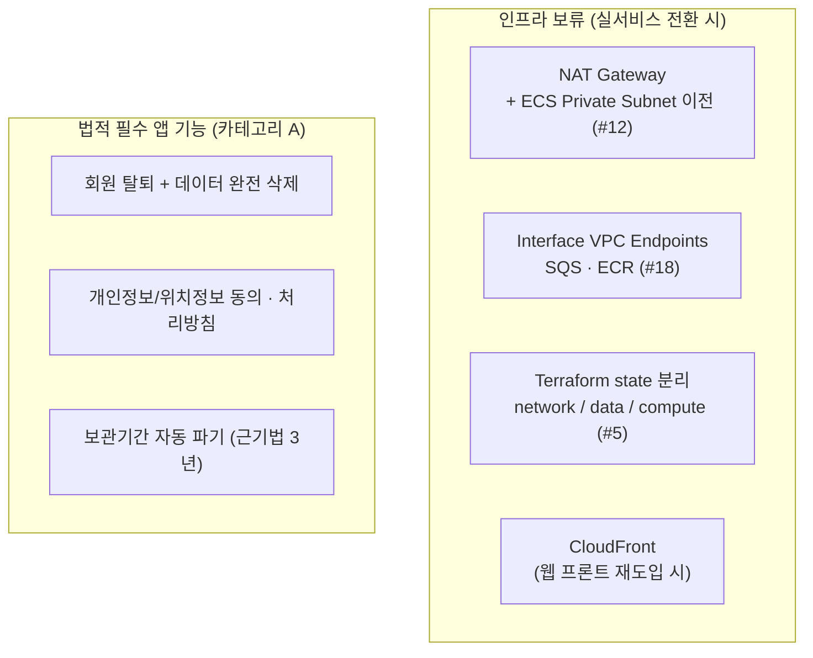

# BADA

외국인·취약 노동자가 흩어진 증거를 올리면, AI가 OCR·번역으로 사실관계를 구조화하여
**사건 타임라인 + 미지급 의심 금액 + 상담/신고 제출용 Evidence Pack(PDF)** 을 만들고,
다음 행동을 모국어로 안내하는 도구.

> ⚖️ BADA는 법률자문이 아니라 **상담 준비용 증거 정리 도구**입니다.
> 위법·체불 여부, 받을 금액을 확정하지 않습니다.

## 설계 원칙 (한 줄)

**계산·비교·정렬·판정은 규칙 기반 코드. 문장화·요약·OCR만 LLM.**
→ "AI가 금액을 잘못 계산하면?"에 "계산은 AI가 안 한다"고 답할 수 있다.

## 주요 기능

증거 정리(OCR/STT/분석/PDF) 외에 다음 애플리케이션 기능을 포함한다. 상세: `docs/서비스-기능-정의서.md`.

- **AI 상담 채팅** — 의도 분류 → 법적 리스크 차단 → RAG(pgvector) 검색 → Bedrock 답변 → 가드레일·면책
- **커뮤니티** — 게시글/댓글/반응/번역/신고/안전검사
- **카카오 챗봇** — 앱 미설치 사용자용 체불 진단·상태 조회(6자리 코드 연동)
- **GPS 근무 증거** — 지오펜스 + 해시 체인 위변조 방지
- **알림(notifications)**

## 리포 구조

```
backend/        FastAPI API 서버 (라우터 9 + 서비스 22)
worker/         분석 워커 (rules = 규칙엔진, llm = OCR·문장화)
mobile-native/  React Native + Expo 모바일 앱 (주력 프론트엔드)
prompts/        LLM 프롬프트 템플릿
infra/          Terraform (AWS IaC, .tf 15개)
monitoring/     Prometheus + Grafana 설정
eval/           평가셋 + 정확도 측정
docs/           프로젝트 문서 (README.md에 목차)
  architecture/   시스템 설계 (OCR, STT, 번역, GPS, Agent)
  infra/          인프라 설계/현황/로드맵
  operations/     운영/모니터링 가이드
  mobile/         모바일 E2E 테스트
  decisions/      의사결정 기록 (ADR)
  runbooks/       장애 대응 절차
  troubleshooting/ 트러블슈팅

# 레거시(운영 대상 아님)
frontend/       Next.js 15.5 웹 — frontend_enabled=false 로 배포 제외 (소스만 잔존)
mobile/         초기 Capacitor 앱 — mobile-native 전환 이전 방식
```

## 빠른 시작 (로컬)

```bash
# 1) DB (postgres + postgis)
docker compose up -d

# 2) 백엔드
cd backend && pip install -r requirements.txt
uvicorn app.main:app --reload

# 3) 규칙 엔진 테스트 (LLM/AWS 없이 동작)
cd worker && pip install -r requirements.txt && pytest -q

# 4) 모바일 앱 (Expo)
cd mobile-native && npm install && npx expo start
```

## 아키텍처

### 현재 (As-Is)

> 인증은 **소셜 OAuth(구글/카카오/네이버) 직접 구현 + 자체 HS256 JWT**. (Cognito는 미사용 레거시)
> NAT Gateway 없이 **S3 Gateway Endpoint(무료)** + public subnet 배치로 운영한다.



### 남은 목표 (To-Be)

> WAF·X-Ray·GuardDuty·Security Hub·Auto Scaling·RDS Multi-AZ·Fargate Spot은 **이미 As-Is에 반영됨**.
> 아래는 종료 일정·비용 대비 의도적으로 **보류**한 항목이다. 상세: `aidlc-docs/remaining-tasks-20260702.md`.



> 상세 설계·잔여 로드맵: `docs/infra/implementation-status.md` · 의사결정: `docs/decisions/decision-record-20260625.md`

## 스택

| 카테고리 | 서비스 |
|----------|--------|
| **컴퓨트** | ECS Fargate (ARM64, Auto Scaling) · Worker FARGATE_SPOT · ECR · ALB (HTTPS/ACM/TLS1.3) |
| **데이터** | RDS PostgreSQL + PostGIS (Multi-AZ, encrypted) · S3 (SSE-KMS · Lifecycle) · SQS + DLQ |
| **인증** | 소셜 OAuth (구글/카카오/네이버) + 자체 HS256 JWT (`bada://` 딥링크) — *Cognito는 미사용 레거시* |
| **AI** | Bedrock Claude Sonnet 4 · Titan Embeddings (RAG/pgvector) · Amazon Translate · Amazon Transcribe |
| **관측성** | CloudWatch Logs/Alarms · Prometheus · Grafana · X-Ray · SNS Alert |
| **보안** | AWS WAF v2 · GuardDuty · Security Hub · Secrets Manager · SSM Parameter Store |
| **PDF** | WeasyPrint (다국어 폰트 임베딩) |
| **모바일** | React Native · Expo · EAS Build |
| **IaC** | Terraform · GitHub Actions OIDC |

**금지 스택**: K8s, Kafka, OpenAI, Textract, ReportLab — 사유는 `.kiro/steering/` 참조.

## 배포 현황

| 서비스 | URL | 상태 |
|--------|-----|------|
| Backend API | `https://api.badasoft.com` | ✅ |
| Grafana | `https://monitor.badasoft.com` | ✅ |
| 모바일 앱 | EAS Build (수동 `workflow_dispatch`) Preview APK | 🔄 구현 중 |

> `https://badasoft.com`은 웹 프론트 제거(`frontend_enabled=false`) 이후 Backend 폴백이다.

## 인프라 운영 기준

- 프로젝트 운영 기간: `2026-06-04` ~ `2026-07-10`
- 팀 전체 AWS 총 예산: `1,500달러`
- 비용 통제: `Worker Fargate Spot`, `Fargate 최소 사양`, `로그 보존기간 단축`, `S3 Lifecycle`, `종료 토글`
- 상세: `docs/infra/implementation-status.md`

## 문서

`docs/README.md` 참조. 주요 문서:

- [인프라 현황 · 프로덕션 로드맵](docs/infra/implementation-status.md)
- [의사결정 기록](docs/decisions/decision-record-20260625.md)
- [장애 대응 런북](docs/runbooks/)
- [남은 태스크](aidlc-docs/remaining-tasks-20260702.md)
- [팀 태스크 배분](aidlc-docs/team-task-distribution.md)

## CI

- **CI**: pytest + coverage + bandit(SAST) + ruff(lint) + pip-audit(SCA) — PR마다 자동 실행
- **Terraform Plan in PR**: `infra/**` 변경 시 읽기전용 plan-role로 fmt/validate/plan 자동 코멘트

## CD / 배포 전략

- **Backend CD**: `develop` push → ECR → ECS 배포 → ALB `/health` 200 게이트
- **Worker CD**: 동일 구조 (`worker/**` 변경 시)
- **배포 방식**: ECS **Rolling Update** + **Deployment Circuit Breaker(자동 롤백)** — backend/worker/frontend 전 서비스 적용. Blue/Green(CodeDeploy)은 의도적 보류(서킷 브레이커로 갈음)
- **수동 롤백**: backend 전용 `rollback-dev-backend.yml`, worker/grafana는 ECS CLI
- **모바일**: EAS Build (수동 `workflow_dispatch`)

## 테스트

```bash
# 전체 테스트 (backend ~50 · worker ~168 + PBT)
cd backend && pytest -q
cd worker && pytest -q

# 커버리지 포함
pip install -r dev-requirements.txt
cd worker && pytest --cov=. --cov-report=term-missing
cd backend && pytest --cov=app --cov-report=term-missing
```
