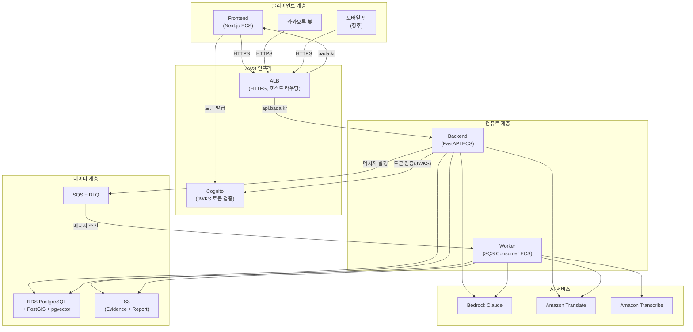

# 컴포넌트 의존성 관계

## 의존성 다이어그램



## 의존성 매트릭스

| 소스 → 대상 | RDS | S3 | SQS | Cognito | Bedrock | Translate | Transcribe | ALB |
|---|---|---|---|---|---|---|---|---|
| **Frontend** | - | - | - | 토큰 발급 | - | - | - | API 호출 |
| **Backend** | CRUD | 파일 저장/조회 | 발행 | JWKS 검증 | OCR/챗봇 | 번역 | - | 수신 |
| **Worker** | CRUD (직접) | 파일 조회/PDF 저장 | 수신 | - | OCR/요약 | 번역 | 전사 | - |

## 통신 패턴

| 패턴 | 소스 → 대상 | 프로토콜 | 특성 |
|------|------------|----------|------|
| 동기 요청-응답 | Frontend → Backend | HTTPS (REST) | CORS, Bearer 토큰 |
| 동기 요청-응답 | Backend → Bedrock | AWS SDK (HTTPS) | IAM 역할 기반 |
| 동기 요청-응답 | Backend → RDS | TCP (PostgreSQL + TLS) | Connection pool |
| 비동기 메시지 | Backend → SQS → Worker | SQS Long Polling | 멱등성, DLQ |
| 비동기 작업 | Worker → Transcribe | AWS SDK (폴링) | 작업 완료 대기 |
| 이벤트 알림 | CloudWatch → SNS → 이메일 | SNS | 운영 알림 |

## 데이터 흐름 (핵심 시나리오)

### 시나리오 1: 증거 업로드 → 분석 완료

```
1. [Frontend] 파일 선택 + 카테고리 → POST /cases/{id}/evidences/upload
2. [Backend] S3 저장 → Evidence 레코드 생성 → OCR 즉시 호출(소파일) 또는 SQS 발행
3. [Frontend] POST /cases/{id}/analyze → Backend가 SQS analyze_case 발행
4. [Worker] SQS 수신 → DB에서 Case+Evidence 조회 → 파이프라인 실행
5. [Worker] 결과 DB 저장 + PDF S3 저장 + Case.status='completed'
6. [Frontend] 폴링(GET /cases/{id}/analysis) → 결과 표시
```

### 시나리오 2: Cognito 로그인

```
1. [Frontend] 로그인 버튼 → Cognito Hosted UI 리다이렉트
2. [Cognito] 사용자 인증 → callback URL로 authorization code 반환
3. [Frontend] code → Cognito token endpoint → Access/Refresh Token 수신
4. [Frontend] Access Token을 localStorage에 저장
5. [Frontend] API 호출 시 Authorization: Bearer <token> 헤더 첨부
6. [Backend] JWKS로 토큰 서명 검증 → claims.sub로 User 조회/생성
```

## 배포 의존성 순서

```
1. Infrastructure (Terraform) — HTTPS, Frontend ECS, Worker 기동
   ↓
2. Backend — 보안 강화, Cognito JWKS 검증
   ↓ (병렬)
3. Worker — 2단계 전환 (DB 직접), STT 구현
4. Frontend — Next.js 빌드/배포 (Backend API 의존)
   ↓
5. 통합 검증 — E2E 흐름
```
