# 서비스 계층 정의

## 서비스 아키텍처 개요

```mermaid
flowchart LR
    subgraph Frontend["Frontend (Next.js ECS)"]
        Auth["인증 서비스"]
        Pages["페이지 렌더링"]
    end

    subgraph Backend["Backend (FastAPI ECS)"]
        AuthSvc["인증 검증 서비스"]
        CaseSvc["사건 관리 서비스"]
        EvidenceSvc["증거 관리 서비스"]
        AnalysisSvc["분석 오케스트레이션"]
        ChatSvc["챗봇 서비스"]
        QueueSvc["큐 발행 서비스"]
    end

    subgraph Worker["Worker (SQS Consumer ECS)"]
        DispatchSvc["디스패치 서비스"]
        PipelineSvc["분석 파이프라인"]
        TranscribeSvc["전사 서비스"]
        PdfSvc["PDF 생성 서비스"]
    end

    Frontend -->|"HTTPS/CORS"| Backend
    Backend -->|"SQS"| Worker
    Worker -->|"DB 직접"| DB[(RDS)]
    Backend -->|"DB"| DB
```



## 서비스 상세

### 1. 인증 서비스 (Frontend + Backend 협업)

| 구분 | 책임 |
|------|------|
| **Frontend** | Cognito Hosted UI 리다이렉트, Authorization Code 수신, Token 교환, Access Token 저장/갱신 |
| **Backend** | Access Token 검증(JWKS), User 조회/생성, 소셜 로그인 콜백(카카오/구글) → 자체 JWT 또는 Cognito 연계 |

**흐름**:
```
1. 사용자 → Frontend 로그인 클릭
2. Frontend → Cognito Hosted UI (또는 카카오/구글 OAuth URL)
3. 인증 완료 → callback으로 authorization code 수신
4. Frontend → Cognito token endpoint (code → Access/ID/Refresh Token)
5. Frontend → Backend API 호출 시 Authorization: Bearer <Access Token>
6. Backend → Cognito JWKS로 서명 검증 → claims에서 sub 추출 → User 매핑
```

### 2. 분석 오케스트레이션 서비스

| 모드 | 흐름 |
|------|------|
| **동기 (소규모)** | Frontend → Backend `/analyze` → 규칙엔진 직접 실행 → 결과 반환 |
| **비동기 (대규모)** | Backend → SQS `analyze_case` 발행 → Worker가 전체 파이프라인 실행 → DB 저장 → Frontend 폴링 |

### 3. Worker 분석 파이프라인 서비스

**2단계 전환 설계** — Worker가 DB에 직접 접근:

```
SQS 메시지 수신 (case_id)
  → DB에서 Case + Evidence 조회
  → OCR (Bedrock Claude Vision / Upstage)
  → 규칙 기반 분석 (wage, deductions, geofence, compare, legal)
  → 번역 (Amazon Translate)
  → 타임라인 구성 + LLM 문장화
  → 요약 (LLM + guardrails)
  → PDF 생성 (WeasyPrint)
  → DB에 결과 저장 (AnalysisResult, TimelineEvent, TranslationPair)
  → S3에 PDF 저장
  → Case.status = 'completed'
```

**환경변수**: `DATABASE_URL` (Secrets Manager에서 주입, 이미 Terraform에 준비됨)

### 4. 음성 전사 서비스

```
SQS 메시지 수신 (evidence_id, s3_key, language_code)
  → Transcribe StartTranscriptionJob (s3_uri, language)
  → 폴링 대기 (GetTranscriptionJob)
  → 결과 텍스트 → DB Evidence.ocr_text 저장
  → Evidence.ocr_status = 'done'
```

### 5. PDF 생성 서비스

```
분석 완료 후 호출
  → Jinja2 HTML 템플릿 렌더 (타임라인 + 차액표 + GPS + 면책고지)
  → WeasyPrint HTML → PDF 변환
  → S3 Report Bucket 업로드
  → DB에 s3_key 저장
```

### 6. 챗봇 서비스 (기존 유지)

```
사용자 메시지 수신
  → 언어 감지
  → 의도 분류 (intent_classifier)
  → 법률 위험 감지 (legal_risk_classifier)
  → RAG 문서 검색 (rag_retriever)
  → 사건 컨텍스트 조회 (case_context_service)
  → LLM 응답 생성 (Bedrock Claude)
  → 가드레일 필터 (guardrail_service)
  → 모국어 번역 (필요 시)
  → 응답 반환
```
