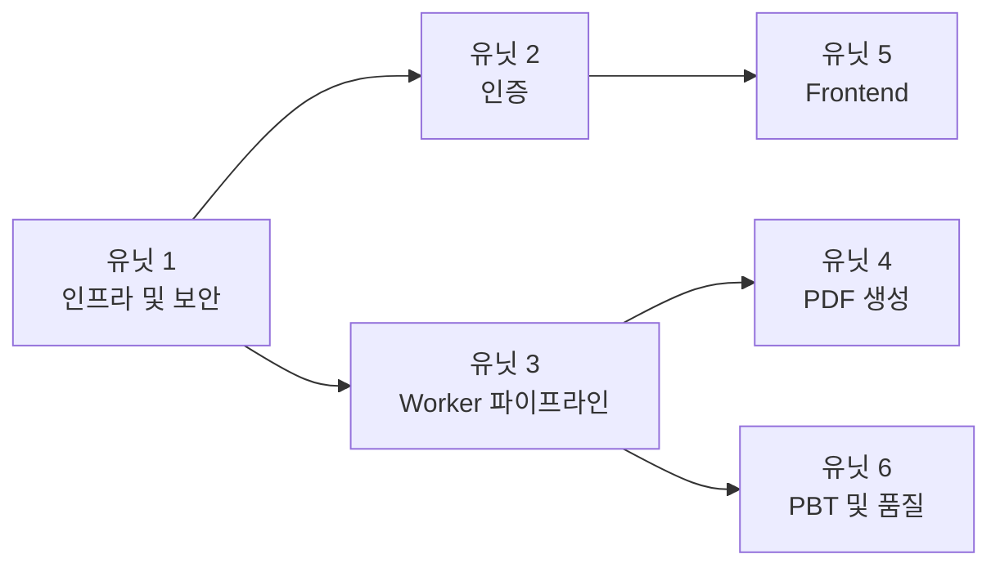

# 유닛 의존성 매트릭스

## 의존성 다이어그램



## 의존성 매트릭스

| | 유닛 1 | 유닛 2 | 유닛 3 | 유닛 4 | 유닛 5 | 유닛 6 |
|---|---|---|---|---|---|---|
| **유닛 1** (인프라) | - | | | | | |
| **유닛 2** (인증) | 의존 | - | | | | |
| **유닛 3** (Worker) | 의존 | | - | | | |
| **유닛 4** (PDF) | | | 의존 | - | | |
| **유닛 5** (Frontend) | | 의존 | | | - | |
| **유닛 6** (PBT) | | | 의존 | | | - |

## 실행 순서 (순차)

```
유닛 1 (인프라/보안)
  → 유닛 2 (인증)
    → 유닛 3 (Worker)
      → 유닛 4 (PDF)
        → 유닛 5 (Frontend)
          → 유닛 6 (PBT)
```

## 의존성 상세

| 소스 → 대상 | 의존 이유 | 차단 여부 |
|---|---|---|
| 유닛 2 → 유닛 1 | HTTPS 도메인이 있어야 Cognito callback URL 설정 가능 | 차단 |
| 유닛 3 → 유닛 1 | Worker ECS 기동 + DATABASE_URL Secret 주입 필요 | 차단 |
| 유닛 4 → 유닛 3 | 분석 결과 데이터가 있어야 PDF 생성 가능 | 차단 |
| 유닛 5 → 유닛 2 | 인증이 동작해야 Frontend 로그인 테스트 가능 | 차단 |
| 유닛 6 → 유닛 3 | Worker 규칙엔진 안정화 후 PBT 적용 | 부분 차단 (PBT 작성은 선행 가능) |

## 공유 리소스

| 리소스 | 사용 유닛 | 충돌 가능성 |
|--------|----------|-----------|
| `infra/main.tf` | 유닛 1, 2 | 낮음 (순차 실행) |
| `backend/app/deps.py` | 유닛 2 | 낮음 (단독 수정) |
| `worker/Dockerfile` | 유닛 3, 4 | 낮음 (순차 실행) |
| `worker/handlers/` | 유닛 3 | 없음 |
| `.github/workflows/` | 유닛 1, 5, 6 | 낮음 (파일 분리) |
