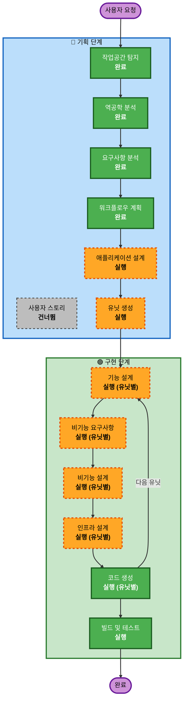

# 실행 계획

## 상세 분석 요약

### 변환 범위
- **변환 유형**: 아키텍처 확장 (기존 시스템 완성 + 프론트엔드 분리 + 보안 강화)
- **주요 변경**: 인증 완성, Worker 활성화, Next.js 프론트엔드 추가, HTTPS, 보안 강화, STT/PDF 완성
- **관련 컴포넌트**: Backend, Worker, Frontend(신규), Infrastructure, CI/CD

### 변경 영향 평가
- **사용자 대면 변경**: 있음 — 새 프론트엔드(Next.js), 인증 전환, 다국어 개선
- **구조 변경**: 있음 — Frontend 별도 배포 추가, Worker 활성화
- **데이터 모델 변경**: 없음 — 기존 모델 활용
- **API 변경**: 소규모 — 보안 헤더 추가, CORS 제한, Rate limiting
- **비기능 영향**: 있음 — Security Baseline, Resiliency, PBT 전체 적용

### 컴포넌트 관계도
```
Frontend (Next.js, 신규) → ALB → Backend API
                                    ↓
                              SQS → Worker
                                    ↓
                         RDS / S3 / Bedrock / Translate / Transcribe
```

- **주요 컴포넌트**: Backend (보안 강화), Worker (활성화), Frontend (신규)
- **인프라 컴포넌트**: Terraform (HTTPS, Frontend 배포, Worker 기동)
- **지원 컴포넌트**: CI/CD (Frontend 배포 파이프라인 추가)

### 위험도 평가
- **위험 수준**: 중상
- **롤백 복잡도**: 보통 (각 유닛 독립 배포 가능)
- **테스트 복잡도**: 높음 (E2E 흐름 + 보안 + PBT)

---

## 워크플로우 시각화



---

## 실행할 단계

### 🔵 기획 단계 (INCEPTION)
- [x] 작업공간 탐지 (완료)
- [x] 역공학 분석 (완료)
- [x] 요구사항 분석 (완료)
- [x] 사용자 스토리 — **건너뜀**
  - **사유**: 요구사항이 명확하고 기존 문서(product.md, domain.md)에 페르소나·사용자 흐름이 정의됨
- [x] 워크플로우 계획 (진행 중)
- [ ] 애플리케이션 설계 — **실행**
  - **사유**: Next.js 프론트엔드 추가, Worker-Backend 연동 설계, 인증 흐름 설계 필요
- [ ] 유닛 생성 — **실행**
  - **사유**: 6개+ 독립 작업 단위(인증, Worker, Frontend, Infra, PDF, STT)로 분해 필요

### 🟢 구현 단계 (CONSTRUCTION, 유닛별 반복)
- [ ] 기능 설계 — **실행**
  - **사유**: 유닛별 비즈니스 로직 상세 설계 (인증 흐름, STT 처리, PDF 렌더)
- [ ] 비기능 요구사항 — **실행**
  - **사유**: Security Baseline(15규칙) + Resiliency + PBT 모두 활성화됨
- [ ] 비기능 설계 — **실행**
  - **사유**: 보안 헤더, Rate limiting, 복원력 패턴 설계
- [ ] 인프라 설계 — **실행**
  - **사유**: HTTPS/ACM, Frontend 배포(CloudFront/S3), Worker 기동, 도메인 준비
- [ ] 코드 생성 — **실행** (항상)
- [ ] 빌드 및 테스트 — **실행** (항상)

### 🟡 운영 단계 (OPERATIONS)
- [ ] 운영 — 향후 확장 예정

---

## 유닛 분해 (예상)

| 유닛 | 주요 범위 | 우선순위 | 의존성 |
|------|----------|----------|--------|
| **유닛 1: 인프라 및 보안** | HTTPS/ACM, 보안 헤더, CORS, Rate limit, Worker 기동 | P0 | 없음 |
| **유닛 2: 인증** | Cognito 완성 + 카카오/구글 소셜 로그인 | P0 | 유닛 1 |
| **유닛 3: Worker 파이프라인** | 전체 활성화 + STT 구현 + Bedrock 검증 | P0 | 유닛 1 |
| **유닛 4: PDF 생성** | WeasyPrint + 다국어 폰트 + Evidence Pack 렌더 | P1 | 유닛 3 |
| **유닛 5: 프론트엔드 (Next.js)** | 전체 화면 + 다국어 + 배포 | P1 | 유닛 2 |
| **유닛 6: PBT 및 품질** | Hypothesis 도입 + 규칙 엔진 테스트 + CI 통합 | P1 | 유닛 3 |

---

## 예상 일정 (6/22 → 6/30 목표, 주말 제외)

| 날짜 | 집중 영역 |
|------|----------|
| 6/22(월) | 애플리케이션 설계 + 유닛 생성 |
| 6/23(화) | 유닛 1 (인프라/보안) — 설계 → 코드 |
| 6/24(수) | 유닛 2 (인증) + 유닛 3 (Worker) 병렬 |
| 6/25(목) | 유닛 4 (PDF) + 유닛 5 (프론트엔드) 시작 |
| 6/26(금) | 유닛 5 (프론트엔드) 계속 + 유닛 6 (PBT) |
| 6/27~28(토·일) | **휴무** |
| 6/29(월) | 유닛 5 완성 + 통합 테스트 |
| 6/30(화) | E2E 검증, 배포 완료 |

---

## 성공 기준
- **주요 목표**: BADA MVP 프로덕션 배포 완료 (HTTPS, 인증, 전체 분석 흐름 동작)
- **핵심 산출물**:
  - ALB HTTPS 적용 + 인증 동작
  - Worker 실행 + 분석 E2E 완료
  - Next.js 프론트엔드 배포
  - PDF Evidence Pack 생성
  - 음성 전사 동작
  - PBT CI 통과
- **품질 게이트**:
  - Security Baseline 15개 규칙 준수
  - Worker E2E 분석 1건 이상 성공
  - Frontend → Backend → Worker → 결과 표시 전체 흐름
  - PBT 규칙 엔진 테스트 통과
