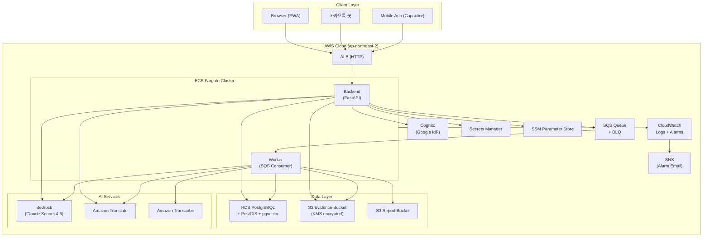
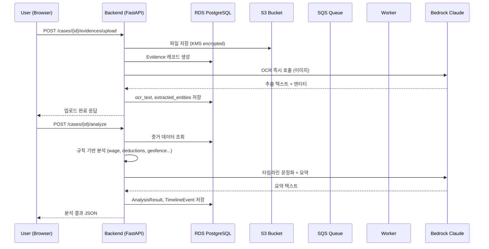

# System Architecture

## System Overview

BADA는 **Backend API + Worker + Static Frontend** 3-컴포넌트 구조로 AWS ECS Fargate 위에서 실행된다. Backend가 사용자 요청을 처리하고, 비동기 분석은 SQS를 통해 Worker에 위임한다. 핵심 설계 원칙은 "계산·비교·정렬·판정은 규칙 코드, 문장화·요약·OCR만 LLM"이다.

## Architecture Diagram

## Component Descriptions

### Backend (FastAPI API Server)
- **Purpose**: 모든 클라이언트 요청의 단일 진입점
- **Responsibilities**: REST API, 인증, 파일 업로드/다운로드, OCR 즉시 호출, 분석 오케스트레이션(동기), SQS 메시지 발행(비동기), AI 챗봇, GPS 수집, 커뮤니티
- **Dependencies**: RDS, S3, SQS, Cognito, Bedrock, Translate, Secrets Manager
- **Type**: Application

### Worker (SQS Consumer)
- **Purpose**: 장시간 비동기 분석 처리
- **Responsibilities**: SQS 폴링, 메시지 디스패치(analyze_case, transcribe), 규칙 기반 분석 파이프라인, PDF 렌더
- **Dependencies**: SQS, RDS, S3, Bedrock, Translate, Transcribe
- **Type**: Application

### Frontend (Static)
- **Purpose**: 사용자 인터페이스 (Backend가 서빙하는 정적 파일)
- **Responsibilities**: 사건 CRUD, 증거 업로드, 결과 표시, GPS 지도뷰, 챗봇 UI, 커뮤니티, i18n
- **Dependencies**: Backend API
- **Type**: Application (static, served by Backend)

### Infrastructure (Terraform)
- **Purpose**: 전체 AWS 리소스 IaC 관리
- **Responsibilities**: VPC, Subnets, ALB, ECS, ECR, RDS, S3, SQS, Cognito, IAM, CloudWatch, SNS
- **Dependencies**: AWS Provider
- **Type**: Infrastructure

## Data Flow

## Integration Points

- **External APIs**:
  - AWS Bedrock (Claude Sonnet 4.6) — OCR, 문장화, 요약, 챗봇
  - Amazon Translate — 다국어 번역
  - Amazon Transcribe — 음성 전사 (구현 중)
  - Upstage Document Parse — 정형 문서 OCR
  - 카카오톡 스킬 API — 챗봇 연동

- **Databases**:
  - RDS PostgreSQL + PostGIS — 핵심 데이터
  - pgvector 확장 — RAG 임베딩 벡터 검색

- **Third-party Services**:
  - Google OAuth (via Cognito) — 소셜 로그인
  - 카카오 OAuth — 소셜 로그인
  - 네이버 OAuth — 소셜 로그인

## Infrastructure Components

- **ECS Cluster**: Backend(desired=1) + Worker(desired=0, 대기)
- **ALB**: Public subnet, HTTP listener (HTTPS 미적용)
- **RDS**: PostgreSQL Single-AZ, private subnet, PostGIS + pgvector 확장
- **S3**: Evidence Bucket(KMS-SSE) + Report Bucket(KMS-SSE)
- **SQS**: Analysis Queue(visibility 15min, long-poll 20s) + DLQ
- **Cognito**: User Pool + Google IdP, Authorization Code Grant
- **VPC**: 2 Public Subnets(ALB/ECS) + 2 Private Subnets(RDS), NAT Gateway 미사용
- **Deployment Model**: GitHub Actions OIDC → ECR push → ECS Service update
- **Networking**: ALB/ECS public subnet, RDS private subnet, Security Groups 분리
