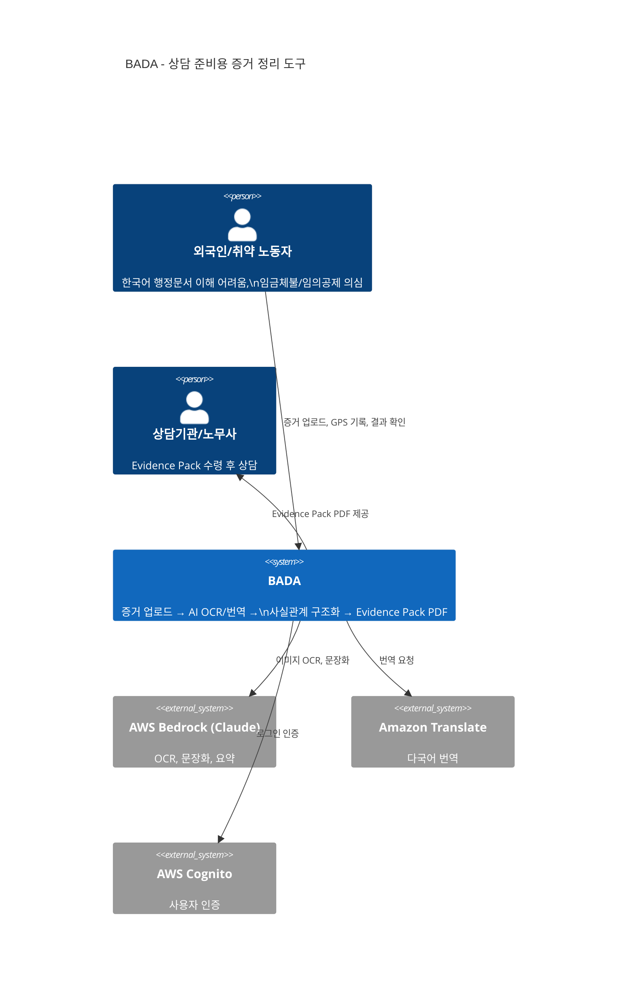

# Business Overview

## Business Context Diagram

## Business Description

- **Business Description**: BADA는 외국인·취약 노동자가 흩어진 증거(급여명세서, 계약서, 카톡 대화, 통장 입금내역, GPS 위치 로그)를 업로드하면, AI가 OCR·번역으로 사실관계를 구조화하여 **사건 타임라인 + 미지급 의심 금액 + 상담/신고 제출용 Evidence Pack(PDF)**을 생성하고, 다음 행동을 모국어로 안내하는 도구이다. 법률자문이 아닌 **상담 준비용 증거 정리 도구**로 포지셔닝된다.

- **Business Transactions**:

| # | 트랜잭션 | 설명 |
|---|---------|------|
| BT-1 | 사건 생성 | 사용자가 사업장·사업주·근무기간·시급·문제유형을 입력하여 사건(Case)을 생성 |
| BT-2 | 증거 업로드 | 이미지/PDF/음성 파일을 카테고리와 함께 업로드, S3 저장 |
| BT-3 | OCR/엔티티 추출 | 업로드된 증거에서 텍스트·구조화 엔티티(금액, 날짜, 시급 등) 추출 |
| BT-4 | 사건 분석 | 규칙 기반으로 차액·공제·누락·GPS·타임라인·비교 수행, LLM으로 요약 |
| BT-5 | GPS 수집/교차검증 | 위치 핑 수신, 지오펜스 판정(IN/OUTSIDE), 카톡 발화와 교차검증 |
| BT-6 | AI 챗봇 상담 | RAG 기반 노동법 안내, 절차 안내, 모국어 응답 |
| BT-7 | Evidence Pack 생성 | WeasyPrint로 제출용(ko) PDF 렌더 |
| BT-8 | 커뮤니티 | 익명 게시판(게시글·댓글·번역·좋아요·신고) |
| BT-9 | 카카오톡 봇 연동 | 카카오 스킬 메시지 수신, 계정 연동, 증거/GPS/분석 연동 |

- **Business Dictionary**:

| 용어 | 의미 |
|------|------|
| Evidence Pack | 사건의 분석 결과를 모아 상담기관 제출용으로 렌더한 PDF 문서 |
| Case (사건) | 하나의 임금체불/분쟁 사안 단위. 사용자 1명이 여러 사건 가능 |
| Evidence (증거) | 사건에 첨부된 개별 파일(이미지, PDF, 텍스트) |
| 규칙 기반 (Rule-based) | LLM 없이 결정론적으로 계산·판정하는 로직 (차액, 공제, 지오펜스) |
| 미지급 의심 금액 | 기대급여 - 실수령 차액. "확정"이 아닌 "의심"으로만 표기 |
| 지오펜스 (Geofence) | 사업장 중심좌표 + 반경으로 정의된 근무지 경계 |
| 교차검증 | GPS 위치 + 카톡 도착 발화 시간 매칭으로 정황 일치 확인 |
| OCR 엔티티 | 이미지/문서에서 추출한 구조화 데이터 (금액, 날짜, 이름 등) |
| 면책 고지 (Disclaimer) | 모든 결과물에 필수 노출되는 "법률자문 아님" 안내 |

## Component Level Business Descriptions

### Backend (FastAPI API Server)
- **Purpose**: 사용자 요청 수신, 데이터 CRUD, 분석 실행, 인증, 파일 관리의 중앙 진입점
- **Responsibilities**: REST API 제공, 인증/인가, 파일 업로드/다운로드, OCR 호출, 분석 오케스트레이션, AI 챗봇, GPS 수집, 커뮤니티 게시판, 카카오톡 연동

### Worker (SQS Consumer)
- **Purpose**: 비동기 분석 파이프라인 실행 — SQS에서 작업을 받아 규칙 기반 분석 + LLM 보조 처리
- **Responsibilities**: SQS 메시지 디스패치, 사건 분석(pipeline.py), 음성 전사(미구현), 규칙 엔진(wage/deductions/geofence/compare/legal), LLM 문장화/요약

### Frontend (Static HTML + Vanilla JS)
- **Purpose**: 사용자 인터페이스 — 모바일 우선 PWA
- **Responsibilities**: 사건 생성/관리, 증거 업로드, 결과 표시(타임라인, 분석, GPS 지도), 다국어 UI, 커뮤니티 게시판, AI 챗봇 인터페이스

### Infrastructure (Terraform)
- **Purpose**: AWS 클라우드 인프라 정의 및 프로비저닝
- **Responsibilities**: VPC/서브넷, ECS Fargate(Backend+Worker), RDS PostgreSQL, S3, SQS+DLQ, ALB, ECR, Cognito, Secrets Manager, SSM, CloudWatch, IAM

### Mobile (Capacitor Wrapper)
- **Purpose**: 웹앱을 네이티브 앱으로 감싸는 래퍼 (스트레치 목표)
- **Responsibilities**: Capacitor 기반 iOS/Android 패키징, 백그라운드 GPS 추적(미구현)

### Eval (평가 하네스)
- **Purpose**: OCR/분석 정확도 측정
- **Responsibilities**: 골든 데이터셋 기반 OCR 점수 산출, 회귀 검증
