# Code Structure

## Build System
- **Type**: pip (requirements.txt) + Docker + Terraform
- **Configuration**:
  - `backend/requirements.txt` — Backend Python dependencies
  - `worker/requirements.txt` — Worker Python dependencies
  - `backend/Dockerfile` — Backend container image
  - `worker/Dockerfile` — Worker container image
  - `docker-compose.yml` — 로컬 PostgreSQL + PostGIS
  - `infra/*.tf` — Terraform AWS infrastructure

## Module Hierarchy

```mermaid
graph TD
    subgraph Backend["backend/app/"]
        Main["main.py (FastAPI app)"]
        Config["config.py (Settings)"]
        DB["db.py (SQLAlchemy engine)"]
        Models["models.py (ORM models)"]
        Deps["deps.py (Auth dependencies)"]
        Errors["errors.py (Error handlers)"]

        subgraph Routers["routers/"]
            RCases["cases.py"]
            REvidences["evidences.py"]
            RAnalysis["analysis.py"]
            RGps["gps.py"]
            RAiChat["ai_chat.py"]
            RAuth["auth.py"]
            RKakao["kakao.py"]
            RCommunity["community.py"]
        end

        subgraph Services["services/"]
            SAnalysis["analysis_service.py"]
            SOcr["ocr_service.py"]
            SLlm["llm_service.py"]
            SMock["mock_llm_service.py"]
            SAuth["auth_service.py"]
            SCognito["cognito_auth_service.py"]
            SStorage["storage.py"]
            SS3["s3.py"]
            SQueue["queue.py"]
            SRag["rag_retriever.py"]
            SEmbedding["embedding_service.py"]
            SChat["ai_chat_orchestrator.py"]
            SGuardrail["guardrail_service.py"]
            SIntent["intent_classifier.py"]
            SLang["language_service.py"]
            STerm["terminology_service.py"]
            SReport["report_builder.py"]
            SLegal["legal_risk_classifier.py"]
            SCommunity["community_service.py"]
            SJobs["jobs.py"]
            SIntake["intake_service.py"]
            SContext["case_context_service.py"]
        end
    end

    subgraph Worker["worker/"]
        Consumer["consumer.py (SQS poll loop)"]
        Pipeline["pipeline.py (process_case)"]
        WConfig["config.py"]

        subgraph Handlers["handlers/"]
            HAnalysis["analysis.py"]
            HTranscription["transcription.py"]
        end

        subgraph Rules["rules/"]
            RWage["wage.py"]
            RDeductions["deductions.py"]
            RGeofence["geofence.py"]
            RMissing["missing.py"]
            RCompare["compare.py"]
            RLegal["legal.py"]
            RGuardrails["guardrails.py"]
            RSanity["sanity.py"]
            RConfidence["confidence.py"]
            RChat["chat_evidence.py"]
            RCategory["category_keywords.py"]
        end

        subgraph Providers["providers/"]
            POcr["ocr.py (ClaudeVision/Upstage)"]
            PLlm["llm.py (Bedrock/Mock)"]
            PTranslate["translate.py (Amazon/Mock)"]
            PTranscribe["transcribe.py (AWS Transcribe)"]
            PClassify["classify.py"]
            PSchema["schema.py (Pydantic)"]
            PBedrock["_bedrock.py"]
            PUpstage["_upstage.py"]
            PParseur["_parseur.py"]
            PLangConfig["language_config.py"]
        end

        subgraph WServices["services/"]
            WTimeline["timeline.py"]
            WTranslation["translation.py"]
            WExtract["extract.py"]
            WIntake["evidence_intake.py"]
            WTranscription["transcription.py"]
        end
    end
```

## Existing Files Inventory

### Backend Core
- `backend/app/main.py` — FastAPI app setup, middleware, static file serving, health endpoints
- `backend/app/config.py` — Pydantic Settings with all env vars (DB, auth, AI, storage modes)
- `backend/app/db.py` — SQLAlchemy engine/session factory, init_db(), health check
- `backend/app/models.py` — 21 ORM models (User, Case, Evidence, Analysis, Timeline, GPS, Community, RAG, Chat, etc.)
- `backend/app/deps.py` — Authentication dependency (demo/JWT/Cognito modes)
- `backend/app/errors.py` — Global error handlers
- `backend/app/schemas.py` — Core Pydantic schemas
- `backend/app/schemas_analyze.py` — Analysis request/response schemas
- `backend/app/schemas_ai_chat.py` — AI chat schemas
- `backend/app/schemas_report.py` — Report/Evidence Pack schemas
- `backend/app/schemas_community.py` — Community post/comment schemas

### Backend Routers
- `backend/app/routers/cases.py` — Case CRUD endpoints
- `backend/app/routers/evidences.py` — Evidence upload, OCR, extraction endpoints
- `backend/app/routers/analysis.py` — Analysis execution and result retrieval
- `backend/app/routers/gps.py` — GPS ping collection, geofence, map data
- `backend/app/routers/ai_chat.py` — AI chatbot endpoint
- `backend/app/routers/auth.py` — OAuth/Cognito login flows
- `backend/app/routers/kakao.py` — 카카오톡 스킬 webhook (대화·증거·GPS·분석 연동)
- `backend/app/routers/community.py` — Community CRUD, reactions, reports

### Backend Services
- `backend/app/services/analysis_service.py` — Orchestrates analysis pipeline (synchronous)
- `backend/app/services/ocr_service.py` — OCR dispatch (Claude Vision / Upstage / Parseur)
- `backend/app/services/llm_service.py` — Bedrock Claude invocation
- `backend/app/services/mock_llm_service.py` — Local mock for development
- `backend/app/services/auth_service.py` — JWT token encode/decode
- `backend/app/services/cognito_auth_service.py` — Cognito token verification
- `backend/app/services/storage.py` — File storage abstraction (local/S3)
- `backend/app/services/s3.py` — S3 presigned URL generation
- `backend/app/services/queue.py` — SQS message publishing
- `backend/app/services/rag_retriever.py` — RAG document retrieval (keyword + vector)
- `backend/app/services/embedding_service.py` — Bedrock/mock embedding generation
- `backend/app/services/ai_chat_orchestrator.py` — Chat flow orchestration
- `backend/app/services/guardrail_service.py` — Output guardrails (금지 표현 차단)
- `backend/app/services/intent_classifier.py` — User message intent classification
- `backend/app/services/language_service.py` — Language detection
- `backend/app/services/terminology_service.py` — Legal term simplification
- `backend/app/services/report_builder.py` — Evidence Pack HTML/PDF generation
- `backend/app/services/legal_risk_classifier.py` — Legal risk level assessment
- `backend/app/services/community_service.py` — Community logic (moderation, translation)
- `backend/app/services/jobs.py` — Async job tracking
- `backend/app/services/intake_service.py` — Evidence intake processing
- `backend/app/services/case_context_service.py` — Case context for chat

### Worker Core
- `worker/consumer.py` — SQS long-polling consumer with dispatch
- `worker/pipeline.py` — Main analysis pipeline (process_case)
- `worker/config.py` — Worker environment configuration

### Worker Handlers
- `worker/handlers/analysis.py` — analyze_case handler (calls backend /analyze endpoint)
- `worker/handlers/transcription.py` — transcribe handler (NOT IMPLEMENTED)

### Worker Rules (규칙 엔진 — 생성형 금지)
- `worker/rules/wage.py` — 기대급여 vs 실수령 차액 계산
- `worker/rules/deductions.py` — 공제 항목 분류 (사전 매핑)
- `worker/rules/geofence.py` — GPS 지오펜스 IN/OUTSIDE 판정 + 교차검증
- `worker/rules/missing.py` — 누락 증거 체크리스트
- `worker/rules/compare.py` — 증거간 대조 (계약 vs 명세서 vs 통장)
- `worker/rules/legal.py` — 법정 기준 점검 (최저임금, 가산수당, 과다공제)
- `worker/rules/guardrails.py` — 출력 가드레일 (금지 표현, 숫자 환각)
- `worker/rules/sanity.py` — 결과 정합성 검증
- `worker/rules/confidence.py` — 신뢰도 산정
- `worker/rules/chat_evidence.py` — 카톡 발화 증거화
- `worker/rules/category_keywords.py` — 카테고리 키워드 매핑

### Worker Providers (외부 서비스 추상화)
- `worker/providers/ocr.py` — OCR 라우팅 (ClaudeVision/Upstage)
- `worker/providers/llm.py` — LLM 추상화 (Bedrock/Mock)
- `worker/providers/translate.py` — 번역 추상화 (Amazon Translate/Mock)
- `worker/providers/transcribe.py` — 음성 전사 (AWS Transcribe)
- `worker/providers/classify.py` — 문서 분류
- `worker/providers/schema.py` — Pydantic 출력 스키마
- `worker/providers/_bedrock.py` — Bedrock Claude 직접 호출
- `worker/providers/_upstage.py` — Upstage API 호출
- `worker/providers/_parseur.py` — Parseur API 호출
- `worker/providers/language_config.py` — 언어별 설정

### Frontend (Static)
- `backend/app/static/index.html` — 메인 SPA HTML (24KB)
- `backend/app/static/js/core.js` — 앱 초기화, 라우팅, 공통 유틸
- `backend/app/static/js/config.js` — API 기본 URL 등 설정
- `backend/app/static/js/auth.js` — 인증 토큰 관리
- `backend/app/static/js/upload.js` — 증거 업로드 UI
- `backend/app/static/js/analysis.js` — 분석 결과 표시
- `backend/app/static/js/gps.js` — GPS 수집 + 지도뷰
- `backend/app/static/js/community.js` — 커뮤니티 게시판
- `backend/app/static/js/chat.js` — AI 챗봇 인터페이스
- `backend/app/static/js/case.js` — 사건 관리
- `backend/app/static/js/link.js` — 카카오 연동
- `backend/app/static/js/i18n.js` — 다국어 번역 사전 (50KB)
- `backend/app/static/css/styles.css` — 전체 스타일시트
- `backend/app/static/sw.js` — Service Worker (PWA)
- `backend/app/static/manifest.webmanifest` — PWA manifest

### Infrastructure
- `infra/main.tf` — 핵심 리소스 (VPC, ECS, RDS, S3, SQS, Cognito, CloudWatch 등)
- `infra/variables.tf` — Terraform 변수 정의
- `infra/outputs.tf` — 출력값 (ALB DNS, ECR URL 등)
- `infra/providers.tf` — AWS provider 설정
- `infra/github-actions.tf` — CI/CD용 IAM Role
- `infra/mcp-readonly.tf` — CloudWatch MCP 읽기 전용 역할

## Design Patterns

### Provider Pattern (Strategy)
- **Location**: `worker/providers/`, `backend/app/services/`
- **Purpose**: 환경(local/aws)에 따라 실제 구현체를 교체
- **Implementation**: `PROVIDER_MODE` 환경변수로 Mock/AWS 구현체 선택. `get_llm()`, `get_ocr()`, `get_translator()` 팩토리 함수

### Dependency Injection
- **Location**: `backend/app/deps.py`
- **Purpose**: 인증 로직을 라우터에서 분리
- **Implementation**: FastAPI `Depends(get_current_user)` — 모든 라우터가 동일 seam 사용

### Repository Pattern (implicit)
- **Location**: 각 Router/Service에서 SQLAlchemy Session 직접 사용
- **Purpose**: DB 접근
- **Implementation**: `get_db()` 의존성 주입, 라우터 내 직접 쿼리

### Pipeline Pattern
- **Location**: `worker/pipeline.py`
- **Purpose**: 분석 단계를 순차 실행
- **Implementation**: `process_case()` 함수 내 단계별 호출 (OCR → 규칙 → 번역 → 타임라인 → 요약)

### Guard Rail Pattern
- **Location**: `worker/rules/guardrails.py`, `backend/app/services/guardrail_service.py`
- **Purpose**: LLM 출력에서 금지 표현 차단, 숫자 환각 감지
- **Implementation**: 정규식 + 키워드 필터링, 사실 목록과 비교

## Critical Dependencies

### boto3 (1.35.30)
- **Usage**: AWS Bedrock, S3, SQS, Translate, Transcribe 호출
- **Purpose**: AWS 서비스 SDK

### SQLAlchemy (2.0.35)
- **Usage**: ORM, DB 세션 관리
- **Purpose**: PostgreSQL/SQLite 데이터 접근

### FastAPI (0.115.0)
- **Usage**: REST API 프레임워크
- **Purpose**: 비동기 웹 서버, OpenAPI 문서 자동 생성

### Pydantic (2.9.2)
- **Usage**: 설정 관리, 요청/응답 스키마, LLM 출력 검증
- **Purpose**: 데이터 검증 및 직렬화

### WeasyPrint (62.3)
- **Usage**: HTML/CSS → PDF 렌더
- **Purpose**: Evidence Pack PDF 생성 (다국어 폰트 지원)

### psycopg (3.2.3) + pgvector (0.3.6)
- **Usage**: PostgreSQL 연결 + 벡터 검색
- **Purpose**: RDS 접속 및 RAG 임베딩 검색
