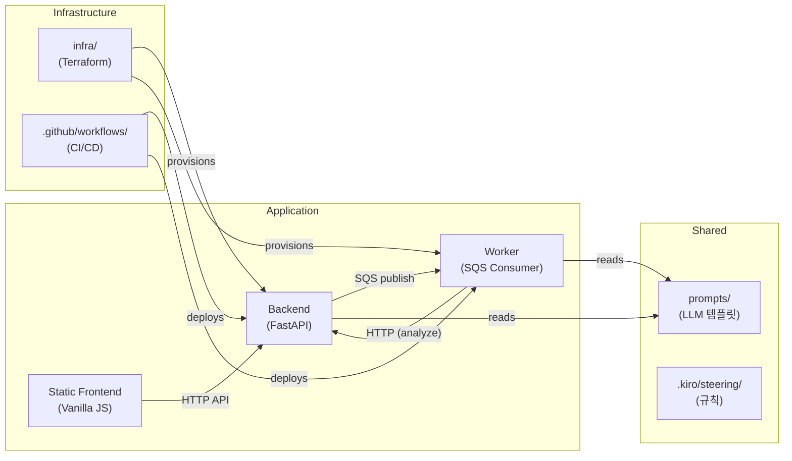

# Dependencies

## Internal Dependencies

### Backend depends on Worker
- **Type**: Runtime (SQS message publish)
- **Reason**: Backend publishes `analyze_case`/`transcribe` messages to SQS for Worker processing

### Worker depends on Backend
- **Type**: Runtime (HTTP API call)
- **Reason**: Worker analysis handler calls Backend's `/cases/{id}/analyze` endpoint (1단계 전략)

### Frontend depends on Backend
- **Type**: Runtime (HTTP API)
- **Reason**: Frontend는 Backend가 서빙하는 정적 파일이며, 모든 데이터를 Backend API로 가져옴

### Worker depends on prompts/
- **Type**: Build-time (파일 참조)
- **Reason**: LLM 호출 시 extraction, timeline, summary 프롬프트 템플릿 사용

## External Dependencies

### Backend (requirements.txt)

| Dependency | Version | Purpose | License |
|-----------|---------|---------|---------|
| fastapi | 0.115.0 | REST API 프레임워크 | MIT |
| uvicorn[standard] | 0.30.6 | ASGI 서버 | BSD-3 |
| sqlalchemy | 2.0.35 | ORM + DB 세션 관리 | MIT |
| alembic | 1.13.3 | DB 스키마 마이그레이션 | MIT |
| pydantic | 2.9.2 | 데이터 검증/직렬화 | MIT |
| pydantic-settings | 2.5.2 | 환경변수 기반 설정 관리 | MIT |
| python-multipart | 0.0.12 | 파일 업로드 파싱 | Apache-2.0 |
| tzdata | 2026.2 | IANA 시간대 DB (Windows용) | Apache-2.0 |
| boto3 | 1.35.30 | AWS SDK (Bedrock, S3, SQS, Translate) | Apache-2.0 |
| requests | 2.32.3 | HTTP 클라이언트 (Upstage API) | Apache-2.0 |
| PyJWT[crypto] | 2.10.1 | JWT 토큰 생성/검증 (RS256) | MIT |
| pytest | 8.3.3 | 테스트 프레임워크 | MIT |
| httpx | 0.27.2 | 비동기 HTTP 테스트 클라이언트 | BSD-3 |
| psycopg[binary] | 3.2.3 | PostgreSQL 드라이버 | LGPL-3.0 |
| pgvector | 0.3.6 | pgvector SQLAlchemy 지원 | MIT |
| pypdf | 6.13.2 | PDF 텍스트 추출 (RAG 시드) | BSD-3 |
| olefile | 0.47 | OLE2 파일 파싱 (HWP) | BSD-2 |

### Worker (requirements.txt)

| Dependency | Version | Purpose | License |
|-----------|---------|---------|---------|
| boto3 | 1.35.30 | AWS SDK (Bedrock, SQS) | Apache-2.0 |
| requests | 2.32.3 | Upstage API 호출 | Apache-2.0 |
| pydantic | 2.9.2 | OCR 출력 스키마 검증 | MIT |
| jinja2 | 3.1.4 | PDF HTML 템플릿 | BSD-3 |
| pytest | 8.3.3 | 테스트 | MIT |
| shapely | 2.0.6 | 로컬 지오펜스 (폴리곤 연산) | BSD-3 |
| weasyprint | 62.3 | HTML → PDF 렌더링 | BSD-3 |

### Infrastructure

| Dependency | Version | Purpose |
|-----------|---------|---------|
| Terraform AWS Provider | ~> 5.x | AWS 리소스 관리 |
| GitHub Actions (actions/checkout) | v4 | 코드 체크아웃 |
| GitHub Actions (aws-actions/configure-aws-credentials) | v4 | OIDC 인증 |
| GitHub Actions (aws-actions/amazon-ecr-login) | v2 | ECR 로그인 |

### Mobile

| Dependency | Version | Purpose |
|-----------|---------|---------|
| @nicemkv/sync-web | (local script) | 웹 빌드 → Capacitor 동기화 |

## Dependency Risks

| Risk | Description | Mitigation |
|------|-------------|-----------|
| WeasyPrint GTK | Windows에서 GTK 런타임 필요, Docker 내에서만 안정 동작 | Docker 이미지에 폰트+GTK 임베딩 |
| psycopg LGPL | LGPL-3.0 라이선스 | 동적 링크(pip install) 사용으로 GPL 전파 없음 |
| boto3 버전 고정 | 1.35.30 — 신규 Bedrock 모델/기능 사용 시 업그레이드 필요 | 정기 업데이트 |
| pgvector 확장 | RDS에서 수동 CREATE EXTENSION 필요 | init_db()에서 자동 생성, Alembic 마이그레이션 |
