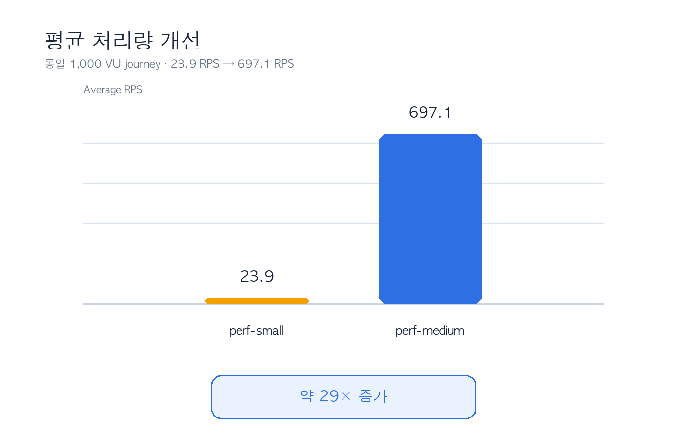
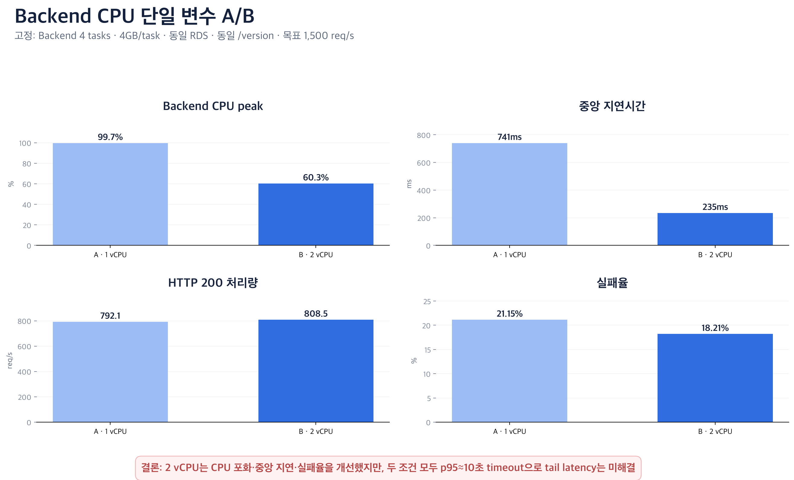
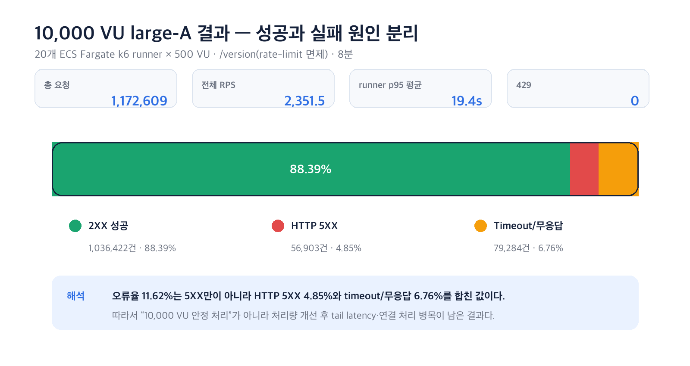
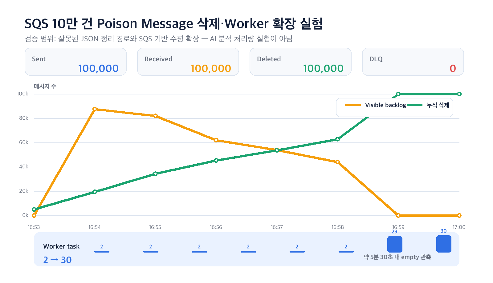
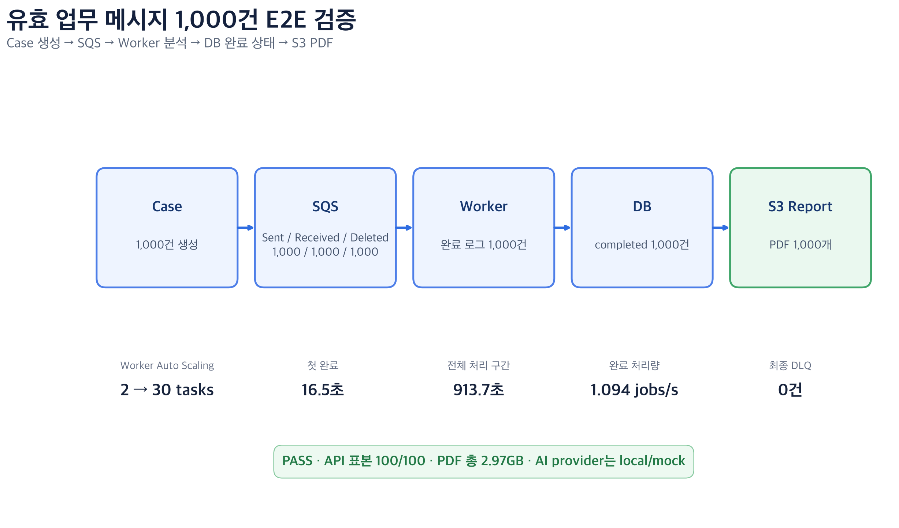
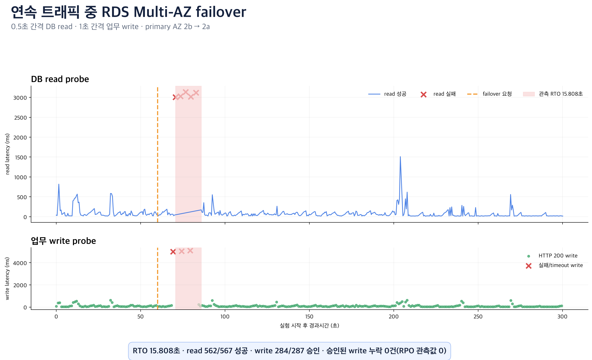

# BADA 운영 고도화: 성능·확장성·복원력 검증 보고서

- 최종 검증: 2026-07-15
- 대상: BADA API, ECS Fargate, SQS Worker, RDS PostgreSQL Multi-AZ
- 용도: 팀 공유, 기술 발표, 포트폴리오 및 기술 인터뷰 근거 자료
- 관련 기준: [RTO/RPO 정의 및 복원 리허설](../rto-rpo-and-restore-rehearsal.md)

---

## 1. 결론부터 보기

BADA는 취약근로자가 증거 자료를 업로드하면 Backend가 요청을 접수하고, SQS와 Worker가 분석·전사·리포트 작업을 비동기로 처리하는 모바일 중심 서비스다. 이번 검증에서는 dev/prod와 분리한 `perf` 환경을 Terraform으로 생성해 성능 병목, 자동 확장, 보호 정책, 장애 복구를 단계적으로 확인했다.

가장 중요한 결론은 다음과 같다.

| 질문 | 검증 결과 | 결론의 범위 |
| --- | --- | --- |
| 최초 병목은 어디인가? | `perf-small` 1,000 VU에서 Backend CPU 100%, RDS CPU 약 7% | 최초 병목은 DB가 아니라 Backend compute |
| 프로파일 조정이 효과가 있었는가? | 같은 journey에서 p95 60,007ms→96ms, 전체 RPS 23.9→697.1 | 프로파일 단위 개선. CPU·메모리·최소 task·RDS를 함께 바꿔 단일 변수 효과로 단정하지 않음 |
| Backend CPU만 늘리면 개선되는가? | 4 tasks·4GB·동일 RDS를 고정하고 1→2 vCPU 비교: CPU peak 99.75%→60.35%, 중앙값 741ms→235ms, HTTP 200 처리량 792.1→808.5 RPS | CPU 포화는 완화됐지만 두 조건 모두 p95가 10초 timeout에 걸려 완전 안정화는 아님 |
| IP rate limit은 대규모 요청을 막는가? | 비면제 경로 5k/7.5k/10k VU에서 429가 92~98% | 보호 정책이 인프라 한계보다 먼저 작동. 공유 IP 정상 사용자 문제는 별도 개선 필요 |
| Backend의 순수 처리 한계는? | 면제 경로 `/version`에서 CPU 약 99%, 성공 처리량 약 900~950 RPS 정체 | medium 프로파일의 Backend 처리 한계 확인 |
| 10,000 VU를 안정 처리했는가? | large-A에서 2XX 88.39%, HTTP 5XX 4.85%, timeout/무응답 6.76%, runner p95 평균 19.4초 | 처리량은 개선됐지만 안정 처리에는 실패. tail latency·연결 계층 병목이 남음 |
| 정상 업무 메시지를 끝까지 처리하는가? | 유효 case 1,000건 모두 `completed`, SQS Sent=Received=Deleted 각 1,000, PDF 1,000개, DLQ 0 | local/mock AI 기준 분석→DB→S3 Report E2E exact-count 통과. 실제 증거 파일·외부 AI 지연은 제외 |
| Worker는 queue 적체에 반응하는가? | poison 100,000건과 정상 업무 1,000건 모두 Worker 2→30 확장 | 삭제 semantics와 정상 업무 E2E를 분리 검증. 정상 1,000건 처리 구간은 913.676초 |
| Multi-AZ failover 중 서비스와 데이터는 어떻게 되는가? | 연속 read/write 중 강제 failover: 앱 관측 RTO 15.808초, HTTP 200 승인 쓰기 284건 중 누락 0 | 0.5초 read·1초 write 표본 기준. 실패/timeout 쓰기 3건은 커밋된 데이터로 간주하지 않음 |
| 운영 환경과 격리됐는가? | perf는 별도 state·VPC·리소스 접두사를 사용했고 최종 destroy 후 state와 활성 perf 리소스가 모두 0 | 공유 환경과 분리된 변경 범위 및 정리 절차를 검증. 프로젝트 종료 뒤 독립적으로 정리된 dev/prod의 최종 가용성은 본 보고서 범위에서 제외 |

### 기술적 완성도 평가

- 강점: 별도 환경 IaC, 분산 부하 발생기, 계층별 지표 분석, 병목 발견 후 재실험, 장애 주입과 정리까지 한 흐름으로 수행했다.
- 특히 유효한 사례: Backend 병목 분석, rate limit과 인프라 한계 분리, CPU 단일 변수 A/B, 정상 업무 1,000건 exact-count E2E, 10,000 VU 실패 원인 분해, SQS 확장, 연속 트래픽 중 RDS failover를 한 흐름으로 검증했다.
- 남은 제약: 일부 7월 7~8일 테스트의 원본 k6 summary가 보존되지 않았고, 최신 E2E는 실제 증거 업로드와 외부 AI 호출 대신 local/mock provider를 사용했다. 해당 결과는 아래에서 증거 등급과 함께 제한적으로 사용한다.

---

## 2. 테스트 구조와 격리 원칙

| 항목 | 구성 |
| --- | --- |
| 환경 | `bada-perf-*`, dev/prod와 별도 VPC·ECS·RDS·SQS |
| Terraform state | `bada/perf/terraform.tfstate` |
| 진입점 | ALB DNS HTTP |
| Compute | ECS Fargate Backend / Worker |
| Database | RDS PostgreSQL |
| 비동기 처리 | SQS Analysis Queue + DLQ |
| 관측 | k6 summary, CloudWatch, Container Insights, ECS/ALB/RDS/SQS API |
| 부하 발생 | 로컬 k6, ECS Fargate 분산 k6 runner, SQS producer |
| AI 비용·외부 변수 | 대규모 실험에서는 mock/local 경로 사용 |

처음에는 `perf.badasoft.com`과 ACM을 포함한 구성을 시도했으나, 당시 `badasoft.com` 공인 DNS 위임이 끊겨 ACM 검증이 완료되지 않았다. 성능 실험의 목적은 HTTPS 인증이 아니라 Backend·Worker·SQS·RDS의 동작 검증이므로 ALB DNS HTTP로 전환했다.

2026-07-14 재실험에서는 코드 재현성 문제도 확인했다.

1. 이전 destroy로 Secrets Manager secret이 삭제 예약 상태여서 동일 이름 재생성이 실패했다.
2. `domain_name=""`인 perf 설정 설명과 달리 HTTP listener가 HTTPS redirect만 수행해 Backend target group이 ALB에 연결되지 않았다.
3. 격리 worktree에서만 domainless listener를 Backend forward로 보정해 실험했으며, 팀 레포 코드는 변경하지 않았다.

이 세 항목은 실험 결과와 별개로, 반복 가능한 perf 환경을 위해 정식 IaC에 반영해야 할 재현성 개선점이다.

최종 cleanup에서는 `0 add / 0 change / 100 destroy`를 확인한 뒤 perf state를 비웠다. 정상 업무 E2E가 만든 PDF 1,000개로 Report 버킷 삭제가 한 차례 중단됐지만, perf 버킷만 비운 뒤 destroy를 재실행해 활성 perf 리소스를 제거했다. 검증 근거는 **별도 Terraform state·리소스 접두사·VPC를 사용한 변경 범위 격리**와 **perf 리소스 정리 완료**다. 프로젝트 종료 뒤 독립적으로 정리된 dev/prod 환경의 최종 health는 이 보고서의 성능 실험 판정에 포함하지 않는다.

---

## 3. 용어와 측정 해석

| 용어 | 의미 | 주의점 |
| --- | --- | --- |
| VU | k6 Virtual User | 실제 가입자 수가 아니라 동시에 동작하는 가상 사용자 수 |
| RPS | 초당 요청 수 | 전체 RPS와 2XX 성공 RPS를 구분해야 함 |
| p95 | 요청의 95%가 완료된 시간 | runner별 p95 평균은 전체 요청을 다시 합친 global p95가 아님 |
| arrival rate | 초당 목표 요청 도착률 | `maxVUs`는 목표 도착률을 만들기 위한 상한이지 실제 동시 사용자 수가 아님 |
| 429 | Too Many Requests | rate limit이 요청을 정책적으로 차단한 결과 |
| HTTP 5XX | 서버 또는 ALB 계층 오류 응답 | timeout·무응답과 구분해야 함 |
| backlog | SQS 대기 작업량 | visible, not-visible, received, deleted를 함께 봐야 실제 처리 여부를 알 수 있음 |
| drain | queue가 비워지는 과정 | visible=0만으로 성공 처리를 단정할 수 없음. Deleted와 업무 결과 저장을 확인해야 함 |
| RTO | 장애 후 서비스 복구 목표 시간 | 요청 시작·완료·지연을 기록하지 않으면 정확한 RTO를 계산할 수 없음 |
| RPO | 허용 가능한 데이터 손실 시점 | marker 1건 보존은 해당 marker의 관측 손실 0이지 전체 시스템 RPO 증명이 아님 |

### 증거 등급

| 등급 | 기준 |
| --- | --- |
| A | 원본 JSON·로그·AWS 지표가 현재 폴더에 보존됨 |
| B | 실행 로그와 당시 CloudWatch 집계는 있으나 전체 원본 k6 artifact가 없음 |
| C | 서술 기록만 남아 있어 정량 결론에는 사용하지 않음 |

---

## 4. 실험 지도

| 실험 | 핵심 질문 | 결과 | 증거 등급 |
| --- | --- | --- | --- |
| 1,000 VU small | 최초 병목은 어디인가? | Backend CPU 100%, RDS 약 7% | B |
| 1,000 VU medium | 프로파일 조정 후 개선되는가? | p95 96ms, 전체 RPS 697.1 | B |
| Backend CPU 단일 변수 A/B | CPU만 1→2 vCPU로 늘리면 개선되는가? | peak CPU·중앙 지연·실패율 개선, p95 timeout은 유지 | A |
| 300 req/s arrival-rate | 비면제 경로 한계는 무엇인가? | 대부분 429, Backend CPU 약 16% | B |
| 분산 5k/7.5k/10k VU | source IP 분산 후 정책은 어떻게 동작하는가? | 429가 92~98% | B |
| `/version` 5k/7.5k/10k VU | rate limit 제외 시 병목은 무엇인가? | CPU 약 99%, 성공 RPS 정체 | B |
| large-A 10k VU | 스케일업 후 안정화되는가? | 2XX 88.39%, 전체 실패 11.62%, p95 약 19.4초 | A |
| 2026-07-08 SQS 100k | 기존 valid-but-invalid 업무 메시지는 삭제되는가? | Received 100k, Deleted 0 | AWS 재조회로 정정 |
| 2026-07-14 SQS poison 100k | malformed-message 삭제와 scale-out이 동작하는가? | Sent=Received=Deleted 100k, Worker 2→30 | A |
| 정상 업무 1,000건 E2E | 유효 분석 메시지가 DB·PDF까지 완료되는가? | completed·SQS 삭제·PDF 각 1,000, DLQ 0 | A |
| 연속 read/write RDS failover | 사용자 관측 중단과 승인 쓰기 손실은 얼마인가? | RTO 15.808초, 승인 쓰기 284건 누락 0 | A |

---

## 5. Backend 병목과 프로파일 개선

### 5.1 perf-small 기준선

| 지표 | 결과 |
| --- | ---: |
| Backend | 0.25 vCPU / 512MB, min 2 / max 10 |
| RDS | db.t4g.medium |
| 전체 RPS | 23.9 |
| p95 | 60,007ms |
| Backend CPU peak | 100% |
| RDS CPU peak | 약 7% |

Backend CPU가 포화되는 동안 RDS는 여유가 있었으므로, 최초 병목을 Backend compute로 판단했다.

### 5.2 perf-medium 재실험

| 항목 | perf-small | perf-medium |
| --- | ---: | ---: |
| Backend | 0.25 vCPU / 512MB | 1 vCPU / 2GB |
| Backend min/max | 2 / 10 | 4 / 30 |
| RDS | db.t4g.medium | db.m6g.large |
| 전체 RPS | 23.9 | 697.1 |
| p95 | 60,007ms | 96ms |
| Backend CPU peak | 100% | 약 59% |

이 결과는 profile 변경 전후의 큰 차이를 보여준다. 다만 CPU·메모리·최소 task 수·RDS class를 동시에 변경했기 때문에 “vCPU 하나만으로 p95가 99.8% 개선됐다”고 말할 수 없다. 또한 medium journey의 실패율 기록은 약 44%이며, 이후 분석상 비면제 요청의 429가 포함된 혼합 결과일 가능성이 높다. 따라서 697.1 RPS는 **성공 업무 처리량이 아니라 전체 요청 처리량**이다.

안전한 결론은 다음과 같다.

> 동일 journey에서 small profile의 CPU 포화가 medium profile에서 해소됐고, 전체 요청 지연과 처리량이 크게 개선됐다. 다만 단일 변수 실험과 성공 응답만의 처리량 비교는 후속 과제다.

### 5.3 Backend CPU 단일 변수 A/B

프로파일 비교의 여러 변수 혼재를 해소하기 위해 Backend task 수 4개, 메모리 4GB/task, RDS `db.m6g.large` Multi-AZ, `/version`, 목표 1,500 req/s를 고정하고 CPU만 변경했다.

| 지표 | A: 1 vCPU | B: 2 vCPU | 변화 |
| --- | ---: | ---: | ---: |
| HTTP 요청 | 241,121 | 237,240 | -1.61% |
| HTTP 200 | 190,131 | 194,046 | +2.06% |
| HTTP 200 처리량 | 792.129 RPS | 808.454 RPS | +2.06% |
| 실패율 | 21.147% | 18.207% | -2.94%p |
| 중앙 지연시간 | 740.874ms | 234.713ms | -68.32% |
| 평균 지연시간 | 2,730.543ms | 2,341.874ms | -14.23% |
| p95 | 10,000.199ms | 10,000.166ms | timeout 유지 |
| Backend CPU peak | 99.747% | 60.349% | -39.40%p |
| dropped iterations | 31,878 | 35,759 | +12.17% |
| RDS CPU peak | 4.45% | 3.925% | DB 병목 아님 |

2 vCPU는 CPU 포화, 중앙 지연, 실패율을 개선했다. 그러나 성공 처리량 증가는 2.06%에 그쳤고 p95는 두 조건 모두 10초 timeout에 걸렸으며 dropped iteration은 오히려 증가했다. 따라서 이 실험은 **CPU 증설의 효율 개선**을 증명하지만 **목표 1,500 RPS 안정 처리**를 증명하지 않는다. 다음 병목 후보는 단일 로컬 부하 발생기, 연결 수, 애플리케이션 concurrency와 timeout이다.

요약 증적: [Backend CPU 단일 변수 A/B](./evidence/backend-cpu-ab-summary.json)

---

## 6. Rate limit과 인프라 한계 분리

### 6.1 `maxVUs=3000`은 3,000 VU 실험이 아니다

기존 문서의 “3,000 VU 테스트”는 실제로 `RATE=300`, `MAX_VUS=3000`, `SUSTAIN=6m`인 `ramping-arrival-rate` 실험이다. `MAX_VUS=3000`은 300 req/s 도착률을 유지하기 위해 k6가 사용할 수 있는 VU 상한이다. 따라서 올바른 명칭은 **300 req/s arrival-rate 테스트(`maxVUs=3000`)**다.

| 지표 | 결과 |
| --- | ---: |
| 총 요청 | 144,600 |
| 실제 전체 RPS | 약 241 |
| p95 | 89ms |
| 실패율 | 83.56% |
| ALB 2XX / 4XX / 5XX | 23,778 / 120,601 / 233 |
| Backend CPU | 약 16% |
| WAF Blocked | 0 |

낮은 CPU와 높은 4XX를 함께 확인해 인프라 포화가 아니라 애플리케이션 IP rate limit이 먼저 작동했다고 판단했다.

### 6.2 분산 5,000~10,000 VU 비면제 경로

Fargate runner별 public IP가 다름을 확인한 뒤 비면제 경로에 constant-VU 부하를 실행했다.

| 단계 | source IP | 429 비율 | HTTP 5XX 비율 | 판단 |
| --- | ---: | ---: | ---: | --- |
| 5,000 VU | 10 | 97.7% | 0.5% | rate limit이 지배적 |
| 7,500 VU | 15 | 94.9% | 3.2% | rate limit + 과부하 신호 |
| 10,000 VU | 20 | 92.0% | 5.8% | rate limit + 연결/서버 오류 증가 |

이 실험은 10,000명의 정상 사용이 실패한다는 뜻은 아니다. 20개 source IP에 10,000 VU를 집중시킨 비정상적인 접속 분포다. 다만 IP당 300회/분 정책은 기숙사·회사·학교 NAT처럼 다수가 IP 하나를 공유할 때 정상 사용자를 함께 제한할 수 있다.

운영 개선안은 IP만 보지 않고 다음 기준을 조합하는 것이다.

- 인증 사용자 ID와 IP
- endpoint별 비용과 위험도
- 로그인 전·후 상태
- burst와 지속 요청의 별도 bucket
- 429 응답의 `Retry-After` 제공과 지표화

---

## 7. 10,000 VU에서 확인한 Backend/연결 계층 한계

Rate limit 면제 경로 `/version`으로 medium profile을 측정했을 때 429는 0이었고 Backend CPU는 약 99%에 도달했다. 성공 처리량은 약 900~950 RPS 부근에서 정체했다. 이후 Backend를 2 vCPU/4GB, min 8/max 60으로 높인 large-A를 20개 runner×500 VU로 8분간 실행했다.

| 지표 | large-A 실측 |
| --- | ---: |
| 총 요청 | 1,172,609 |
| 전체 RPS 합 | 2,351.5 |
| 2XX | 1,036,422 (88.39%) |
| HTTP 5XX | 56,903 (4.85%) |
| timeout/무응답 | 79,284 (6.76%) |
| 429 | 0 |
| 전체 실패율 | 약 11.62% |
| p95 | runner별 p95 평균 19.4초, 최대 19.96초 |
| RDS CPU | 최대 약 3.8% |

기존 문서는 전체 실패율 11.62%를 5XX 비율로 표현했지만, 원본 집계상 HTTP 5XX는 4.85%이고 나머지 6.76%는 timeout/무응답이다. 또한 19.4초는 runner별 p95의 평균이며 global p95가 아니다.

결론:

- large-A는 전체 처리량을 늘렸지만 안정화에는 실패했다.
- RDS는 병목이 아니었다.
- 남은 병목 후보는 ALB target health, application server concurrency, connection backlog, timeout, reactive Auto Scaling 지연이다.
- “10,000 VU를 안정 처리했다”가 아니라 “10,000 VU에서 성공·5XX·timeout을 분리해 다음 병목을 확인했다”가 정확한 설명이다.

---

## 8. SQS·Worker 실험: 두 결과를 구분해야 한다

### 8.1 2026-07-08 기존 100,000건 실험의 정정

기존 producer는 문법상 유효한 JSON이지만 존재하지 않는 case ID를 넣었다. Worker는 이를 수신했으나 handler 실패 후 삭제하지 않았다.

| CloudWatch 지표 | 값 |
| --- | ---: |
| NumberOfMessagesSent | 100,000 |
| NumberOfMessagesReceived | 100,000 |
| NumberOfMessagesDeleted | 0 |
| Visible max | 90,175 |
| NotVisible max | 100,000 |
| Oldest age max | 381초 |
| Worker | 2→30 |
| DLQ | 짧은 관측 창에서 0 |

따라서 당시 visible=0은 성공 drain이 아니라 메시지가 visibility timeout 동안 in-flight로 이동한 상태였다. 이 테스트가 증명한 것은 **Worker가 메시지를 수신하고 2→30으로 확장된 것**이며, 성공 처리·삭제·업무 결과 저장은 증명하지 못했다.

### 8.2 2026-07-14 100,000건 poison-message 재실험

삭제 semantics를 검증하기 위해 malformed JSON을 의도적으로 주입했다. 이 입력은 `consumer.py`의 잘못된 JSON 분기에서 명시적으로 삭제된다.

| 지표 | 결과 |
| --- | ---: |
| producer 전송 | 100,000건, 실패 0 |
| 전송 시간 | 9.721초, 약 10,286.7 msg/s |
| SQS Sent / Received / Deleted | 100,000 / 100,000 / 100,000 |
| Visible max | 87,382 |
| NotVisible max | 8 |
| Oldest age max | 273초 |
| Worker running | 2→30 |
| empty 관측 | 전송 완료 약 330초 후 |
| DLQ 최종 | 0 |
| 삭제 로그 | `잘못된 JSON 본문, 삭제` 100,000건 |

이 실험으로 증명한 것:

- 10만 건 전송·수신·삭제 exact count 일치
- malformed-message sanitation 경로
- backlog-per-task 정책에 따른 Worker 2→30 확장
- 실험 종료 시 main queue와 DLQ empty

증명하지 않은 것:

- 유효 증거 10만 건의 Bedrock 분석 완료
- DB 저장·Transcribe·PDF까지의 E2E 처리량
- 장시간 업무 메시지에서의 Worker 확장 지연
- 전체 분석 파이프라인 RPO

요약 증적: [SQS poison-message 100,000건](./evidence/sqs-poison-100k-summary.json)

### 8.3 정상 업무 메시지 1,000건 E2E

poison-message 실험과 실제 업무 처리를 분리하기 위해, 임금 분쟁 메타데이터를 가진 유효 case 1,000건을 생성하고 `analyze_case` 메시지로 Worker→DB→S3 Report 경로를 검증했다.

| 검증 지점 | 결과 |
| --- | ---: |
| Case 생성 / 최종 `completed` | 1,000 / 1,000 |
| SQS Sent / Received / Deleted | 1,000 / 1,000 / 1,000 |
| Worker 시작 / 완료 로그 | 1,000 / 1,000 |
| 분석 결과 API 표본 | 100/100 HTTP 200 |
| S3 PDF | 1,000개, 총 2.973GB |
| Worker Auto Scaling | 2→30 tasks |
| 첫 Worker 시작→첫 완료 | 16.484초 |
| 첫 Worker 시작→마지막 완료 | 913.676초 |
| 완료 처리량 | 1.094 jobs/s |
| 최종 main queue / DLQ | 0 / 0 |

Worker Auto Scaling은 첫 처리 시작 약 5분 뒤 30 tasks를 요청했다. 즉 정상 업무 경로는 exact-count로 완료했지만, 초기 backlog에 대한 target-tracking 평가·기동 지연이 전체 처리시간에 영향을 줬다. 대응 후보는 초기 desired/min capacity, step scaling, queue age alarm, task startup time 단축이다.

범위와 한계:

- case 메타데이터는 유효하지만 실제 증거 파일을 업로드하지 않았다.
- AI provider는 local/mock이므로 Bedrock·OCR·Transcribe·Translate 지연과 품질은 포함하지 않는다.
- PDF 1,000개 생성과 저장은 검증했지만 문서 내용 품질을 평가한 실험은 아니다.
- 최초 관찰 프로세스는 완료 후 API polling 중 connection reset으로 종료됐고, 별도 복구 검증이 API·Worker Logs·SQS·DB 상태·S3를 교차 확인해 `pass=true`를 확정했다.

요약 증적: [정상 업무 E2E 1,000건](./evidence/business-e2e-1000-summary.json)

---

## 9. 장애 복구와 RTO/RPO 검증

### 9.1 ECS task 장애

- Backend task 강제 중지 후 ECS service가 desired capacity를 복구했다.
- Worker task 강제 중지 후 replacement가 관측됐다.
- 당시 replacement 완료 시각과 요청별 지연 원본을 보존하지 않아 초 단위 RTO는 계산할 수 없다.
- 2026-07-08 SQS 메시지는 삭제되지 않았으므로 “Worker 장애 중에도 업무 처리 완료·메시지 유실 0”이라고 표현하지 않는다.

### 9.2 2026-07-08 RDS Multi-AZ 초기 측정

| 항목 | 1차 | 2차 |
| --- | ---: | ---: |
| RDS event duration | 약 43초 | 약 50초 |
| 완료된 `/health/db` 요청 | 67건 모두 200 | 60건 모두 200 |
| health 로그 최대 간격 | 약 25초 | 약 16초 |
| pre-failover marker | 미사용 | failover 후 조회 성공 |

모든 완료 요청이 200이었던 것은 긍정적이다. 그러나 로그에는 failover 구간과 겹치는 25초·16초의 표본 공백이 있다. 요청 시작 시각·완료 시각·latency가 따로 없어서 그 구간의 blocking이나 짧은 장애를 배제할 수 없다.

정확한 결론:

- RDS 자체 failover event는 약 43~50초였다.
- 수집 완료된 health 응답에서는 non-200이 없었다.
- 한 개의 사전 커밋 marker가 failover 후 보존됐다.
- 앱 관측 RTO는 **미확정**이다.
- RPO는 “사전 커밋 marker 1건의 관측 손실 0”으로 제한한다.
- failover 중 지속 쓰기와 Snapshot/PITR 복원은 별도 실험이 필요하다.

### 9.3 2026-07-15 연속 read/write failover

기존 health 표본 공백을 해소하기 위해 0.5초 간격 `/health/db` read와 1초 간격 `POST /cases` write를 계속 발생시키면서 `bada-perf-postgres-multiaz`에 강제 failover를 요청했다.

| 항목 | 결과 |
| --- | ---: |
| primary AZ | `ap-northeast-2b`→`ap-northeast-2a` |
| read 시도 / 성공 / 실패 | 567 / 562 / 5 |
| 첫 read 실패 / 마지막 read 실패 | 실험 t=70.611s / 82.800s |
| 3회 연속 성공 회복 | t=85.918s |
| 앱 관측 RTO | 15.808초 |
| write 시도 / HTTP 200 승인 / 실패·timeout | 287 / 284 / 3 |
| 승인 write 사후 누락 | 0건 |
| 관측 RPO | 승인된 write 기준 0건 |

RTO는 첫 실패 직전의 마지막 성공부터 마지막 실패 뒤 3회 연속 성공이 시작된 시점까지로 계산했다. RPO 0은 HTTP 200을 받은 284건에만 적용한다. 실패 또는 timeout 3건은 커밋 성공을 보장받지 못했으므로 손실 데이터로 계산하지도, 보존 데이터로 주장하지도 않는다. AWS RDS event 완료 시각은 control plane 진행 상태이며 앱 관측 RTO를 대신하지 않는다.

- 요약 증적: [RDS failover 이벤트·토폴로지·판정](./evidence/rds-failover-summary.json)
- 운영 목표와 복구 절차: [RTO/RPO 정의 및 복원 리허설](../rto-rpo-and-restore-rehearsal.md)

---

## 10. 서비스 개선으로 연결된 의사결정

| 발견 | 의사결정 또는 후속 조치 | 기대 효과 |
| --- | --- | --- |
| Backend CPU가 최초 병목 | 기본 task capacity와 최소 task 수 우선 검토 | DB 과잉 증설 방지 |
| 전체 RPS와 성공 RPS 혼재 | 상태코드별 처리량을 별도 기록 | 성능 수치 과장 방지 |
| IP rate limit이 먼저 작동 | user/IP/endpoint 기반 다층 정책 설계 | 공유 NAT 정상 사용자 보호 |
| 10k large-A에서 timeout 6.76% | app concurrency·ALB target·timeout 분석 | tail latency 개선 |
| 기존 SQS visible=0 오해 | Sent/Received/Deleted/NotVisible 동시 수집 | queue 처리 완료 여부 정확히 판정 |
| RDS health 표본 공백 | 요청 시작·종료·latency·error를 함께 저장 | 실제 앱 RTO 측정 가능 |
| perf IaC 재생성 실패 | secret 삭제 정책과 domainless listener 정식화 | 반복 가능한 실험 환경 |
| CPU 단일 변수에서 p95 timeout 유지 | app concurrency·connection·분산 generator 재검토 | tail latency 병목 분리 |
| 정상 업무 1,000건 처리 중 scale-out 지연 | step scaling·min capacity·task startup 최적화 | queue 대기시간 단축 |
| 연속 failover RTO 15.808초 | retry/backoff·connection pool 재연결 정책 검토 | DB 전환 구간 오류 감소 |

---

## 11. 증빙 인덱스

팀 공유본에는 결론 재검증에 필요한 **요약 증적만** 포함했다. 요청별 원시 로그, 실행 스크립트, 개인 실행 일지는 저장소에 싣지 않았다.

| 증빙 | 확인 가능한 내용 |
| --- | --- |
| [large-A k6 요약](./evidence/large-a-k6-summary.json) | runner, VU, 총 요청, 2XX, 429, HTTP 5XX, timeout, p95 |
| [large-A CloudWatch 요약](./evidence/large-a-cloudwatch-summary.json) | ECS·ALB·RDS 관측 지표 |
| [Backend CPU 단일 변수 A/B](./evidence/backend-cpu-ab-summary.json) | 고정 조건, CPU 1→2 vCPU, 성공 RPS·지연·CPU 비교 |
| [SQS poison-message 100,000건](./evidence/sqs-poison-100k-summary.json) | exact count와 queue/Worker 확장 지표 |
| [정상 업무 E2E 1,000건](./evidence/business-e2e-1000-summary.json) | case·SQS·Worker·DB·S3 PDF exact count와 한계 |
| [연속 RDS failover](./evidence/rds-failover-summary.json) | RDS event, AZ 전환, 앱 관측 RTO와 승인 쓰기 보존 |

---

## 12. 이력서·면접에서 사용할 수 있는 표현

### 한 문장

> dev/prod와 분리된 perf 환경과 ECS Fargate 분산 k6 runner를 구성해 최대 10,000 VU 부하를 실행하고, CPU 단일 변수 A/B와 정상 업무 1,000건 exact-count E2E로 병목과 Worker 확장을 검증했으며, 연속 트래픽 중 RDS Multi-AZ failover에서 앱 관측 RTO 15.808초와 승인 쓰기 누락 0건을 측정했습니다.

### 성능 개선 사례

> 1,000 VU 기준 profile에서 Backend CPU 100% 포화를 발견했고, Backend capacity와 최소 task 수를 포함한 medium profile로 재실험해 CPU 포화를 해소하고 전체 요청 p95를 60,007ms에서 96ms로 낮췄습니다. 다만 여러 변수를 함께 조정한 profile-level 결과이므로 단일 vCPU 효과로 과장하지 않았습니다.

### 실패에서 얻은 인사이트

> 10,000 VU large-A에서 전체 RPS 2,351.5를 기록했지만 2XX는 88.39%였고, HTTP 5XX 4.85%와 timeout/무응답 6.76%가 남았습니다. 이를 안정 처리 성공으로 포장하지 않고 연결 처리와 tail latency를 다음 병목으로 정의했습니다.

### 단일 변수·E2E·복원력 보강 사례

> 기존 profile 비교가 여러 변수를 동시에 바꾼 한계를 보완하기 위해 task 수·메모리·RDS·부하를 고정하고 CPU만 1→2 vCPU로 바꿨습니다. CPU peak는 99.75%에서 60.35%, 중앙 지연은 741ms에서 235ms로 개선됐지만 p95 timeout은 남아 CPU 증설만으로 충분하지 않음을 확인했습니다. 이어 정상 업무 1,000건을 SQS·Worker·DB·S3 PDF까지 exact count로 검증하고, 연속 read/write 중 Multi-AZ failover의 앱 관측 RTO 15.808초와 승인 쓰기 누락 0건을 측정했습니다.

### 피해야 할 표현

| 피해야 할 표현 | 정확한 표현 |
| --- | --- |
| “3,000 VU를 처리했다.” | “300 req/s arrival-rate 테스트를 실행했고 `maxVUs` 상한은 3,000이었다.” |
| “10,000 VU를 안정 처리했다.” | “10,000 VU에서 성공 88.39%와 실패 원인을 분리해 다음 병목을 확인했다.” |
| “5XX가 11.62%였다.” | “HTTP 5XX 4.85%와 timeout/무응답 6.76%를 합친 전체 실패가 약 11.62%였다.” |
| “SQS 10만 건 AI 분석을 완료했다.” | “malformed message 10만 건의 삭제 semantics와 Worker 2→30 확장을 검증했다.” |
| “RDS failover RTO/RPO가 0이다.” | “연속 probe 기준 앱 관측 RTO는 15.808초였고, HTTP 200 승인 쓰기 284건의 사후 누락은 0건이었다. 실패·timeout 3건은 커밋 보존 범위에서 제외했다.” |

---

## 13. 보강 과제 완료와 선택적 확장

2026-07-14~15에 기존 최우선 보강 과제였던 Backend CPU 단일 변수 A/B, 정상 업무 1,000건 E2E, 연속 read/write failover를 모두 수행했다. 포트폴리오 핵심 결론에 필요한 실행형 공백은 닫혔다.

추가 확장은 현재 결과의 필수 보완이 아니라 검증 범위를 넓히기 위한 선택 과제다.

1. **실제 증거·외부 AI E2E**: 소규모 표본으로 Bedrock·OCR·Transcribe·Translate 지연과 결과 품질을 포함한다.
2. **Snapshot/PITR restore**: failover가 아닌 백업 복원 RTO와 복구 시점 RPO를 별도 측정한다.
3. **분산 generator 단일 변수 A/B**: 로컬 generator 한계를 배제하고 1,500 RPS 이상에서 app concurrency·connection 병목을 분리한다.

---

## 14. 최종 판단

실험 설계와 수행은 포트폴리오 가치가 충분하다. 특히 격리 환경 생성·분산 부하·AWS 지표 분석·장애 주입·cleanup을 모두 경험했다는 점이 강하다. 다만 기존 문서는 visible=0을 성공 drain으로 해석하거나 `maxVUs`를 실제 VU로 부르는 등 일부 과장이 있었다.

2026-07-14~15 검증에서는 해당 표현을 모두 측정 정의에 맞게 수정하고, SQS 10만 건 삭제 semantics, CPU 단일 변수 A/B, 정상 업무 1,000건 E2E, 연속 RDS failover를 추가했다. 따라서 이 문서는 **성공 수치만 나열하는 자료가 아니라, 병목 가설→통제 실험→업무 E2E→장애 복구→cleanup을 증거와 한계까지 설명하는 실무형 성능·복원력 검증 사례**로 사용할 수 있다.
