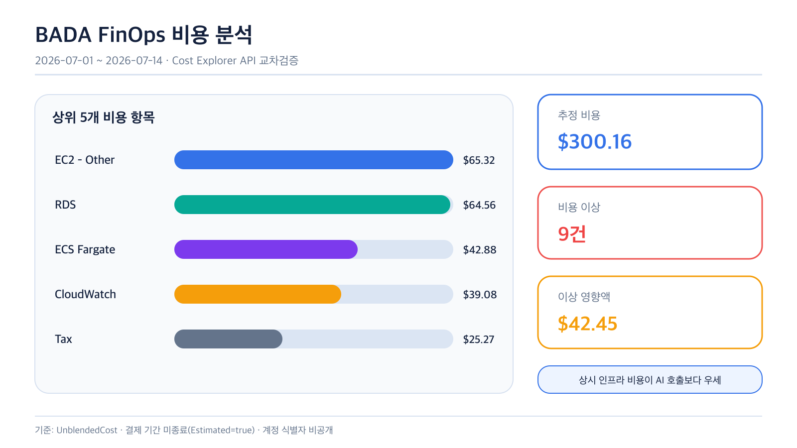
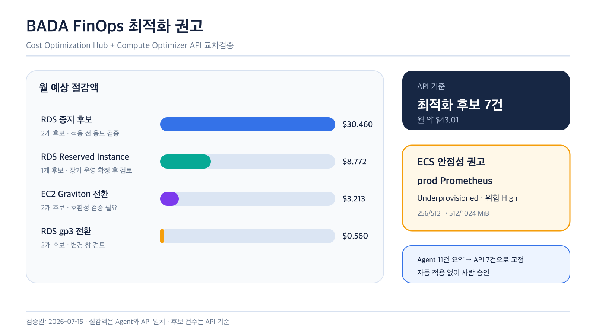
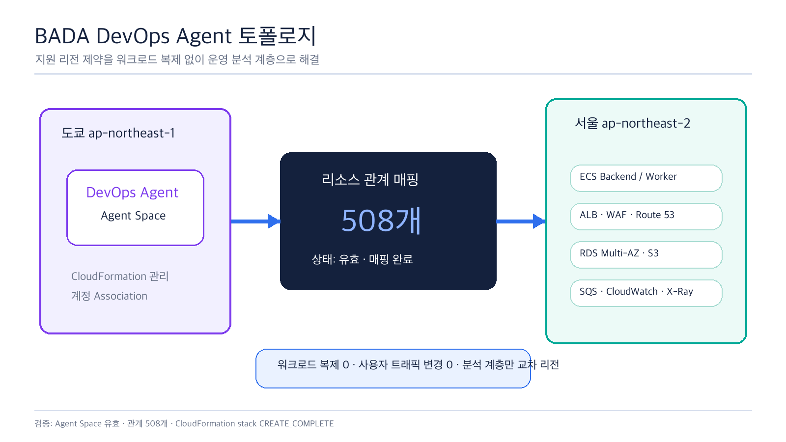
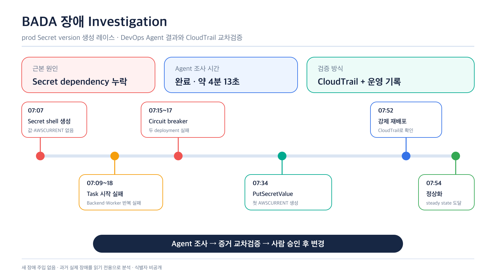

# BADA AgentOps 포트폴리오 보고서

최종 갱신: 2026-07-15

프로젝트: BADA — 취약근로자 증거 패키징 서비스

담당 범위: AWS 인프라·IaC·CI/CD·운영 고도화

## 1. 한눈에 보는 결과

BADA의 ECS Fargate, RDS Multi-AZ, NAT Gateway, CloudWatch, Bedrock 운영 비용과 배포 장애를 사람이 여러 콘솔에서 추적하던 문제를 개선하기 위해 AWS FinOps Agent와 DevOps Agent를 도입했다.

| 검증 항목 | 정량 결과 | 의미 |
| --- | ---: | --- |
| 7월 1~14일 추정 비용 | `$300.16` | 비용의 대부분이 AI 호출보다 상시 인프라에서 발생 |
| 비용 이상 징후 | `9건`, 영향액 `$42.45` | NAT·RDS·ECS 증가 시점을 자동 분류 |
| 최적화 후보 | `7건`, 월 약 `$43.01` | RDS 중지·RI·Graviton·gp3 검토 후보 도출 |
| 비용 가드레일 | 월 `$1,500`, 3단계 알림 | 실제 비용 50%·80%·100% 도달 시 통지 |
| 수동 알림 전달 검증 | SNS→이메일 수신 성공 | 실제 Cost Anomaly 이벤트 E2E와 구분 |
| ECS right-sizing | prod Prometheus 위험 `High` | 256/512 MiB에서 512/1024 MiB 증설 후보 확인 |
| DevOps 토폴로지 | 관계 `508개` | 도쿄 Agent가 서울 리소스 관계를 인식 |
| Agent 조사 시간 | 약 `4분 13초` | 약 47분간 발생한 실제 장애 이력의 원인 식별 |

핵심은 Agent 출력을 그대로 적용하지 않고, **`Agent 분석 → AWS API·CloudTrail 교차검증 → 사람 승인`**을 운영 게이트로 만든 것이다.

## 2. 도입 배경

BADA는 모바일 요청을 ALB와 ECS Backend가 처리하고, 장시간 분석 작업은 SQS와 ECS Worker로 분리한다. 데이터는 RDS Multi-AZ와 S3에 저장하며 CloudWatch, Prometheus, Grafana, X-Ray로 관측한다.

운영 복잡도가 높아지면서 다음 두 문제가 생겼다.

- 비용: RDS, ECS, NAT, CloudWatch, Bedrock 중 어느 계층이 비용 증가를 만들었는지 빠르게 구분하기 어려웠다.
- 장애: 배포 실패 시 ECS event, CloudWatch, Secrets Manager, CloudTrail을 각각 조회해야 했다.

FinOps Agent는 비용 분석 계층으로, DevOps Agent는 리소스 관계와 장애 분석 계층으로 배치했다. 두 Agent는 사용자 트래픽 경로에 포함되지 않으므로 장애가 나더라도 BADA 사용자 기능에 직접 영향을 주지 않는다.

## 3. FinOps Agent 적용 결과

### 3.1 비용 구조



Cost Explorer 기준 7월 1~14일 추정 비용은 `$300.16`이었다. 상위 항목은 EC2-Other `$65.32`, RDS `$64.56`, ECS `$42.88`, CloudWatch `$39.08`, Tax `$25.27` 순이었다.

이 값은 7월 15일을 제외한 비용 기준선이다. 같은 날 20:56 KST에 조회한 Budget 실제 비용 `$307.421`에는 7월 15일의 일부 사용량이 추가 반영되어 두 값의 기준 시점이 다르다.

이 결과로 현재 비용 최적화 우선순위를 Bedrock 호출보다 다음 순서로 잡았다.

1. NAT·데이터 전송을 포함한 EC2-Other 세부 비용
2. dev/prod RDS의 상시 가동과 Multi-AZ 비용
3. ECS task 수와 Fargate CPU·Memory
4. CloudWatch 로그 보존량과 Container Insights

### 3.2 비용 이상과 최적화



Cost Anomaly Detection은 9건, 영향액 `$42.45`를 반환했다. 가장 큰 이상은 7월 10~13일 NAT Gateway 처리량·시간과 리전 내 데이터 전송 증가로 인한 `$22.84`였다. 7월 14일에는 RDS Multi-AZ `$9.15`, ECS Fargate ARM vCPU `$8.97` 증가가 확인됐다.

Cost Optimization Hub API는 다음 최적화 후보 7건과 월 예상 절감액 `$43.005`를 반환했다.

| 최적화 후보 | 건수 | 월 예상 절감액 | 적용 판단 |
| --- | ---: | ---: | --- |
| RDS 중지 후보 | 2 | `$30.460` | 실제 용도와 데모 일정을 확인하기 전 적용 금지 |
| RDS Reserved Instance | 1 | `$8.772` | 장기 운영이 확정된 뒤 구매 검토 |
| EC2 Graviton 전환 | 2 | `$3.213` | 애플리케이션 호환성 검증 필요 |
| RDS gp3 전환 | 2 | `$0.560` | 변경 창과 성능 영향 검토 필요 |

Agent 화면은 “11개 추천”으로 요약했지만 API의 실제 조치 항목은 7개였다. 월 절감액 합계는 일치했다. 또한 Agent 답변에서 누락된 prod Prometheus의 `Underprovisioned` 권고를 Compute Optimizer API로 추가 확인했다.

### 3.3 FinOps 운영 판단

- Agent 분석은 비용 조사 시간을 단축하는 초안으로 사용한다.
- 공식 비용과 추천 건수는 Cost Explorer·Cost Anomaly Detection·Cost Optimization Hub API로 확정한다.
- Stop·RI 구매처럼 서비스 영향이나 되돌릴 수 없는 조치는 사람이 승인한다.
- `BADA-Project-Cost-Guardrail` 월간 Budget을 `$1,500`로 활성화하고 실제 비용 기준 50%(`$750`)·80%(`$1,200`)·100%(`$1,500`) 알림을 구성했다.
- CLI 교차검증 시 실제 비용은 `$307.421`(한도의 20.49%), 예측 비용은 `$652.421`(43.49%)이었고 세 알림 상태는 모두 `OK`였다.
- 수동 SNS Publish부터 이메일 수신까지 전달 경로를 검증했다. 실제 Cost Anomaly가 탐지되어 이메일이 도착하는 전체 E2E는 다음 실발생 건에서 확인한다.
- Budget에는 자동 중지 같은 Action을 연결하지 않았다. 비용 알림 후 영향도와 롤백 가능성을 검토하는 사람 승인 원칙을 유지한다.

## 4. DevOps Agent 적용 결과

### 4.1 리전 제약을 운영 분석 계층으로 해결



DevOps Agent는 서울 리전에서 지원되지 않았다. 워크로드를 복제하지 않고 지원 리전인 도쿄에 Agent Space만 구성했다. CloudFormation으로 Agent Space, AWS 계정 Association, Agent IAM Role, Operator IAM Role을 배포했고, 서울 리소스 관계 508개가 매핑되는 것을 확인했다.

이 선택은 다음 장점이 있었다.

- 기존 서울 dev/prod 인프라와 사용자 트래픽을 변경하지 않았다.
- Agent Space를 IaC로 재현할 수 있다.
- 지원 리전 제약을 운영 분석 계층에서만 우회했다.

### 4.2 실제 prod 장애 RCA



새 장애를 주입하지 않고 7월 3일 prod 초기 배포 실패 이력을 읽기 전용 Investigation으로 조사했다.

1. Terraform이 Secrets Manager secret shell을 먼저 만들었지만 값과 `AWSCURRENT` version은 없었다.
2. Backend와 Worker가 secret을 읽지 못해 여러 차례 시작 실패했다.
3. 두 ECS deployment가 circuit breaker로 실패했다.
4. 약 27분 뒤 `PutSecretValue`로 첫 version이 생성됐다.
5. Backend와 Worker에 `force-new-deployment`가 실행된 뒤 steady state에 도달했다.

Agent는 Terraform Secret dependency 누락을 근본 원인으로 제시했다. 복구 배포의 실행 주체는 Agent 결과만으로 확정하지 못했기 때문에 CloudTrail과 운영 기록을 다시 조회해 `forceNewDeployment=true`를 확인했다.

### 4.3 RCA 품질 평가

| 평가 항목 | 결과 |
| --- | --- |
| 근본 원인 | 운영 기록과 일치 |
| 영향 범위 | Backend·Worker 시작 실패와 circuit breaker 실패 식별 |
| 시간 순서 | Secret shell 생성부터 정상화까지 재구성 |
| 누락 | 복구 배포 실행 주체는 Agent 단독으로 확정하지 못함 |
| 최종 판정 | 탐색 범위 축소와 RCA 초안에 유효, CloudTrail 교차검증 필수 |

## 5. 운영 절차로 남긴 것

```text
비용 이상 또는 장애 감지
  → FinOps/DevOps Agent 분석
  → 근거 서비스·시간대·리소스 확인
  → AWS API·CloudTrail·운영 기록 교차검증
  → 영향도와 롤백 가능성 검토
  → 인프라 담당자 승인 후 변경
  → 결과와 재발 방지 조치를 문서화
```

Agent는 운영자를 대체하는 자동 복구기가 아니라, 증거 탐색과 원인 후보 생성을 빠르게 하는 운영 보조 계층으로 사용했다.

## 6. 포트폴리오 표현

### 이력서 한 줄

> AWS FinOps·DevOps Agent를 도입해 비용 `$300.16`, 비용 이상 9건, 최적화 후보 7건을 API로 교차검증하고, 실제 prod 배포 실패의 Secret dependency 레이스를 CloudTrail과 함께 분석하는 human-in-the-loop AgentOps 절차를 구축했습니다.

### 면접 설명

> FinOps Agent가 분석한 비용과 최적화 결과를 Cost Explorer·Cost Optimization Hub API로 다시 검증했습니다. 이 과정에서 Agent가 추천을 11개로 요약했지만 실제 조치 항목은 7개였고, prod Prometheus의 right-sizing 권고도 누락된 것을 발견했습니다. DevOps Agent에서는 서울 리전 미지원 문제를 도쿄 Agent Space로 우회하고, 과거 prod 장애를 조사해 Secret version 생성 레이스를 식별했습니다. 두 사례를 통해 Agent 결과를 바로 적용하지 않고 공식 API와 CloudTrail을 거치는 승인 게이트를 운영 절차로 만들었습니다.

### 과장 없이 사용해야 하는 표현

- 실제 Agent 생성과 분석은 완료했지만 비용 절감 조치를 자동 적용한 것은 아니다.
- 수동 SNS Publish부터 이메일 수신까지는 확인했지만, 실제 비용 이상 탐지 이벤트가 SNS와 이메일로 전달되는 전체 E2E는 아직 관찰하지 않았다.
- DevOps Agent는 원인을 분석했지만 장애를 자동 복구하지 않았다.
- 비용 값은 결제 기간이 끝나지 않은 추정치다.

## 7. 증거 연결

| 검증 대상 | 기준 파일 |
| --- | --- |
| FinOps 비용·이상·최적화 | [`evidence/finops-analysis-summary.json`](evidence/finops-analysis-summary.json) |
| DevOps Agent Space·토폴로지 | [`evidence/devops-agent-space-summary.json`](evidence/devops-agent-space-summary.json) |
| DevOps 장애 RCA | [`evidence/devops-agent-rca-summary.json`](evidence/devops-agent-rca-summary.json) |
| 상세 수행 과정 | [`aws-agent-ops-implementation-result.md`](aws-agent-ops-implementation-result.md) |
| IaC 템플릿 | [`devops-agent-tokyo-agent-space.yaml`](devops-agent-tokyo-agent-space.yaml) |
