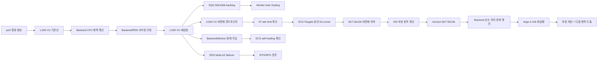
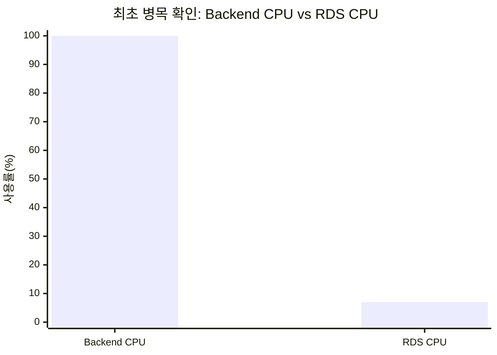
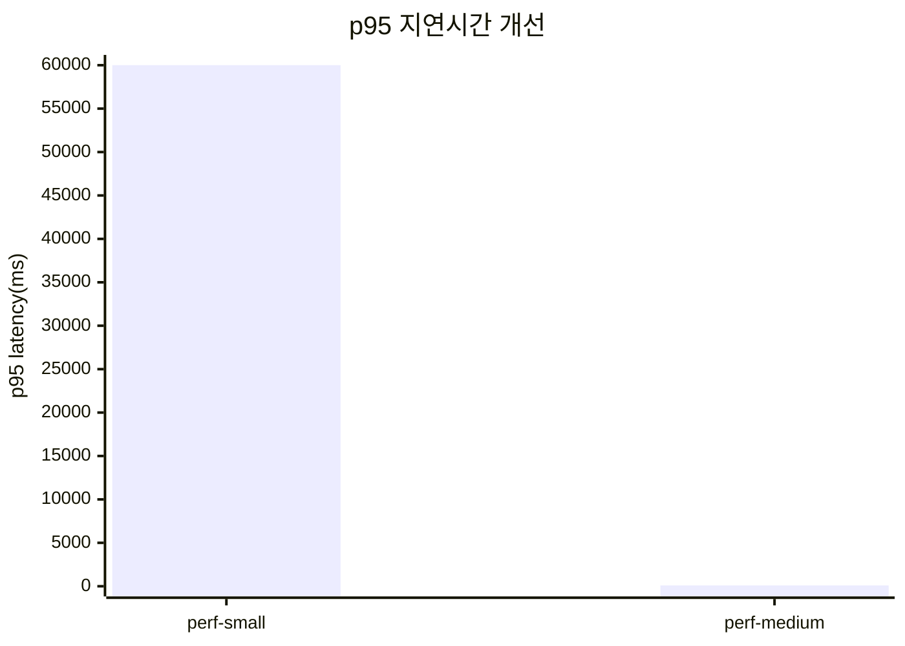
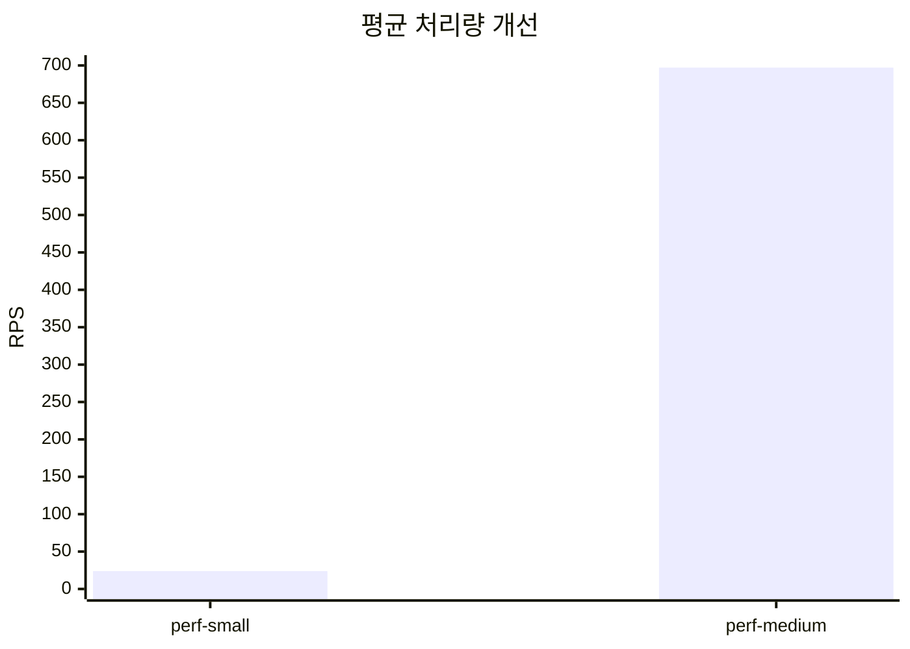
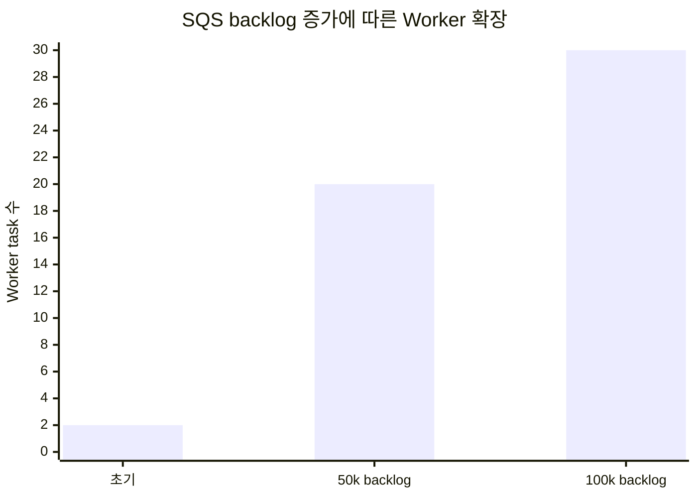
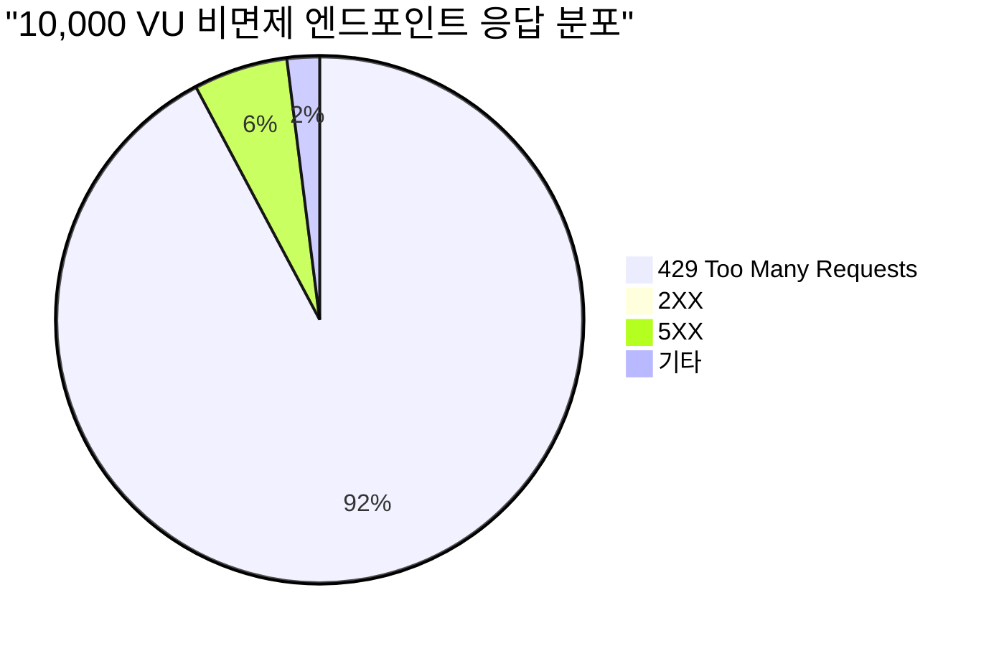
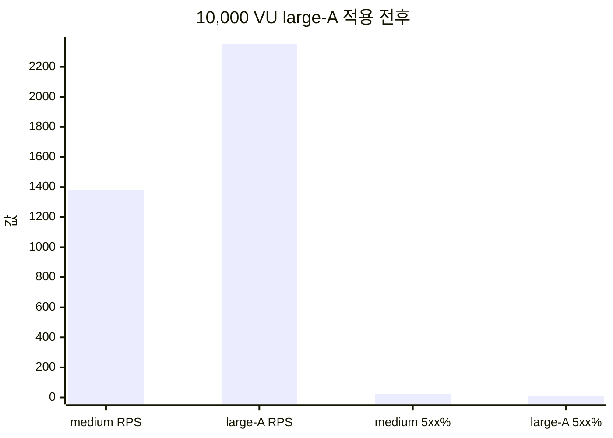

# BADA 성능 검증·부하테스트 종합 보고서

작성일: 2026-07-09
대상: BADA 인프라 성능 검증, 확장성 개선, 장애 복구 리허설
용도: 팀 공유, 발표/포트폴리오 정리, 면접 설명 자료

---

## 1. 한눈에 보는 결론

BADA는 취약근로자의 임금·신분·근무 증거를 수집하고, AI 분석과 리포트 생성을 통해 증거 패키징을 돕는 모바일 중심 서비스다. 사용자는 이미지·PDF·음성·위치 자료를 업로드하고, Backend API는 요청을 받은 뒤 SQS와 Worker를 통해 분석·전사·PDF 생성 작업을 비동기로 처리한다.

이번 테스트는 “배포된 서비스가 켜져 있는지”를 확인하는 수준이 아니라, 실제 운영 상황에서 다음 질문에 답하기 위해 진행했다.

- 사용자가 몰리면 Backend API와 RDS 중 어디가 먼저 병목이 되는가?
- 분석 요청이 대량으로 쌓였을 때 SQS 기반 Worker가 자동 확장되는가?
- 5,000~10,000 VU 부하에서 rate limit, ECS, ALB, RDS 지표를 어떻게 해석해야 하는가?
- 장애가 발생했을 때 ECS와 RDS Multi-AZ 구성이 어느 정도 복구력을 보이는가?
- dev/prod 운영 환경에 영향을 주지 않고 실험 환경을 안전하게 생성·삭제할 수 있는가?

핵심 성과는 다음과 같다.

| 검증 항목 | 결과 | 의미 |
| --- | --- | --- |
| 최초 병목 분석 | 1,000 VU에서 Backend CPU 100%, RDS CPU 약 7% | 병목은 DB가 아니라 Backend compute |
| 성능 개선 | p95 60,007ms → 96ms, RPS 23.9 → 697.1 | Backend 사이징 조정으로 처리량 약 29배 개선 |
| 비동기 확장성 | SQS 100,000건 backlog에서 Worker 2→30, DLQ 0 | 분석 파이프라인 수평 확장 검증 |
| Rate limit 검증 | 5k/7.5k/10k 비면제 엔드포인트에서 429 선차단 | 비정상 대량 요청 보호, 정책 고도화 필요 |
| Backend 순수 한계 | `/version` 10,000 VU에서 CPU 99%, 성공 처리량 약 900~950 RPS 정체 | rate limit 제외 시 Backend/ALB/app 계층 한계 확인 |
| 10,000 VU 개선 실험 | large-A 적용 후 RPS·5xx 개선, p95는 20초 부근 잔존 | 스케일업 후 다음 병목 도출 |
| 장애 복구 | Backend/Worker task stop에도 self-healing, DLQ 0 | 단일 task 장애 복구력 확인 |
| RDS failover | RDS event 기준 43~50초, `/health/db` 샘플 non-200 없음, marker row 보존 | 앱 health 샘플 기준 RTO 0, 테스트 기준 RPO 0 |
| 운영 안전성 | perf destroy 후 dev plan `No changes` | 테스트 환경 격리 검증 |

---

## 2. 테스트 환경

성능 검증은 기존 dev/prod와 분리된 `perf` 환경에서 수행했다.

| 항목 | 구성 |
| --- | --- |
| 환경 이름 | `bada-perf-*` |
| Terraform state | `bada/perf/terraform.tfstate` |
| Compute | ECS Fargate Backend / Worker |
| Queue | SQS Analysis Queue + DLQ |
| Database | RDS PostgreSQL |
| 진입점 | ALB DNS HTTP |
| 관측 | k6 summary, CloudWatch, ECS, ALB, RDS, SQS, Container Insights |
| 부하 도구 | k6, ECS Fargate 분산 k6 runner, SQS 주입 스크립트 |
| 대규모 AI 호출 | mock/local 처리 |

초기에는 `perf.badasoft.com`과 ACM 인증서를 사용하는 HTTPS 구조를 계획했지만, `badasoft.com` 공인 DNS 위임 문제로 ACM 검증이 진행되지 않았다. 성능 검증의 핵심 목적은 HTTPS 자체가 아니라 Backend/Worker/RDS/SQS의 병목과 확장성 검증이었기 때문에, perf 환경은 ALB DNS HTTP 모드로 전환했다.

테스트 종료 후에는 `terraform destroy`로 임시 리소스를 제거하고, dev 환경의 Terraform plan이 `No changes`임을 확인했다.

---

## 3. 용어 빠른 설명

이 보고서에서 반복해서 사용하는 성능 테스트 용어는 다음과 같다. 숫자 자체보다 **어떤 조건에서 측정했는지**와 **무엇을 의미하는지**를 함께 보는 것이 중요하다.

| 용어 | 의미 | 이 문서에서의 해석 |
| --- | --- | --- |
| VU | Virtual User. k6에서 동시에 동작하는 가상 사용자 수 | `1,000 VU`는 실제 회원 1,000명을 뜻하기보다, 동시에 요청을 발생시키는 가상 사용자 1,000명을 의미한다. |
| RPS | Requests Per Second. 초당 요청 수 | 서비스가 초당 어느 정도 요청을 받거나 처리했는지 보는 처리량 지표다. 전체 요청 RPS와 2XX 성공 RPS는 구분해서 해석했다. |
| p95 latency | 요청 지연시간의 95번째 백분위 | 요청 100개 중 95개가 이 시간 안에 끝났다는 의미다. 평균보다 사용자 체감 지연과 tail latency를 설명하기 좋다. |
| p99 latency | 요청 지연시간의 99번째 백분위 | 극단적으로 느린 일부 요청까지 포함한 tail latency 확인용 지표다. |
| error rate | 실패 요청 비율 | 5XX만 의미하지 않는다. 429 rate limit이나 4XX도 실패로 집계될 수 있어 상태코드 분포와 함께 봐야 한다. |
| 2XX / 4XX / 5XX | HTTP 응답 상태 코드 범주 | 2XX는 성공, 4XX는 클라이언트/정책성 실패, 5XX는 서버 계층 오류로 해석한다. 이번 테스트에서는 429와 5XX를 분리해 봤다. |
| 429 | Too Many Requests | rate limit에 의해 요청이 차단된 상태다. 인프라 장애라기보다 보호 정책이 먼저 작동했다는 의미로 해석했다. |
| DLQ | Dead Letter Queue | SQS 메시지가 반복 처리 실패 후 격리되는 큐다. `DLQ 0`은 테스트 범위에서 처리 실패 메시지가 쌓이지 않았다는 의미다. |
| backlog | 처리 대기 중인 작업량 | SQS visible message 수로 관측했다. backlog가 증가하면 Worker Auto Scaling이 동작해야 한다. |
| drain | 큐에 쌓인 메시지를 Worker가 소비해 비우는 과정 | `100,000건 drain`은 대량 작업을 넣은 뒤 Worker가 확장되어 큐를 비우는지 확인한 테스트다. |
| Auto Scaling | 부하에 따라 ECS task 수를 자동 조정하는 기능 | Backend는 CPU, Worker는 SQS backlog-per-task 성격의 지표를 기준으로 확장 여부를 확인했다. |
| perf-small | 기준선 측정을 위한 작은 성능 테스트 프로파일 | Backend 0.25 vCPU 중심의 초기 구성이다. 병목을 드러내기 위한 기준선으로 사용했다. |
| perf-medium | 1차 개선 검증용 프로파일 | Backend 1 vCPU, min 4 구성으로 조정한 뒤 1,000 VU 개선 효과를 검증했다. |
| large-A | 10,000 VU 개선 실험용 큰 프로파일 | Backend 2 vCPU/4GB, min 8/max 60으로 조정한 구성이다. 처리량은 개선됐지만 p95 병목은 남았다. |
| RTO | Recovery Time Objective. 복구 시간 목표 | 장애 후 서비스가 다시 정상 관측되기까지의 시간이다. 이 문서에서는 “앱 health 샘플 기준”과 “RDS event 기준”을 분리했다. |
| RPO | Recovery Point Objective. 데이터 손실 허용 범위 | 장애 시점 기준 얼마만큼의 데이터 손실을 허용할지에 대한 기준이다. 이번 failover에서는 marker row 보존으로 테스트 기준 RPO 0을 확인했다. |
| failover | 장애 시 대기 인스턴스나 다른 노드로 역할이 전환되는 과정 | RDS Multi-AZ에서 강제 failover를 수행해 앱 health와 데이터 보존 여부를 확인했다. |

예를 들어 `10,000 VU에서 p95 20초, 429 0, 5XX 24%`라는 결과는 “10,000명이 안정적으로 사용 가능하다”가 아니다. 이 값은 **rate limit을 제거한 조건에서 Backend 처리 한계에 도달했고, 초과 요청이 timeout/5XX로 전환됐다**는 의미다.

---

## 4. 전체 실험 흐름

---

## 5. 핵심 실험 1 — 최초 병목은 RDS가 아니라 Backend CPU

`perf-small` 구성에서 1,000 VU 테스트를 실행했다.

| 지표 | 결과 |
| --- | ---: |
| Backend task | 0.25 vCPU / 512MB |
| Backend min/max | 2 / 10 |
| RDS | db.t4g.medium |
| 평균 RPS | 23.9 |
| p95 latency | 60,007ms |
| 실패율 | 45.46% |
| Backend CPU peak | 100% |
| RDS CPU peak | 약 7% |

판단:

- Backend CPU가 100%에 도달했다.
- RDS CPU는 약 7%로 여유가 있었다.
- 따라서 최초 병목은 DB가 아니라 Backend compute capacity였다.

이 결과를 통해 “DB부터 키우자”가 아니라, Backend task size와 최소 task 수를 먼저 조정해야 한다는 결론을 얻었다.

---

## 6. 핵심 실험 2 — 사이징 조정 후 p95 60초 → 96ms

병목이 Backend CPU임을 확인한 뒤 `perf-medium` 프로파일로 조정했다.

| 항목 | perf-small | perf-medium |
| --- | --- | --- |
| Backend task | 0.25 vCPU / 512MB | 1 vCPU / 2GB |
| Backend min/max | 2 / 10 | 4 / 30 |
| Worker max | 20 | 30 |
| RDS | db.t4g.medium | db.m6g.large |

동일한 1,000 VU 조건으로 재측정한 결과다.

| 지표 | perf-small | perf-medium | 변화 |
| --- | ---: | ---: | --- |
| 평균 RPS | 23.9 | 697.1 | 약 29배 증가 |
| p95 latency | 60,007ms | 96ms | 약 99.8% 감소 |
| Backend CPU peak | 100% | 59% | CPU 포화 해소 |
| 완료/중단 iteration | 4,968 / 853 | 146,994 / 0 | 중단 0 |

판단:

- Backend CPU와 최소 task 수를 조정하자 동일 부하에서 p95가 60초에서 96ms로 낮아졌다.
- 평균 처리량은 23.9 RPS에서 697.1 RPS로 증가했다.
- RDS가 아니라 Backend compute 계층을 조정한 것이 효과적이었다.

이 테스트는 단순히 리소스를 키운 것이 아니라, **병목 확인 → 개선 적용 → 동일 조건 재측정** 흐름을 갖춘 성능 개선 사례다.

---

## 7. 핵심 실험 3 — SQS 100,000건 backlog와 Worker Auto Scaling

BADA는 AI 분석·전사·PDF 생성 같은 작업을 Backend에서 직접 처리하지 않고 SQS와 Worker로 분리한다. 이 구조가 실제 backlog 상황에서 확장되는지 확인했다.

| 지표 | 1차 테스트 | 2차 테스트 |
| --- | ---: | ---: |
| 주입 메시지 | 50,000건 | 100,000건 |
| 투입 속도 | 13,441 msg/s | 약 14,609 msg/s |
| SQS visible peak | 약 41,881 | 약 72,804 |
| Worker task | 2 → 20 | 2 → 30 |
| Drain 결과 | visible 감소 확인 | 약 5분 내 visible 0 |
| DLQ | 0 | 0 |

판단:

- SQS backlog가 증가하자 Worker가 자동 확장됐다.
- 100,000건 backlog에서도 DLQ는 0으로 유지됐다.
- Worker 장애 주입 중에도 queue drain이 지속됐다.

주의할 점은, 이 테스트가 실제 AI 모델 latency를 측정한 것은 아니라는 점이다. 검증 대상은 SQS backlog와 Worker scale-out/drain 회복력이다.

---

## 8. 핵심 실험 4 — 3,000~10,000 VU에서 rate limit과 인프라 한계 분리

### 7.1 비면제 엔드포인트: 429 보호 동작 확인

비면제 엔드포인트에 3,000 VU 이상 부하를 넣었을 때 높은 실패율이 나왔지만, 원인은 서버 장애가 아니라 IP 기반 rate limit이었다.

| 단계 | 총 요청 | RPS | 2XX | 429 | 5XX | 판단 |
| --- | ---: | ---: | ---: | ---: | ---: | --- |
| 3,000 VU | 144,600 | 241 | 23,778 | 대부분 4XX | 233 | 단일 IP rate limit |
| 5,000 VU | 1,344,978 | 약 4,300 | 2,900 | 1,314,548(97.7%) | 6,900(0.5%) | rate limit 선차단 |
| 7,500 VU | 1,610,572 | 약 5,100 | 2,982 | 1,497,590(93.0%) | 51,000(3.2%) | 429 우세 |
| 10,000 VU | 1,563,467 | 약 5,090 | 3,069 | 1,438,990(92.0%) | 90,254(5.8%) | rate limit + 일부 과부하 |

판단:

- 분산 k6 runner는 source IP 분산에 성공했다.
- 하지만 10~20개 source IP만으로는 IP당 300건/60초 제한을 넘기 때문에 대부분 429가 발생했다.
- 이 결과는 “Backend가 10,000 VU를 안정적으로 처리했다”가 아니라, **rate limit이 비정상 대량 요청을 먼저 차단했다**는 의미다.

운영 설계 측면에서는 IP 단독 rate limit이 보호 장치로는 동작하지만, 공유 NAT·회사망·기숙사망처럼 여러 사용자가 같은 IP를 쓰는 환경에서는 정상 사용자까지 제한할 수 있다. 따라서 `user_id`, endpoint, 인증 상태, 요청 유형을 함께 고려하는 다층 rate limit 정책이 필요하다.

### 7.2 `/version` 면제 경로: Backend 순수 처리 한계 확인

rate limit 영향을 제거하기 위해 면제 경로인 `/version`을 대상으로 5,000/7,500/10,000 VU를 재실행했다.

| 단계 | 총 요청 | 전체 RPS | p95 | 2XX | 429 | 5XX | Backend CPU | 판단 |
| --- | ---: | ---: | ---: | ---: | ---: | ---: | --- | --- |
| 5,000 VU | 321,013 | 약 1,033 | 20s | 270,264(84%) | 0 | 24,109(7.5%) | avg88% / max99.7% | CPU 포화 진입 |
| 7,500 VU | 377,039 | 약 1,190 | 20s | 284,388(75%) | 0 | 48,890(13%) | 약 99% | 처리량 정체 |
| 10,000 VU | 437,103 | 약 1,382 | 20s | 281,712(64%) | 0 | 약 24% | avg99.4% / max99.7% | CPU 한계 확인 |

판단:

- 429가 0건이므로 rate limit이 아닌 Backend 처리 용량을 관측한 결과다.
- 성공 처리량은 약 900~950 RPS 부근에서 정체했다.
- 초과 요청은 20초 timeout과 5XX로 전환됐다.

여기서 전체 RPS와 성공 RPS는 다르게 해석해야 한다. 표의 RPS는 k6 runner가 보낸 전체 요청 기준이고, “성공 처리량 약 900~950 RPS”는 2XX 응답만 기준으로 환산한 값이다.

---

## 9. 핵심 실험 5 — 10,000 VU large-A 개선 실험

Backend task를 2 vCPU / 4GB, min 8 / max 60으로 키운 `large-A` 프로파일로 `/version` 10,000 VU를 재실행했다.

| 지표 | current-medium 10,000 VU | large-A 10,000 VU |
| --- | ---: | ---: |
| 총 요청 | 437,103 | 1,172,609 |
| 전체 RPS | 약 1,382 | 약 2,351 |
| 429 | 0 | 0 |
| 5XX | 약 24% | 약 11.6% |
| p95 | 20s | 약 19.4s |
| RDS CPU | 낮음 | max 약 3.8% |

판단:

- large-A는 처리량과 오류율을 개선했다.
- 하지만 p95는 여전히 20초 부근에 머물렀다.
- RDS는 여전히 병목이 아니었다.
- 다음 병목은 단순 CPU나 DB가 아니라 ALB target health, application concurrency, connection backlog, timeout 처리 계층으로 이동한 것으로 해석했다.

즉, 10,000 VU 안정화가 완전히 끝난 것이 아니라 **부분 개선 후 다음 병목을 도출한 상태**다.

---

## 10. 핵심 실험 6 — 장애 주입과 RTO/RPO 관측

### 9.1 ECS task self-healing

| 테스트 | 결과 | 의미 |
| --- | --- | --- |
| Backend task stop | ALB healthy target 유지, 관측 다운타임 없음 | Stateless API task 장애 시 ECS self-healing 확인 |
| Worker task stop | ECS가 task 자동 교체, SQS drain 지속, DLQ 0 | Worker 장애가 메시지 유실로 이어지지 않음 |

Backend task 하나가 종료되어도 ALB와 ECS service가 전체 서비스 중단을 막았다. Worker task가 중지되어도 SQS 메시지는 보존되고 ECS가 capacity를 복구했다.

### 9.2 RDS Multi-AZ forced failover

`bada-dev-postgres-multiaz`를 대상으로 forced failover를 두 차례 수행했다.

| 항목 | 결과 |
| --- | --- |
| 1차 failover | `/health/db` 67개 샘플 모두 200, RDS event 기준 약 43초 |
| 2차 failover | `/health/db` 60개 샘플 모두 200, RDS event 기준 약 50초 |
| API 관측 RTO | `/health/db` 샘플 기준 0초 |
| RPO | failover 전 insert한 marker row 조회 성공, 테스트 기준 RPO 0 |
| rollback | 불필요 |

주의:

- RTO 0초는 “RDS failover가 0초 만에 끝났다”는 의미가 아니다.
- 정확한 표현은 **앱 health 샘플링 기준 RTO 0초, RDS event 기준 failover 약 43~50초**다.
- Snapshot restore와 PITR은 별도 DR 리허설 대상으로 남긴다.

---

## 11. 테스트를 통해 도출한 서비스 개선점

| 발견 | 조치·해석 | 서비스 고도화 의미 |
| --- | --- | --- |
| 1,000 VU에서 Backend CPU 100% | Backend task size와 min capacity 조정 | API 계층 기본 처리 용량 개선 |
| RDS CPU는 전 구간 낮음 | DB보다 Backend/ALB/app 계층 우선 튜닝 | 불필요한 DB 스케일업 방지 |
| SQS backlog 증가 | Worker 2→30 자동 확장 | 분석 파이프라인 비동기 확장성 검증 |
| 3,000~10,000 VU에서 429 | IP 단독 rate limit 한계 확인 | user_id·endpoint 기반 다층 rate limit 필요 |
| `/version` 10,000 VU에서 CPU 99% | Backend 순수 처리 한계 확인 | autoscaling·concurrency·timeout 튜닝 필요 |
| large-A에서 p95 미해결 | 병목이 ALB/app runtime 계층으로 이동 | 다음 튜닝 지점 명확화 |
| RDS failover 중 앱 health 정상 | Multi-AZ 전환 효과 일부 검증 | DB 장애 대응 기준 수립 |

---

## 12. 이력서·면접 활용 문장

### 짧은 버전

> dev/prod와 분리된 perf 환경을 Terraform으로 구성하고, 1,000 VU 부하테스트에서 Backend CPU 병목을 발견해 task size와 최소 task 수를 조정했습니다. 그 결과 p95 지연시간을 60초에서 96ms로 낮추고 평균 처리량을 약 29배 개선했습니다.

### 상세 버전

> BADA 프로젝트에서 운영 환경과 분리된 성능 검증 환경을 IaC로 구성하고 k6, CloudWatch, ECS/RDS/SQS 지표를 활용해 병목을 분석했습니다. 1,000 VU 기준선에서 Backend CPU가 100% 포화되는 문제를 발견했고, Backend task 사이징과 최소 task 수를 조정해 동일 부하에서 p95 지연시간을 60,007ms에서 96ms로 낮추고 평균 처리량을 23.9 RPS에서 697.1 RPS로 개선했습니다. 이후 ECS Fargate 분산 k6 runner로 5,000~10,000 VU를 실행해 IP 기반 rate limit 보호 동작과 Backend CPU 처리 한계를 분리해 분석했습니다. SQS 100,000건 backlog에서는 Worker 2→30 자동 확장과 DLQ 0을 확인했고, RDS Multi-AZ forced failover에서는 앱 health 샘플링 기준 non-200 없이 marker 데이터가 보존됨을 검증했습니다.

### 안전한 표현

| 피해야 할 표현 | 안전한 표현 |
| --- | --- |
| “10,000 VU를 안정적으로 처리했습니다.” | “10,000 VU를 실행해 rate limit 보호 동작과 Backend 처리 한계를 분리해 분석했습니다.” |
| “RTO가 0초입니다.” | “앱 health 샘플링 기준 RTO 0초로 관측됐고, RDS event 기준 failover는 약 43~50초였습니다.” |
| “RDS 장애 시 데이터 손실이 없습니다.” | “이번 failover 리허설에서 사전 커밋한 marker row가 보존되어 테스트 기준 RPO 0으로 기록했습니다.” |
| “SQS 100,000건 AI 분석을 완료했습니다.” | “SQS 100,000건 backlog에서 Worker scale-out과 DLQ 0을 검증했습니다.” |

---

## 13. 한계와 후속 과제

| 한계 | 후속 과제 |
| --- | --- |
| 10,000 VU large-A에서도 p95 20초 부근 | ALB target health, app server concurrency, connection backlog, timeout 튜닝 |
| 비면제 엔드포인트는 IP rate limit이 먼저 작동 | user_id·endpoint·인증 상태 기반 다층 rate limit 설계 |
| Worker 장애의 초 단위 RTO 미측정 | ECS service event와 CloudWatch timestamp 기반 복구 시간 저장 |
| RDS failover는 health 샘플 기준 | 실제 읽기/쓰기 트래픽 중 failover 재측정 |
| Snapshot/PITR 복구 미수행 | snapshot restore → Secret 전환 → ECS 재배포까지 RTO 측정 |
| 비용 효율 비교는 부분 수행 | small/medium/large별 p95·RPS·월 비용 비교 |

---

## 14. 최종 결론

이번 성능 검증의 핵심은 높은 VU 숫자 자체가 아니라, **병목을 관측하고, 개선하고, 다시 측정하고, 남은 한계를 정직하게 분리했다는 점**이다.

BADA 인프라는 이번 실험을 통해 다음을 확인했다.

- API 계층의 최초 병목은 RDS가 아니라 Backend CPU였다.
- Backend task size와 최소 task 수 조정만으로 1,000 VU 기준 p95와 처리량이 크게 개선됐다.
- SQS와 Worker 분리 구조는 대량 backlog 상황에서 수평 확장 가능성을 보였다.
- IP 기반 rate limit은 보호 장치로 동작하지만, 대규모 정상 사용자와 공유 네트워크 환경을 고려하면 정책 고도화가 필요하다.
- 10,000 VU에서는 단순 스케일업 이후에도 ALB/app runtime/timeout 계층의 병목이 남았다.
- RDS Multi-AZ failover 중 앱 health 샘플 기준 실패 응답은 관측되지 않았고, marker 데이터도 보존됐다.

따라서 이번 테스트는 “서비스가 돌아간다”를 넘어, 운영 환경에서 어떤 계층을 먼저 개선해야 하는지 보여준 실무형 성능 검증 사례로 정리할 수 있다.
