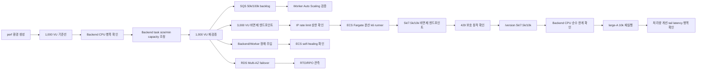

# BADA 성능 검증·확장성 개선 보고서

작성일: 2026-07-09  
작성 목적: 팀 공유, 인프라 성능 검증 결과 정리, 포트폴리오·면접 활용

---

## 1. 요약

BADA는 취약근로자의 임금·신분·근무 증거를 수집하고, AI 분석과 리포트 생성을 통해 증거 패키징을 돕는 모바일 중심 서비스다. 사용자는 사건을 생성하고 이미지·PDF·음성·위치 자료를 업로드하며, Backend API는 요청을 받고 Worker는 SQS를 통해 분석·전사·PDF 생성 같은 무거운 작업을 비동기로 처리한다.

이번 성능 검증은 단순히 “서비스가 배포된다”를 확인하기 위한 테스트가 아니라, 실제 운영 상황을 가정해 다음 질문에 답하기 위해 진행했다.

- 사용자가 몰릴 때 Backend API와 RDS 중 어디가 먼저 병목이 되는가?
- 분석 요청이 급증했을 때 SQS 기반 Worker가 자동 확장되는가?
- 대규모 부하에서 rate limit, ALB, ECS, RDS 지표를 어떻게 해석해야 하는가?
- 장애가 발생했을 때 ECS와 RDS Multi-AZ 구성이 어느 정도 복구력을 보이는가?
- 테스트 환경이 dev/prod 운영 환경에 영향을 주지 않고 안전하게 생성·삭제되는가?

핵심 결과는 다음과 같다.

| 구분 | 핵심 결과 |
| --- | --- |
| 1,000 VU 기준선 | Backend 0.25 vCPU task가 CPU 100%에 도달, p95 60,007ms |
| 병목 개선 | Backend 1 vCPU / min 4로 조정 후 p95 96ms, RPS 23.9 → 697.1 |
| 처리량 개선 | 동일 1,000 VU 조건에서 평균 처리량 약 29배 증가 |
| SQS 확장성 | 100,000건 backlog에서 Worker 2→30 자동 확장, DLQ 0 |
| Rate limit | 3,000~10,000 VU 비면제 엔드포인트에서 IP 기반 429가 먼저 작동 |
| Backend 순수 한계 | `/version` 10,000 VU에서 429 없이 Backend CPU 99% 포화, 성공 처리량 약 900~950 RPS 정체 |
| 10,000 VU 개선 실험 | Backend large-A 적용 후 처리량·5xx 비율은 개선, p95/timeout 병목은 잔존 |
| RDS failover | RDS event 기준 failover 약 43~50초, `/health/db` 샘플 기준 non-200 없음 |
| 데이터 보존 | failover 전 삽입한 marker row 보존, 테스트 기준 RPO 0 |
| 운영 안전성 | perf 리소스 destroy 후 dev plan `No changes` 확인 |

---

## 2. 테스트 환경과 원칙

성능 검증은 기존 dev/prod 운영 환경과 분리된 `perf` 환경에서 수행했다.

| 항목 | 구성 |
| --- | --- |
| 환경 이름 | `bada-perf-*` |
| Terraform state | `bada/perf/terraform.tfstate` |
| Compute | ECS Fargate Backend / Worker |
| 진입점 | ALB DNS HTTP |
| Queue | SQS Analysis Queue + DLQ |
| Database | RDS PostgreSQL |
| 관측 지표 | k6 summary, CloudWatch, ECS, ALB, RDS, SQS, Container Insights |
| 부하 도구 | k6, ECS Fargate 분산 k6 runner, SQS 주입 스크립트 |
| AI 호출 | 대규모 부하에서는 mock/local 처리 |

처음에는 `perf.badasoft.com`과 ACM 인증서를 연결해 운영과 유사한 HTTPS 구조로 만들려고 했다. 하지만 `badasoft.com`의 공인 DNS 위임 문제로 ACM 검증이 진행되지 않았고, 성능 검증의 핵심 목적은 HTTPS 자체가 아니라 Backend/Worker/RDS/SQS의 병목과 확장성 검증이었기 때문에 ALB DNS HTTP 모드로 전환했다.

테스트 원칙은 다음과 같았다.

| 원칙 | 설명 | 적용 방식 |
| --- | --- | --- |
| 운영 환경 보호 | dev/prod 서비스에 영향이 없어야 함 | 별도 state, 별도 prefix, 테스트 후 destroy |
| 재현 가능성 | 같은 환경을 다시 생성·삭제할 수 있어야 함 | Terraform 기반 perf 환경 |
| 관측 가능성 | 실패율만 보지 않고 병목 위치를 설명해야 함 | k6 + CloudWatch + ECS/RDS/SQS 지표 교차 확인 |
| 과장 금지 | 성공/실패를 구분하고 한계를 명확히 기록 | 10,000 VU 안정화 미완, RTO 관측 기준 명시 |

---

## 3. 전체 실험 흐름

---

## 4. 테스트별 결과와 의미

### 4.1 1,000 VU 기준선 — 최초 병목은 RDS가 아니라 Backend CPU

`perf-small` 구성에서 1,000 VU 테스트를 실행했다.

| 지표 | 결과 |
| --- | --- |
| Backend task | 0.25 vCPU / 512MB |
| Backend min/max | 2 / 10 |
| RDS | db.t4g.medium |
| 평균 RPS | 23.9 |
| p95 latency | 60,007ms |
| 실패율 | 45.46% |
| Backend CPU peak | 100% |
| RDS CPU peak | 약 7% |

해석:

- Backend CPU가 100%에 도달했다.
- RDS CPU는 약 7%로 여유가 있었다.
- 따라서 최초 병목은 DB가 아니라 Backend compute capacity였다.

의미:

- “DB부터 키우자” 같은 추측이 아니라 실제 지표로 병목 위치를 구분했다.
- 이후 리소스 조정 방향을 Backend task size와 최소 task 수로 좁힐 수 있었다.

---

### 4.2 1,000 VU 재검증 — p95 60초 → 96ms, 처리량 약 29배 개선

병목이 Backend CPU임을 확인한 뒤 `perf-medium` 프로파일로 조정했다.

| 항목 | perf-small | perf-medium |
| --- | --- | --- |
| Backend task | 0.25 vCPU / 512MB | 1 vCPU / 2GB |
| Backend min/max | 2 / 10 | 4 / 30 |
| Worker max | 20 | 30 |
| RDS | db.t4g.medium | db.m6g.large |

동일한 1,000 VU 조건으로 재측정한 결과다.

| 지표 | perf-small | perf-medium | 변화 |
| --- | ---: | ---: | --- |
| 평균 RPS | 23.9 | 697.1 | 약 29배 증가 |
| p95 latency | 60,007ms | 96ms | 약 99.8% 감소 |
| Backend CPU peak | 100% | 59% | CPU 포화 해소 |
| 완료/중단 iteration | 4,968 / 853 | 146,994 / 0 | 중단 0 |

해석:

- Backend CPU와 최소 task 수를 조정하자 동일 부하에서 p95가 60초에서 96ms로 낮아졌다.
- 평균 처리량은 23.9 RPS에서 697.1 RPS로 증가했다.
- RDS가 아니라 Backend compute 계층을 조정한 것이 효과적이었다.

의미:

- 단순히 리소스를 키운 것이 아니라, 병목을 확인한 뒤 같은 조건에서 개선 여부를 재검증했다.
- 이 결과는 포트폴리오에서 가장 강하게 활용할 수 있는 성능 개선 사례다.

---

### 4.3 SQS 50,000/100,000건 backlog — Worker 2→30 자동 확장

BADA는 AI 분석·전사·PDF 생성 같은 작업을 Backend에서 직접 처리하지 않고 SQS와 Worker로 분리한다. 이 구조가 실제 backlog 상황에서 확장되는지 확인했다.

| 지표 | 1차 테스트 | 2차 테스트 |
| --- | ---: | ---: |
| 주입 메시지 | 50,000건 | 100,000건 |
| 투입 속도 | 13,441 msg/s | 약 14,609 msg/s |
| SQS visible peak | 약 41,881 | 약 72,804 |
| Worker task | 2 → 20 | 2 → 30 |
| Drain 결과 | visible 감소 확인 | 약 5분 내 visible 0 |
| DLQ | 0 | 0 |

해석:

- SQS backlog가 증가하자 Worker가 자동 확장됐다.
- 100,000건 backlog에서도 DLQ는 0으로 유지됐다.
- Worker 장애 주입 중에도 queue drain이 지속됐다.

의미:

- Backend API 계층과 분석 Worker 계층이 분리되어 있어 서로 독립적으로 확장될 수 있음을 확인했다.
- 대량 분석 요청이 들어와도 API가 직접 모든 무거운 작업을 처리하지 않는 구조의 장점이 검증됐다.

주의:

- 이 테스트는 실제 AI 모델 latency를 측정한 것이 아니라, SQS backlog와 Worker scale-out/drain 회복력을 검증한 것이다.

---

### 4.4 Backend/Worker 장애 주입 — ECS self-healing 확인

Backend task와 Worker task를 강제로 중지해 장애 상황을 만들었다.

| 테스트 | 결과 | 의미 |
| --- | --- | --- |
| Backend task stop | ALB healthy target 유지, 관측 다운타임 없음 | Stateless API task 장애 시 ECS self-healing 확인 |
| Worker task stop | ECS가 task 자동 교체, SQS drain 지속, DLQ 0 | Worker 장애가 메시지 유실로 이어지지 않음 |

해석:

- Backend task 하나가 종료되어도 ALB와 ECS service가 전체 서비스 중단을 막았다.
- Worker task가 중지되어도 SQS 메시지는 보존되고 ECS가 capacity를 복구했다.

의미:

- BADA의 API 계층과 분석 계층은 단일 task 장애에 대해 기본적인 self-healing 구조를 갖는다.
- 다만 task replacement 완료 시각을 초 단위로 측정한 것은 아니므로, 정확한 task-level RTO는 후속 측정 대상으로 남긴다.

---

### 4.5 3,000 VU — 서버 장애가 아니라 IP 기반 rate limit이 먼저 작동

`perf-medium` 상태에서 비면제 엔드포인트에 3,000 VU 부하를 실행했다.

| 지표 | 결과 |
| --- | ---: |
| 총 요청 | 144,600 |
| 평균 RPS | 241 |
| p95 latency | 89ms |
| 실패율 | 83.56% |
| ALB 2XX / 4XX / 5XX | 23,778 / 120,601 / 233 |
| WAF Blocked | 0 |
| Backend CPU | 약 16% |
| RDS CPU | 약 7% |

해석:

- 실패율은 높았지만 5XX는 매우 적었다.
- WAF 차단은 0이었다.
- Backend CPU와 RDS CPU는 모두 여유가 있었다.
- 실패 대부분은 4XX였고, 애플리케이션의 IP 기반 rate limit에 의한 429로 해석했다.

의미:

- 이 단계에서 확인한 것은 “인프라가 3,000 VU를 못 버틴다”가 아니라, “단일 source IP 부하테스트는 앱 rate limit에 먼저 걸린다”는 점이다.
- 부하테스트를 설계할 때 실제 사용자처럼 여러 source IP에서 요청을 발생시키는 분산 runner가 필요하다는 결론을 얻었다.

---

### 4.6 5,000/7,500/10,000 VU 비면제 엔드포인트 — rate limit 보호 동작 확인

ECS Fargate 기반 분산 k6 runner를 사용해 source IP를 분산한 뒤 5,000/7,500/10,000 VU를 실행했다.

| 단계 | runner×VU | 총 요청 | RPS | 2XX | 429 | 5XX | 판단 |
| --- | --- | ---: | ---: | ---: | ---: | ---: | --- |
| 5,000 VU | 10×500 | 1,344,978 | 약 4,300 | 2,900 | 1,314,548(97.7%) | 6,900(0.5%) | rate limit 선차단 |
| 7,500 VU | 15×500 | 1,610,572 | 약 5,100 | 2,982 | 1,497,590(93.0%) | 51,000(3.2%) | 429 우세 |
| 10,000 VU | 20×500 | 1,563,467 | 약 5,090 | 3,069 | 1,438,990(92.0%) | 90,254(5.8%) | rate limit + 일부 과부하 |

해석:

- 분산 runner 자체는 source IP 분산에 성공했다.
- 하지만 10~20개 source IP만으로는 IP당 300건/60초 제한을 넘기 때문에 대부분 429가 발생했다.
- RDS는 여전히 병목이 아니었다.

의미:

- 현재 IP 기반 rate limit은 비정상 대량 요청을 차단하는 보호 장치로 동작했다.
- 동시에 공유 네트워크·NAT 환경의 정상 사용자까지 고려하면 IP 단독 기준은 한계가 있다.
- 운영 정책은 `user_id`, endpoint, 인증 상태, 요청 유형을 함께 고려하는 다층 rate limit로 고도화할 필요가 있다.

주의:

- 이 결과는 “Backend가 10,000 VU를 안정적으로 처리했다”는 의미가 아니다.
- 비면제 엔드포인트에서는 rate limit이 먼저 작동했기 때문에 순수 Backend 처리 한계는 별도로 측정해야 한다.

---

### 4.7 `/version` 5,000/7,500/10,000 VU — Backend CPU 순수 한계 확인

rate limit 영향을 제거하기 위해 면제 경로인 `/version`을 대상으로 분산 부하를 재실행했다.

| 단계 | 총 요청 | 전체 RPS | p95 | 2XX | 429 | 5XX | Backend CPU | 판단 |
| --- | ---: | ---: | ---: | ---: | ---: | ---: | --- | --- |
| 5,000 VU | 321,013 | 약 1,033 | 20s | 270,264(84%) | 0 | 24,109(7.5%) | avg88% / max99.7% | CPU 포화 진입 |
| 7,500 VU | 377,039 | 약 1,190 | 20s | 284,388(75%) | 0 | 48,890(13%) | 약 99% | 처리량 정체 |
| 10,000 VU | 437,103 | 약 1,382 | 20s | 281,712(64%) | 0 | 약 24% | avg99.4% / max99.7% | CPU 한계 확인 |

해석:

- 429가 0건이므로 rate limit이 아닌 Backend 처리 용량을 관측한 결과다.
- 전체 요청 RPS와 2XX 성공 RPS는 다르게 해석해야 한다.
- 2XX 성공 처리량은 약 900~950 RPS 부근에서 정체했다.
- 초과 요청은 20초 timeout과 5XX로 전환됐다.

의미:

- `perf-medium`의 Backend 1 vCPU × 4 task 구성에서는 CPU가 다음 병목이었다.
- 더 높은 부하를 안정화하려면 task size, min capacity, autoscaling 기준을 조정해야 한다.

---

### 4.8 large-A 10,000 VU — 처리량·오류율은 개선, tail latency는 미해결

Backend task를 2 vCPU / 4GB, min 8 / max 60으로 키운 `large-A` 프로파일로 `/version` 10,000 VU를 재실행했다.

| 지표 | current-medium 10,000 VU | large-A 10,000 VU |
| --- | ---: | ---: |
| 총 요청 | 437,103 | 1,172,609 |
| 전체 RPS | 약 1,382 | 약 2,351 |
| 429 | 0 | 0 |
| 5XX | 약 24% | 약 11.6% |
| p95 | 20s | 약 19.4s |
| RDS CPU | 낮음 | max 약 3.8% |

해석:

- large-A는 처리량과 오류율을 개선했다.
- 하지만 p95는 여전히 20초 부근에 머물렀다.
- RDS는 여전히 병목이 아니었다.
- 다음 병목은 단순 CPU나 DB가 아니라 ALB target health, application concurrency, connection backlog, timeout 처리 계층으로 이동한 것으로 해석했다.

집계 기준:

- 표의 총 요청·RPS·상태코드는 k6 runner별 client-side summary를 합산한 값이다.
- CloudWatch ALB `RequestCount`는 별도 metric window의 ALB 관측값이므로 k6 합산값과 직접 1:1로 비교하지 않는다.
- k6 결과는 부하 발생량과 응답 분포 확인에, CloudWatch/ALB/ECS/RDS 지표는 병목 계층과 리소스 상태 확인에 사용했다.

의미:

- “리소스를 키우면 모든 문제가 끝난다”가 아니라, 부하가 커질수록 병목 계층이 이동한다는 것을 확인했다.
- 10,000 VU 안정화 완료가 아니라 “부분 개선 후 다음 병목 도출”로 해석해야 한다.

---

### 4.9 RDS Multi-AZ forced failover — 앱 health 관측 기준 RTO 0초, marker 기준 RPO 0

dev App DB인 `bada-dev-postgres-multiaz`를 대상으로 forced failover를 두 차례 수행했다.

| 항목 | 결과 |
| --- | --- |
| 1차 failover | `/health/db` 67개 샘플 모두 200, RDS event 기준 약 43초 |
| 2차 failover | `/health/db` 60개 샘플 모두 200, RDS event 기준 약 50초 |
| API 관측 RTO | `/health/db` 샘플 기준 0초 |
| RPO | failover 전 insert한 marker row 조회 성공, 테스트 기준 RPO 0 |
| rollback | 불필요 |

해석:

- RDS 내부 failover 이벤트는 약 43~50초 동안 진행됐다.
- 하지만 `/health/db` 반복 요청 샘플에서는 non-200이 관측되지 않았다.
- failover 전 커밋한 marker row가 failover 후에도 조회되어 테스트 기준 데이터 유실은 없었다.

주의:

- RTO 0초는 “RDS failover가 0초 만에 끝났다”는 의미가 아니다.
- 샘플 사이에 발생했을 수 있는 매우 짧은 연결 오류까지 완전히 배제한 것도 아니다.
- 정확한 표현은 “앱 health 샘플링 기준 RTO 0초, RDS event 기준 failover 약 43~50초”다.
- Snapshot restore와 PITR은 별도 DR 리허설 대상으로 남긴다.

---

## 5. 성능 검증을 통해 서비스가 어떻게 고도화됐는가

이번 테스트는 단순한 부하 주입이 아니라, BADA 인프라 설계의 다음 고도화 방향을 수치로 확인한 과정이었다.

| 발견 | 조치·해석 | 서비스 고도화 의미 |
| --- | --- | --- |
| 1,000 VU에서 Backend CPU 100% | Backend task size와 min capacity 조정 | API 계층의 기본 처리 용량 개선 |
| RDS CPU는 전 구간 낮음 | DB보다 Backend/ALB/app 계층 우선 튜닝 | 불필요한 DB 스케일업 방지 |
| SQS backlog 증가 | Worker 2→30 자동 확장 | 분석 파이프라인의 비동기 확장성 검증 |
| 3,000~10,000 VU에서 429 | IP 단독 rate limit 한계 확인 | user_id·endpoint 기반 다층 rate limit 필요 |
| `/version` 10,000 VU에서 CPU 99% | Backend 순수 처리 한계 확인 | autoscaling·concurrency·timeout 튜닝 필요 |
| large-A에서 p95 미해결 | 병목이 ALB/app runtime 계층으로 이동 | 다음 튜닝 지점 명확화 |
| RDS failover 중 앱 health 정상 | Multi-AZ 전환 효과 일부 검증 | DB 장애 대응 기준 수립 |

---

## 6. 포트폴리오에서 강조할 수 있는 지점

이번 실험은 다음 역량을 보여준다.

1. **IaC 기반 실험 환경 구성**
   - dev/prod와 분리된 perf state를 구성하고, 테스트 후 destroy와 dev plan `No changes`로 무영향을 확인했다.

2. **관측 기반 병목 분석**
   - k6 실패율만 본 것이 아니라 ECS CPU, RDS CPU, ALB 4XX/5XX, SQS backlog, DLQ를 함께 확인했다.

3. **개선 전후 재측정**
   - Backend task 사이징 변경 후 같은 1,000 VU 조건에서 p95와 RPS 개선을 수치로 검증했다.

4. **비동기 파이프라인 확장성 검증**
   - SQS 100,000건 backlog에서 Worker가 2→30으로 자동 확장되고 DLQ 0을 유지했다.

5. **실패를 설계 인사이트로 전환**
   - 3,000~10,000 VU 실패를 단순 장애가 아니라 rate limit 정책과 부하 발생 조건의 문제로 해석했다.

6. **DR/RTO/RPO 기준 분리**
   - ECS self-healing, SQS 메시지 보존, RDS Multi-AZ failover, Snapshot/PITR을 구분해 기록했다.

---

## 7. 한계와 후속 과제

| 한계 | 후속 과제 |
| --- | --- |
| 10,000 VU large-A에서도 p95 20초 부근 | ALB target health, app server concurrency, connection backlog, timeout 튜닝 |
| 비면제 엔드포인트는 IP rate limit이 먼저 작동 | user_id·endpoint·인증 상태 기반 다층 rate limit 설계 |
| Worker 장애의 초 단위 RTO 미측정 | ECS service event와 CloudWatch timestamp 기반 복구 시간 저장 |
| RDS failover는 health 샘플 기준 | 실제 읽기/쓰기 트래픽 중 failover 재측정 |
| Snapshot/PITR 복구 미수행 | snapshot restore → Secret 전환 → ECS 재배포까지 RTO 측정 |
| 비용 효율 비교는 부분 수행 | small/medium/large별 p95·RPS·월 비용 비교 |

---

## 8. 이력서·면접 활용 문장

### 짧은 버전

> dev/prod와 분리된 perf 환경을 Terraform으로 구성하고, 1,000 VU 부하테스트에서 Backend CPU 병목을 발견해 task size와 최소 task 수를 조정했습니다. 그 결과 p95 지연시간을 60초에서 96ms로 낮추고 평균 처리량을 약 29배 개선했습니다.

### 상세 버전

> BADA 프로젝트에서 운영 환경과 분리된 성능 검증 환경을 IaC로 구성하고 k6, CloudWatch, ECS/RDS/SQS 지표를 활용해 병목을 분석했습니다. 1,000 VU 기준선에서 Backend CPU가 100% 포화되는 문제를 발견했고, Backend task 사이징과 최소 task 수를 조정해 동일 부하에서 p95 지연시간을 60,007ms에서 96ms로 낮추고 평균 처리량을 23.9 RPS에서 697.1 RPS로 개선했습니다. 이후 ECS Fargate 분산 k6 runner로 5,000~10,000 VU를 실행해 IP 기반 rate limit 보호 동작과 Backend CPU 처리 한계를 분리해 분석했습니다. SQS 100,000건 backlog에서는 Worker 2→30 자동 확장과 DLQ 0을 확인했고, RDS Multi-AZ forced failover에서는 앱 health 샘플링 기준 non-200 없이 marker 데이터가 보존됨을 검증했습니다.

### 면접에서 조심해서 말할 표현

| 피해야 할 표현 | 안전한 표현 |
| --- | --- |
| “10,000 VU를 안정적으로 처리했습니다.” | “10,000 VU를 실행해 rate limit 보호 동작과 Backend 처리 한계를 분리해 분석했습니다.” |
| “RTO가 0초입니다.” | “앱 health 샘플링 기준 RTO 0초로 관측됐고, RDS event 기준 failover는 약 43~50초였습니다.” |
| “RDS 장애 시 데이터 손실이 없습니다.” | “이번 failover 리허설에서 사전 커밋한 marker row가 보존되어 테스트 기준 RPO 0으로 기록했습니다.” |
| “SQS 100,000건 AI 분석을 완료했습니다.” | “SQS 100,000건 backlog에서 Worker scale-out과 DLQ 0을 검증했습니다.” |

---

## 9. 결론

이번 성능 검증의 가장 큰 의미는 높은 VU 숫자 자체가 아니라, **병목을 관측하고, 개선하고, 다시 측정하고, 남은 한계를 정직하게 분리했다는 점**이다.

BADA 인프라는 이번 실험을 통해 다음을 확인했다.

- API 계층의 최초 병목은 RDS가 아니라 Backend CPU였다.
- Backend task size와 최소 task 수 조정만으로 1,000 VU 기준 p95와 처리량이 크게 개선됐다.
- SQS와 Worker 분리 구조는 대량 backlog 상황에서 수평 확장 가능성을 보였다.
- IP 기반 rate limit은 보호 장치로 동작하지만, 대규모 정상 사용자와 공유 네트워크 환경을 고려하면 정책 고도화가 필요하다.
- 10,000 VU에서는 단순 스케일업 이후에도 ALB/app runtime/timeout 계층의 병목이 남았다.
- RDS Multi-AZ failover 중 앱 health 샘플 기준 실패 응답은 관측되지 않았고, marker 데이터도 보존됐다.

따라서 이번 테스트는 “서비스가 돌아간다”를 넘어, 운영 환경에서 어떤 계층을 먼저 개선해야 하는지 보여준 실무형 성능 검증 사례로 정리할 수 있다.
