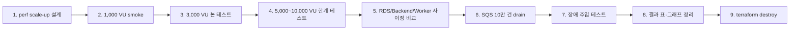

# BADA 대규모 성능 검증 실험 계획

이 문서는 `perf` 환경을 활용해 BADA 서비스의 대규모 부하 대응력, 비동기 처리 회복력, 리소스 사이징 근거, 장애 복구 흐름을 검증하기 위한 실행 계획서다. 실제 구현과 `terraform apply`는 이 문서의 점검 항목을 모두 확인한 뒤 별도 작업으로 수행한다.

## 1. 실험 목표

이번 실험은 단순히 요청을 많이 보내는 것이 아니라, 운영 관점에서 다음 질문에 답하는 것을 목표로 한다.

| 질문 | 확인 방법 | 산출물 |
| --- | --- | --- |
| Backend API는 대규모 동시 요청에서 어디까지 안정적으로 버티는가? | 1,000 → 3,000 → 5,000~10,000 VU 단계 부하 | p95 latency, error rate, RPS, ALB target response time |
| ECS Fargate Auto Scaling은 부하 증가에 맞춰 실제로 확장되는가? | Backend CPU 기반 scale-out 관측 | Desired/Running task count, scaling activity timeline |
| 분석 요청이 몰렸을 때 Worker와 SQS는 backlog를 회복할 수 있는가? | SQS 10만 건 적체 후 drain 관측 | visible/in-flight/oldest age, Worker task count, drain time |
| 리소스 사이즈를 키우면 성능 병목이 어디서 어떻게 바뀌는가? | Backend/Worker/RDS 사이징 비교 | 비용 대비 성능 비교표, 병목 변화 |
| 장애 발생 시 서비스가 자동 복구되는가? | ECS task 중지, Worker 중지, RDS reboot/failover 계열 테스트 | 복구 시간, 알람 발생, 영향 범위 |

## 2. 절대 원칙

| 원칙 | 적용 방식 |
| --- | --- |
| 기존 서비스 무영향 | dev/prod와 분리된 `bada/perf/terraform.tfstate`, `bada-perf-*`, **ALB DNS HTTP**만 사용 (도메인/HTTPS 미사용) |
| 테스트 대상 명시 | k6 실행 시 `TARGET_URL="http://<perf-alb-dns>"`(=`$PERF_TARGET_URL`), SQS 실행 시 `--queue bada-perf-analysis` 필수 |
| 접속 방식 | `badasoft.com` 공인 DNS 위임 문제로 ACM 검증 불가 → **ALB DNS HTTP**로 수행. `https://api.perf.badasoft.com`은 도메인 위임 복구 시에만 사용 가능한 옵션 |
| 외부 AI 대량 호출 방지 | 대규모 테스트는 `mock`/`local` provider 모드 사용, Bedrock/Transcribe 실호출은 별도 소량 E2E로 분리 |
| 비용 통제 | 실행 전 Cost Explorer/Budget 확인, 단계별 중단 기준 설정, 테스트 종료 즉시 destroy |
| 재현성 | tfvars, 실행 명령, CloudWatch 캡처, k6 summary JSON, scaling activity 출력 보관 |

## 3. 전체 실행 순서



## 4. Phase 0 — 실행 전 기준선 점검

실행 전 아래 항목을 기록한다.

| 점검 항목 | 명령 또는 확인 위치 | 판정 |
| --- | --- | --- |
| 현재 AWS 계정 | `aws sts get-caller-identity --profile bada-team` | BADA 계정인지 확인 |
| 현재 월 비용 | Cost Explorer | 테스트 전 비용 기준선 |
| Fargate On-Demand vCPU quota | Service Quotas `L-3032A538` | 목표 task 수 수용 여부 |
| Fargate Spot vCPU quota | Service Quotas `L-36FBB829` | Worker Spot scale-out 가능 여부 |
| VPC quota | Service Quotas `VPCs per Region` | `perf` VPC 생성 가능 여부 |
| EIP 사용량 | `aws ec2 describe-addresses` | no-NAT이면 영향 없음, NAT 선택 시 필수 |
| Terraform plan | `terraform plan -var-file=env/perf.tfvars` | `create`만 존재해야 함 |
| dev/prod 영향 | plan resource prefix 확인 | `bada-dev-*`, `bada-prod-*` 변경 없어야 함 |

## 5. Phase 1 — perf 환경 scale-up 설계

현재 리허설 기준의 `perf` 환경은 Backend max 10, Worker max 20 수준으로 Auto Scaling 동작 검증에는 충분하다. 대규모 성능 검증에서는 아래와 같이 단계적으로 확장한다.

### 5.1 권장 scale-up 프로파일

| 프로파일 | 목적 | Backend | Worker | RDS | 사용 시점 |
| --- | --- | --- | --- | --- | --- |
| `perf-small` | 기립/스모크 | min 2 / max 10, 0.25 vCPU | min 2 / max 20, 1 vCPU | `db.t4g.medium` | apply 직후 |
| `perf-medium` (실제 적용) | 1,000~3,000 VU | min 4 / max 30, **1 vCPU / 2GB** | min 2 / max 30, 1 vCPU / 2GB | `db.m6g.large` | 본 테스트 1차 (2026-07-07 적용) |
| `perf-large` | 5,000~10,000 VU | min 8 / max 80+, 1 vCPU | min 8 / max 100+, 2 vCPU | `db.r6g.large` 또는 `db.r6g.xlarge` | 한계 테스트 |

> 실제 Terraform 변수 변경은 별도 구현 단계에서 수행한다. 문서 단계에서는 어떤 프로파일을 적용할지와 각 프로파일의 예상 비용·쿼터 여유를 먼저 확정한다.

### 5.2 비용 추정 단위

| 비용 항목 | 주요 변수 |
| --- | --- |
| ECS Fargate | Backend/Worker task 수, vCPU, memory, 실행 시간 |
| RDS | instance class, 실행 시간, CPU credit 사용량 |
| ALB/WAF | 요청량, LCU, rule 평가량 |
| CloudWatch | 로그 수집량, custom metric, alarm, dashboard |
| S3/SQS | 요청 수, 저장량, 메시지 수 |

예상 비용은 실험 전 “최소/중간/최대” 3단계로 작성한다. 한계 테스트는 반드시 시간 제한을 둔다.

## 6. Phase 2 — 1,000 VU smoke

목적은 본격적인 대규모 부하 전에 perf endpoint, ALB, Backend, RDS, CloudWatch 수집이 정상인지 확인하는 것이다.

```bash
k6 run \
  -e TARGET_URL="$PERF_TARGET_URL" \
  -e VUS=1000 \
  -e SUSTAIN=10m \
  load-test/k6/backend-journey.js
```

확인 항목:

- HTTP 200 비율
- p95 latency
- `http_req_failed`
- ALB 5xx
- Backend task count
- RDS CPU / DatabaseConnections
- CloudWatch log error

중단 기준:

- 5xx가 급증하고 5분 이상 회복되지 않음
- RDS connection이 한계에 붙고 회복되지 않음
- Backend task가 scale-out 되지 않음

## 7. Phase 3 — 3,000 VU 본 테스트

목적은 일반적인 대규모 사용 상황을 가정해 Backend API와 RDS 병목을 관측하는 것이다.

```bash
k6 run \
  -e TARGET_URL="$PERF_TARGET_URL" \
  -e MODE=latency \
  -e RATE=300 \
  -e MAX_VUS=3000 \
  -e SUSTAIN=20m \
  load-test/k6/backend-autoscaling.js
```

기록 항목:

| 항목 | 기록 방식 |
| --- | --- |
| peak RPS | k6 summary |
| p95 latency | k6 summary + CloudWatch ALB TargetResponseTime |
| error rate | k6 summary + ALB 5xx |
| scale-out 시각 | Application Auto Scaling activity |
| Backend task count | ECS service metric |
| RDS 병목 | CPU, connection, free memory |

## 8. Phase 4 — 5,000~10,000 VU 한계 테스트

> **상태: 미수행 (의도적 보류).** 3,000 VU 단계에서 비면제 엔드포인트가 앱 IP rate limit(300/분, 429)에 먼저 걸림을 확인 → 단일 IP k6로는 그 이상 유효 부하를 만들 수 없다. **선행 조건: 분산 k6 runner 또는 다중 소스 IP 설계.** 목표는 성공 여부가 아니라 최초 병목·한계 지점 식별.

목적은 서비스가 무너지는 지점을 찾는 것이다. 성공 기준은 “끝까지 0% 에러”가 아니라, 병목이 발생했을 때 어떤 지표가 먼저 깨지는지 식별하는 것이다.

### 8.1 단계 상승 방식

| 단계 | 목표 | 실행 시간 | 다음 단계 진행 조건 |
| --- | ---: | --- | --- |
| Limit-1 | 5,000 VU | 15m | 5xx와 p95가 통제 가능 |
| Limit-2 | 7,500 VU | 15m | Backend/RDS 포화가 회복 가능 |
| Limit-3 | 10,000 VU | 10m | 쿼터·비용·서비스 안정성 허용 |

### 8.2 실행 예시

```bash
k6 run \
  -e TARGET_URL="$PERF_TARGET_URL" \
  -e MODE=latency \
  -e RATE=800 \
  -e MAX_VUS=10000 \
  -e SUSTAIN=15m \
  load-test/k6/backend-autoscaling.js
```

주의:

- 단일 로컬 PC에서 10,000 VU를 안정적으로 발생시키기 어려울 수 있다.
- 필요 시 k6 Cloud 또는 분산 runner 구조를 별도 설계한다.
- 한계 테스트는 반드시 종료 시간을 정하고 실행한다.

## 9. Phase 5 — RDS/Backend/Worker 사이징 비교

목적은 “왜 이 리소스 사이즈가 적절한가”에 대한 근거를 만드는 것이다.

### 9.1 비교 매트릭스

| 실험 | Case A | Case B | Case C | 비교 지표 |
| --- | --- | --- | --- | --- |
| Backend task size | 0.25 vCPU / 512MB | 0.5 vCPU / 1GB | 1 vCPU / 2GB | p95, RPS, CPU, task count |
| Worker task size | 1 vCPU / 2GB | 2 vCPU / 4GB | 4 vCPU / 8GB | drain time, backlog age |
| RDS class | `db.t4g.medium` | `db.m6g.large` | `db.r6g.large` | CPU, connection, p95 |
| Worker capacity provider | Fargate Spot | On-Demand | base On-Demand + Spot | 비용, 안정성 |

### 9.2 결과표 양식

| 구성 | 테스트 | peak RPS | p95 | error rate | Backend peak task | Worker peak task | RDS peak CPU | 비용 추정 | 판단 |
| --- | --- | ---: | ---: | ---: | ---: | ---: | ---: | ---: | --- |
| Small | 1,000 VU |  |  |  |  |  |  |  |  |
| Medium | 3,000 VU |  |  |  |  |  |  |  |  |
| Large | 5,000+ VU |  |  |  |  |  |  |  |  |

## 10. Phase 6 — SQS backlog drain 테스트 (계획 100,000건 / 1차 실행 50,000건)

목적은 분석 요청이 대량으로 몰렸을 때 Worker가 scale-out 되어 backlog를 회복하는지 확인하는 것이다.

> **실행 현황**: 1차 실행은 **50,000건**으로 수행했고 Worker가 **2→20 자동 확장**(DLQ 0)됨을 확인했다(§14 참조). 아래 `--count 100000`은 후속 확대 목표값이며, 필요 시 100,000건으로 올려 재실행한다. "100,000건 완료"로 기록하지 말 것.

```bash
python load-test/sqs/fill_backlog.py \
  --queue bada-perf-analysis \
  --count 100000 \
  --workers 80 \
  --watch \
  --profile bada-team
```

관측 항목:

- SQS `ApproximateNumberOfMessagesVisible`
- SQS `ApproximateNumberOfMessagesNotVisible`
- SQS `ApproximateAgeOfOldestMessage`
- Worker desired/running task count
- Worker scaling activity
- DLQ count
- drain 완료 시간

주의:

- `--queue`를 생략하면 기본값이 dev 큐일 수 있으므로 절대 생략하지 않는다.
- bogus case_id 방식은 실제 AI 분석 시간을 대표하지 않는다.
- 이 테스트는 “큐 적체와 회복력” 검증이며, 실제 분석 latency는 유효 case로 소량 별도 측정한다.

## 11. Phase 7 — 장애 주입 테스트

부하가 없는 상태와 부하가 있는 상태를 나눠 복구 시간을 측정한다.

| 테스트 | 방법 | 관측 항목 | 기대 결과 |
| --- | --- | --- | --- |
| Backend task 중지 | ECS task stop | ALB 5xx, target health, replacement task time | ECS가 새 task 기동 |
| Worker task 중지 | ECS task stop | SQS visible/oldest age, Worker task count | backlog 증가 후 회복 |
| RDS reboot | RDS reboot 또는 failover 계열 테스트 | API error, DB connection, recovery time | 짧은 오류 후 회복 |
| Alarm 확인 | 임계치 유발 | CloudWatch Alarm, SNS | 알림 발생과 OK 복구 |

명령 예시는 실제 실행 단계에서 대상 task ARN을 확인한 뒤 작성한다.

## 12. 결과 정리 산출물

실험 후 아래 자료를 한 폴더에 모은다.

```text
load-test/results/YYYY-MM-DD-perf/
├── 00-experiment-summary.md
├── 01-k6-1000vu-summary.json
├── 02-k6-3000vu-summary.json
├── 03-k6-limit-summary.json
├── 04-sqs-drain-output.txt
├── 05-scaling-activities-backend.txt
├── 06-scaling-activities-worker.txt
├── screenshots/
│   ├── alb-target-response-time.png
│   ├── backend-task-count.png
│   ├── rds-cpu-connection.png
│   └── sqs-backlog-drain.png
└── cost-snapshot.txt
```

요약 문장 양식:

> 별도 `perf` 환경을 IaC로 구성해 최대 `<N>` VU 부하를 발생시켰고, ECS Fargate Auto Scaling, ALB 응답시간, RDS 연결/CPU, SQS backlog drain을 관측했다. 그 결과 `<병목>`이 먼저 발생함을 확인했고, `<개선안>`을 도출했다.

## 13. 종료 절차

테스트 종료 후에는 아래 순서를 따른다.

1. k6 실행 중지
2. SQS producer 중지
3. `bada-perf-analysis` 큐 depth 확인
4. 필요 시 perf 큐 purge
5. CloudWatch 캡처 저장
6. k6 summary JSON 저장
7. Cost Explorer 기준 비용 스냅샷 저장
8. Terraform destroy
9. dev backend로 Terraform init 복귀
10. dev/prod 상태 확인

```bash
cd infra
terraform init -reconfigure -backend-config=backends/perf.hcl
terraform destroy -var-file=env/perf.tfvars
terraform init -reconfigure -backend-config=backends/dev.hcl
terraform plan -var-file=env/dev.tfvars
```

성공 기준:

- `perf` 임시 리소스 제거
- `bada-perf-*` 주요 리소스 미잔존
- dev plan `No changes`
- prod 상태 무변경
- 결과 캡처와 요약 문서 저장


---

## 14. 실행 결과 요약 (2026-07-07)

### perf-small (baseline) → perf-medium 개선 검증
| 지표 (1,000 VU journey, 동일 테스트) | perf-small (0.25vCPU) | perf-medium (1vCPU, min4) |
| --- | --- | --- |
| 평균 RPS | 23.9 | **697.1** (29×) |
| p95 | 60,007 ms | **96 ms** |
| Backend CPU peak | **100% (포화)** | **59%** |
| 완료/중단 iteration | 4,968 / 853 | 146,994 / 0 |

→ Backend task를 0.25→1 vCPU로 상향하고 min_capacity를 4로 확보하니 **CPU 병목이 해소**되고 처리량·지연이 극적으로 개선됨.

### ⭐ 핵심 발견: 앱 IP Rate Limit이 비면제 엔드포인트 부하의 실제 상한
- `backend/app/middleware/rate_limit.py`: IP 기반 rate limit `_LIMIT=300 / _WINDOW=60s`(IP당 분당 300건, 초과 시 429). 면제 경로 `/health`, `/version`, `/health/db`.
- 3,000 VU latency(RATE=300, `/community/boards`): 실패율 83.56%(ALB 4XX 120,601 / 2XX 23,778, **WAF Blocked 0**), 그러나 Backend CPU 16%·p95 89ms → **대부분 429**(인프라 한계 아님).
- SQS 50,000건 backlog: Worker **2→20 자동 확장**, DLQ 0 (별도 검증됨, backlog 경로는 rate limit 무관).

### 병목 서사 정리
1. **1,000 VU 병목**: perf-small 백엔드 CPU 포화(면제 엔드포인트 `/version` 폭주 기준).
2. **3,000 VU 개선**: perf-medium에서 CPU 여유(16~59%), 타임아웃 소멸.
3. **한계 분석 조건**: 비면제 엔드포인트의 진짜 한계·스케일아웃(5,000~10,000 VU)은 **분산 소스 IP(분산 k6 runner)** 필요 — 앱 rate limit이 IP·인스턴스별 인메모리이기 때문. 앱 코드는 수정하지 않는다(rate_limit.py 하드코딩).

### 후속 과제
- **분산 k6 runner**(Fargate 다중 태스크 또는 k6 Cloud, 멀티 소스 IP)를 설계해야 비면제 엔드포인트의 실제 처리량 한계와 Backend scale-out(≥ min4→max30)을 관측할 수 있다.
- RDS는 전 구간 병목 아님(CPU ≤ 7%) → m6g.large는 헤드룸 성격, 비용 최적화 시 하향 여지.


---

## 15. 분산 k6 runner 기반 5,000~10,000 VU (2026-07-08 실행 결과)

> **상태: 실행 완료.** perf 환경 재기립(`terraform apply`, 101 add / 0 change / 0 destroy) → runner 이미지 GitHub Actions로 빌드/ECR push(amd64) → source IP 분산 검증 PASS → 5,000/7,500/10,000 VU 3단계 실행 → 결과 수집 → **perf 및 runner 리소스 전량 destroy**, dev plan `No changes` 확인. 대상은 perf ALB DNS(`http://bada-perf-alb-*`)만 사용했고 앱 `rate_limit.py`는 수정하지 않았다.

### 15.1 분산 k6 runner source IP 검증

| Runner 수 | Distinct external IP 수 | 방식 | 결과 |
| --- | --- | --- | --- |
| 5 | **5** (13.209.18.96 / 3.34.41.3 / 3.38.187.249 / 43.201.51.200 / 43.203.218.62) | Fargate public subnet + assignPublicIp=ENABLED | **PASS** |

runner 수만큼 서로 다른 external IP가 확인되어 Fargate public IP 방식의 source IP 분산이 실제로 동작함을 검증했다. 이 PASS를 확인한 뒤에만 5,000 VU 이상을 진행했다.

### 15.2 5,000~10,000 VU 결과 (각 단계 5분, constant-vus)

| 단계 | Runner 수 | 총 VU | 총요청 | RPS(ALB peak) | p95 | 2XX | 4XX(429) | 5XX | 병목 |
| --- | --- | --- | --- | --- | --- | --- | --- | --- | --- |
| 5,000 | 10 × 500 | 5,000 | 1,344,978 | ≈4,300 rps (peak 5,620/min) | ~1,610ms | 2,900 (0.2%) | 1,321,008 (429 1,314,548 · 97.7%) | 6,900 (0.5%) | 앱 IP rate limit |
| 7,500 | 15 × 500 | 7,500 | 1,587,995 | ≈5,190 rps | ~10,000ms | 2,991 (0.2%) | 1,512,963 (429 1,506,464 · 94.9%) | 50,492 (3.2%) | rate limit + 백엔드 과부하 조짐 |
| 10,000 | 20 × 500 | 10,000 | 1,563,467 | ≈5,090 rps | ~10,000ms | 3,069 (0.2%) | 1,445,926 (429 1,438,990 · 92.0%) | 90,254 (5.8%) | rate limit + 백엔드 5xx 증가 |

- **처리량은 약 5,000~5,600 RPS에서 정체**됐다(VU를 7,500→10,000으로 올려도 유효 RPS는 늘지 않음).
- **응답의 92~98%가 429**(앱 IP rate limit). 2xx는 전 단계 0.2% 수준.
- **5xx 비율이 부하와 함께 상승**(0.5% → 3.2% → 5.8%). rate limit 처리량 한계를 넘어선 백엔드 과부하 신호다.

### 15.3 Backend scale-out

| 단계 | Backend min/max | Peak task | CPU(avg/peak) | Memory peak | 판단 |
| --- | --- | --- | --- | --- | --- |
| 5,000 | 4 / 30 | **4 (미확장)** | ~50–59% / **100%** | ~15% | 서비스 평균 CPU가 목표 부근이라 scale-out 미발동 |
| 7,500 | 4 / 30 | **4 (미확장)** | ~76% / **~100%** | ~15% | 평균이 짧게 초과했으나 5분 창에서 지속 조건 미달 |
| 10,000 | 4 / 30 | **4 (미확장)** | 高(peak 100%) | ~15% | 동일 |

> rate limit 미들웨어가 **모든 요청을 앱 안에서 처리한 뒤 429를 반환**하므로 429 폭주에도 Backend CPU는 peak 100%까지 올랐다. 다만 4개 태스크의 서비스 평균 CPU가 목표 부근에 머물고 부하 창이 5분이라, CPU Target Tracking의 지속 조건을 넘기지 못해 min 4에서 확장되지 않았다.

### 15.4 RDS 상태

| 단계 | RDS class | CPU peak | Connection peak | 병목 여부 |
| --- | --- | --- | --- | --- |
| 5,000 | db.m6g.large | ~5.9% | 65 | 아님 |
| 7,500 | db.m6g.large | ~6% | ~45 | 아님 |
| 10,000 | db.m6g.large | ~5% | ~46 | 아님 |

RDS는 전 구간 CPU 6% 이하로 병목이 아니었다(대부분 요청이 429로 조기 반환되어 DB까지 도달하지 않음).

### 15.5 결론 — 분산 IP만으로는 비면제 엔드포인트 인프라 한계를 못 본다

- Fargate public IP로 **source IP 분산 자체는 성공**(5 runner = 5 distinct IP)했다.
- 그러나 앱 rate limit은 **IP당 300건/60초(≈5 rps/IP)**라, runner 10~20개(=IP 10~20개)로 수천 RPS를 만들면 **IP마다 한도를 수십 배 초과**해 결국 92~98%가 429가 된다.
- 즉 **비면제 엔드포인트의 진짜 인프라 한계(백엔드 scale-out 상한, RDS 한계)를 측정하려면** ① 수천 개 규모의 source IP(k6 Cloud 다중 로드존 또는 훨씬 큰 러너 플릿), ② 테스트 소스 대역에 한정한 rate limit 예외(앱 변경 — 이번 범위 밖), 또는 ③ 면제 엔드포인트 대상 테스트가 필요하다.
- **지배적 상한은 인프라가 아니라 앱 IP rate limit 정책**임을 3,000 VU(단일 IP)에 이어 5,000~10,000 VU(분산 IP)에서도 재확인했다.

### 15.6 정리(cleanup) 확인

- runner 태스크 종료, runner CLI 리소스(ECR/S3/IAM/LogGroup/TaskDef) 삭제
- `terraform destroy` 완료(perf state 0 resources), ALB log 버킷 정리 후 destroy
- dev backend 재init 후 `terraform plan` → **No changes** (dev/prod 무영향)
- 임시 GitHub Actions 빌드 브랜치/워크플로 삭제
