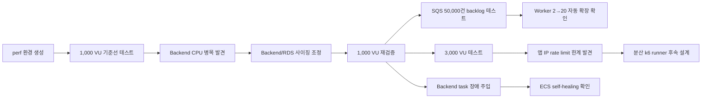
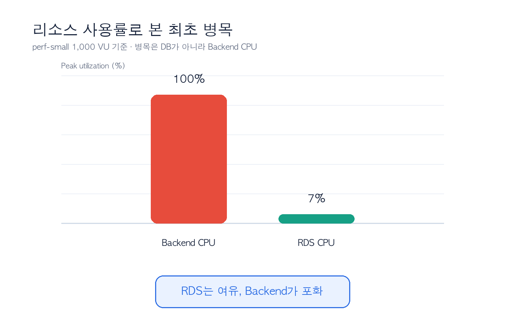
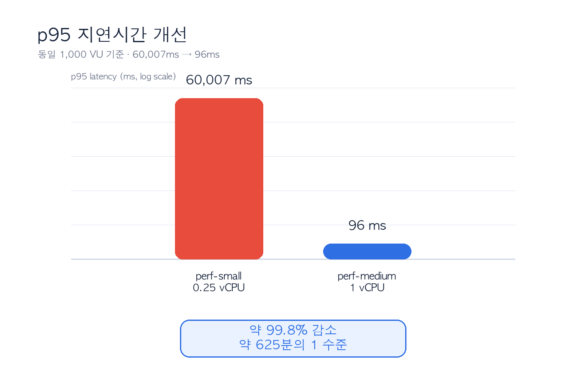
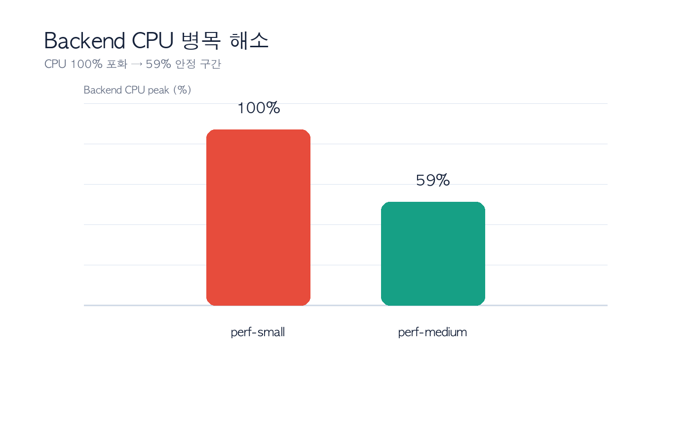
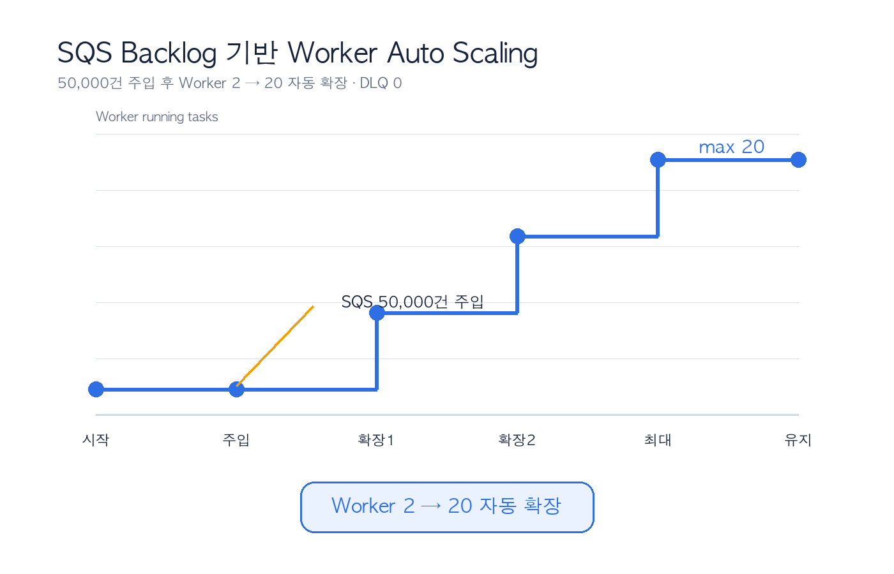
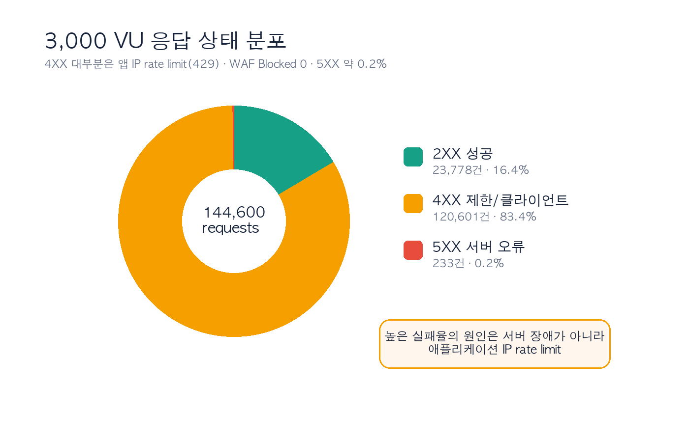

# BADA 성능 검증 및 확장성 개선 Case Study

작성일: 2026-07-07

이 문서는 BADA 서비스의 성능 검증 실험 결과를 정리한 대표 산출물이다. 운영(dev/prod)과 분리된 `perf` 환경에서 수행한 부하테스트의 병목 발견, 리소스 조정, 개선 검증, 한계 분석 과정을 담는다.

---

## 1. 한 줄 요약

BADA 서비스의 운영 환경(dev/prod)과 분리된 `perf` 성능 검증 환경을 Terraform으로 구성하고, 1,000 VU 부하에서 Backend CPU 병목을 발견한 뒤 리소스 조정으로 **p95 지연시간 60,007ms → 96ms**, **평균 처리량 23.9 RPS → 697.1 RPS(약 29배)** 개선을 검증했다.

---

## 2. 이 테스트를 왜 진행했나

BADA는 취약근로자의 임금·신분·근무 증거를 수집하고, AI 분석과 리포트 생성을 통해 증거 패키징을 돕는 서비스다. 사용자는 모바일 앱에서 사건을 생성하고, 이미지·PDF·음성·위치 등 다양한 자료를 업로드한다. Backend는 요청을 받고, Worker는 SQS를 통해 분석·전사·PDF 생성 같은 무거운 작업을 비동기로 처리한다.

이 구조는 기능이 많아질수록 다음 질문이 중요해진다.

- 사용자가 몰리면 Backend API가 먼저 병목이 되는가?
- 분석 요청이 많이 쌓이면 Worker가 SQS backlog를 따라 확장되는가?
- RDS가 병목인지, Backend CPU가 병목인지 구분할 수 있는가?
- 장애가 발생했을 때 ECS가 자동으로 복구하는가?
- dev/prod 환경에 영향을 주지 않고 대규모 실험을 수행할 수 있는가?

따라서 단순히 “배포가 된다”를 확인하는 수준이 아니라, **실제 운영 관점에서 병목을 찾고 개선 효과를 수치로 검증하는 실험**을 수행했다.

---

## 3. 테스트 설계 원칙

이번 테스트에서 가장 중요하게 둔 기준은 세 가지였다.

| 원칙 | 설명 | 적용 방식 |
| --- | --- | --- |
| 운영 환경 보호 | 기존 dev/prod 서비스에 영향을 주지 않아야 함 | 별도 `bada/perf/terraform.tfstate`, `bada-perf-*` prefix 사용 |
| 재현 가능성 | 테스트 환경을 다시 만들고 삭제할 수 있어야 함 | Terraform `perf` backend/tfvars 기반 구성 |
| 결과의 설명 가능성 | 단순 트래픽 주입이 아니라 병목·개선·한계를 설명해야 함 | CloudWatch/ECS/RDS/SQS/k6 지표를 함께 기록 |

실험 후에는 `terraform destroy`로 임시 perf 리소스를 제거하고, dev 환경이 `No changes`임을 재검증했다.

---

## 4. 테스트 환경 구성

| 구분 | 구성 |
| --- | --- |
| 환경 이름 | `bada-perf-*` |
| IaC | Terraform, 별도 `bada/perf/terraform.tfstate` |
| Compute | ECS Fargate Backend / Worker |
| 진입점 | ALB DNS HTTP |
| Queue | SQS Analysis Queue + DLQ |
| Database | RDS PostgreSQL |
| 관측 | CloudWatch, ECS metrics, ALB metrics, RDS metrics, SQS metrics, k6 summary |
| 부하 도구 | k6, SQS 주입용 boto3 스크립트 |
| AI 호출 | 대규모 부하에서는 mock/local 처리 |

처음에는 `perf.badasoft.com`과 ACM 인증서를 붙여 운영과 유사한 HTTPS 구조로 만들려고 했지만, `badasoft.com`의 공인 DNS 위임 문제로 ACM 검증이 진행되지 않았다. 부하테스트의 핵심 목적은 HTTPS 자체가 아니라 Backend/Worker/RDS/SQS의 확장성 검증이었기 때문에, perf 환경은 **ALB DNS HTTP 모드**로 전환했다.

이 결정으로 테스트 목적은 유지하면서 DNS/ACM 문제로 인한 지연을 줄이고, dev/prod 환경과의 충돌도 피할 수 있었다.

---

## 5. 실험 흐름

---

## 6. 핵심 결과 1 — 최초 병목은 RDS가 아니라 Backend CPU였다

perf-small 구성에서 1,000 VU 테스트를 실행했다.

| 지표 | 결과 |
| --- | --- |
| Backend task | 0.25 vCPU / 512MB |
| Backend min/max | 2 / 10 |
| RDS | db.t4g.medium |
| 평균 RPS | 23.9 |
| p95 latency | 60,007ms |
| 실패율 | 45.46% |
| Backend CPU peak | 100% |
| RDS CPU peak | 약 7% |

**판단**
RDS는 CPU 7% 수준으로 여유가 있었고, Backend CPU가 100%에 도달했다. 따라서 최초 병목은 DB가 아니라 **Backend compute capacity**였다. 이 결과는 “DB부터 키워야 한다”는 막연한 판단이 아니라, 실제 지표 기반으로 병목 위치를 구분했다는 점에서 의미가 있다.

---

## 7. 핵심 결과 2 — 리소스 조정 후 p95 60초 → 96ms

병목이 Backend CPU임을 확인한 뒤, perf-medium 프로파일로 조정했다.

| 항목 | perf-small | perf-medium |
| --- | --- | --- |
| Backend task | 0.25 vCPU / 512MB | 1 vCPU / 2GB |
| Backend min/max | 2 / 10 | 4 / 30 |
| Worker max | 20 | 30 |
| RDS | db.t4g.medium | db.m6g.large |

동일한 1,000 VU journey를 다시 실행한 결과는 다음과 같다.

| 지표 | perf-small | perf-medium | 변화 |
| --- | --- | --- | --- |
| 평균 RPS | 23.9 | 697.1 | 약 29배 증가 |
| p95 latency | 60,007ms | 96ms | 약 99.8% 감소 (약 625분의 1 수준) |
| Backend CPU peak | 100% | 59% | CPU 포화 해소 |
| 완료/중단 iteration | 4,968 / 853 | 146,994 / 0 | 중단 0 |

**판단**
Backend task의 CPU와 메모리를 상향하고 최소 task 수를 4개로 확보하자, 동일 1,000 VU에서 p95가 60초에서 96ms로 낮아졌다. 처리량도 23.9 RPS에서 697.1 RPS로 증가했다. 단순히 리소스를 키운 것이 아니라, **측정된 병목을 기준으로 조정하고 개선 여부를 같은 조건에서 재검증했다**는 점이 핵심이다.

---

## 8. 핵심 결과 3 — SQS 기반 Worker Auto Scaling 검증

BADA는 분석·전사·PDF 생성처럼 시간이 오래 걸리는 작업을 Backend에서 직접 처리하지 않고, SQS와 Worker로 분리한다. 이 구조가 실제 backlog 상황에서 확장되는지 확인하기 위해 SQS에 50,000건의 메시지를 주입했다.

| 지표 | 결과 |
| --- | --- |
| 주입 메시지 | 50,000건 |
| 투입 속도 | 13,441 msg/s |
| SQS visible peak | 약 41,881 |
| Worker task | 2 → 20 자동 확장 |
| DLQ | 0 |

**판단**
SQS backlog가 증가하자 Worker가 2개에서 최대 20개까지 자동 확장됐다. 이는 BADA의 비동기 분석 파이프라인이 요청 폭증 상황에서도 Worker 계층을 독립적으로 확장할 수 있음을 보여준다.

---

## 9. 핵심 결과 4 — ECS self-healing 검증

Backend task 1개를 강제로 중지해 장애 상황을 만들었다.

| 항목 | 결과 |
| --- | --- |
| 조치 | Backend ECS task 1개 강제 중지 |
| ALB healthy target | 2 유지 |
| 관측 다운타임 | 없음 |
| 복구 방식 | ECS가 신규 task로 reconcile |

**판단**
태스크 하나를 중지해도 ALB healthy target이 유지됐고, ECS가 신규 태스크를 기동해 서비스 상태를 복구했다. 이를 통해 ECS Fargate 서비스의 self-healing 동작과 배포 안정성을 확인했다.

---

## 10. 핵심 결과 5 — 3,000 VU에서 인프라가 아니라 앱 Rate Limit이 먼저 걸렸다

perf-medium 상태에서 3,000 VU 테스트를 수행했다. 이때 높은 실패율이 나왔지만, 원인은 서버 장애가 아니었다.

| 지표 | 결과 |
| --- | --- |
| 총 요청 | 144,600 |
| 평균 RPS | 241 |
| p95 latency | 89ms |
| 실패율 | 83.56% |
| ALB 2XX / 4XX / 5XX | 23,778 / 120,601 / 233 |
| WAF Blocked | 0 |
| Backend CPU | 약 16% |
| RDS CPU | 약 7% |

**원인 분석**

- 5XX는 233건으로 매우 적었다.
- WAF 차단은 0이었다.
- Backend CPU와 RDS CPU 모두 여유가 있었다.
- 실패 대부분은 4XX였고, 애플리케이션의 IP rate limit 정책에 의해 429가 발생한 것으로 해석된다.

즉 3,000 VU 단계에서 발견한 것은 인프라 장애가 아니라 **단일 소스 IP 부하테스트의 구조적 한계**였다. 실제 사용자 트래픽은 여러 IP에서 분산되어 들어오지만, 로컬 k6는 하나의 소스 IP에서 요청을 보내기 때문에 IP당 제한에 먼저 도달한다.

이 결과를 바탕으로 5,000~10,000 VU 한계 테스트는 단일 로컬 k6가 아니라, **분산 k6 runner** 또는 k6 Cloud처럼 멀티 소스 IP를 만들 수 있는 방식이 필요하다고 판단했다. 앱의 `rate_limit.py` 정책은 수정·완화하지 않으며, 목표는 정책 우회가 아니라 단일 소스 IP 한계를 제거하고 실제 다수 사용자 분산 접속 조건을 재현하는 것이다.

---

## 11. 주요 트러블슈팅

| 문제 | 원인 | 대응 | 배운 점 |
| --- | --- | --- | --- |
| ACM 검증 대기 | `badasoft.com` 공인 DNS 위임 문제 | perf는 ALB DNS HTTP 모드로 전환 | 테스트 목적에 맞게 HTTPS 의존성을 제거 |
| 1,000 VU 실패율 45% | Backend 0.25 vCPU 포화 | Backend 1 vCPU, min 4로 조정 | 병목은 RDS가 아니라 Backend CPU |
| task 크기 변경 미반영 | ECS service `ignore_changes=[task_definition]` | `force-new-deployment` 실행 | Terraform lifecycle 설정과 실제 배포 동작 차이 확인 |
| 3,000 VU 실패율 83% | 앱 IP rate limit | 5xx/WAF/CPU/RDS 지표 교차분석 | 실패율만 보지 말고 상태 코드와 리소스 지표를 함께 봐야 함 |

---

## 12. 이번 실험에서 얻은 인프라 설계 인사이트

### 12.1 Backend는 최소 용량 확보가 중요하다

CPU 기반 Auto Scaling은 알람 감지와 Fargate task 기동, ALB health check까지 시간이 걸린다. 짧고 강한 부하에서는 max capacity보다 **min capacity 확보**가 p95 안정화에 더 직접적이었다.

### 12.2 RDS를 먼저 키우는 것이 항상 답은 아니다

처음에는 DB 병목을 의심할 수 있지만, 실측 결과 RDS CPU는 7% 수준이었다. 병목은 Backend CPU였고, Backend 조정만으로 p95와 RPS가 크게 개선됐다.

### 12.3 SQS 분리는 확장성의 핵심이다

분석 작업을 Backend에서 직접 처리하지 않고 SQS와 Worker로 분리했기 때문에, API 계층과 분석 계층을 독립적으로 확장할 수 있었다.

### 12.4 부하테스트도 현실 트래픽 조건을 고려해야 한다

단일 로컬 k6는 단일 소스 IP라는 한계를 가진다. 앱에 IP rate limit이 있는 경우, VU만 높이면 인프라 한계가 아니라 rate limit만 측정하게 된다. 대규모 사용자 시뮬레이션에는 분산 부하 발생기가 필요하다.

---

## 13. 최종 성과 요약

| 항목 | 성과 |
| --- | --- |
| 병목 발견 | 1,000 VU에서 Backend CPU 100% 포화 확인 |
| 지연시간 개선 | p95 60,007ms → 96ms |
| 처리량 개선 | 23.9 RPS → 697.1 RPS |
| CPU 안정화 | Backend CPU 100% → 59% |
| Worker 확장 | SQS 50,000건 주입 시 Worker 2 → 20 자동 확장 |
| 장애 복구 | Backend task 중지 시 관측 다운타임 없음 |
| 한계 규명 | 3,000 VU 실패 원인이 인프라가 아니라 앱 IP rate limit임을 확인 |
| 운영 안전성 | 테스트 후 perf destroy, dev/prod 무영향 재검증 |

---

## 14. 후속 개선 방향

| 후속 과제 | 목적 |
| --- | --- |
| 분산 k6 runner 구성 | 실제 다수 사용자처럼 여러 소스 IP에서 5,000~10,000 VU 부하 생성 |
| perf-large 프로파일 테스트 | Backend/RDS/커넥션풀의 다음 병목 지점 확인 |
| Worker 장애 주입 | 분석 계층 장애 시 backlog 회복 시간 측정 |
| 비용 대비 성능 비교 | small/medium/large 프로파일별 p95·RPS·비용 효율 비교 |

분산 k6 runner의 설계·구현과 5,000~10,000 VU 단계 테스트 절차는 [`k6-runner/`](./k6-runner/)와 [`perf-scale-experiment.md`](./perf-scale-experiment.md)에 정리했다.

> **후속 실행 결과(2026-07-08).** ECS Fargate 분산 runner로 5,000/7,500/10,000 VU를 실제 실행했다. Fargate public IP로 source IP 분산 자체는 성공(5 runner = 5 distinct IP)했으나, 앱 rate limit이 IP당 300건/60초라 runner 10~20개(=IP 10~20개)로 수천 RPS를 만들면 여전히 응답의 92~98%가 429였고, 유효 처리량은 약 5,000 RPS에서 정체했다. RDS는 CPU 6% 이하로 병목이 아니었다. 결론적으로 **비면제 엔드포인트의 인프라 한계를 측정하려면 수천 개 규모의 source IP(예: k6 Cloud 다중 로드존)가 필요**하며, 단일 서비스의 IP rate limit 정책이 지배적 상한임을 분산 환경에서도 재확인했다. 상세 수치는 [`perf-scale-experiment.md §15`](./perf-scale-experiment.md)에 있다. (테스트 후 perf·runner 리소스 전량 destroy, dev `No changes` 확인.)
